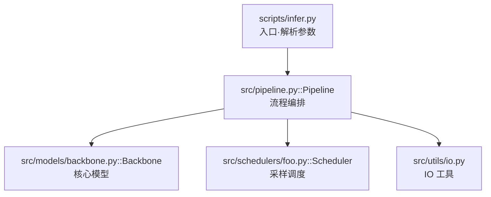
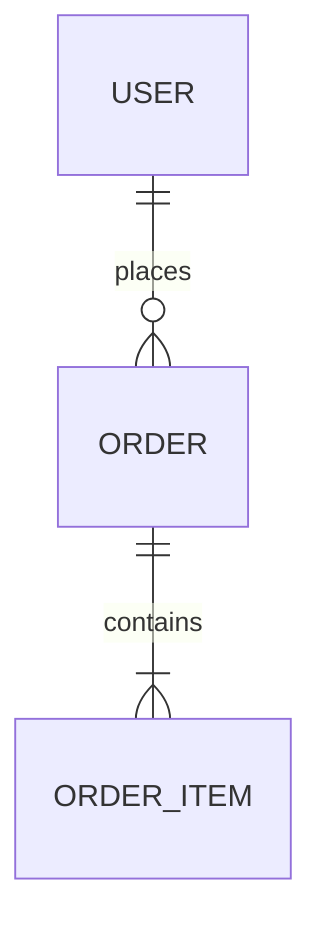

# Phase 4: 代码地图与入口定位

**目标**：找出"代码如何运行起来"——包管理、入口文件、模块依赖关系。

## 4.1 包管理与依赖

### 按语言读取配置

| 语言 | 配置文件 |
|------|----------|
| Python | `pyproject.toml`, `setup.py`, `requirements.txt`, `environment.yml` |
| JS/TS | `package.json`, `pnpm-lock.yaml`, `vite.config.*`, `next.config.*` |
| Rust | `Cargo.toml` |
| Go | `go.mod` |
| C++ | `CMakeLists.txt` |

### 提取信息

| 维度 | 内容 |
|------|------|
| 包名 / CLI 命令 | 项目叫什么，提供什么命令 |
| 核心技术栈 | 依赖中的关键库 |
| Entry points | Python entry points / npm scripts |
| 硬件依赖 | 是否依赖 CUDA、torch、transformers 等 |

## 4.2 入口定位

### 搜索命令

```bash
SRC="/tmp/<repo>-src"
cd "$SRC"

# Python 入口
grep -R "if __name__ == ['\"]__main__['\"]" -n . --include='*.py' | head -50

# CLI 框架
grep -R "argparse\|typer\|click\|fire" -n . --include='*.py' | head -80

# npm scripts
cat package.json 2>/dev/null | sed -n '/"scripts"/,/}/p'
```

### 记录内容

| 维度 | 需要回答的问题 |
|------|---------------|
| CLI 入口 | `--help` 或 main 函数在哪个文件？ |
| App 入口 | web server / GUI 的启动文件？ |
| 训练入口 | `train.py` / `trainer/` 在哪？ |
| 推理入口 | `infer.py` / `pipeline/` 在哪？ |
| 参数流向 | CLI 参数如何流向核心模块？ |
| README 对应 | README 示例对应哪个入口文件？ |

## 4.3 模块依赖图（文字版）

输出类似：

```text
README example
  → scripts/infer.py
    → src/pipeline.py::Pipeline
      → src/models/backbone.py::Backbone
      → src/schedulers/foo.py::Scheduler
      → src/utils/io.py
```

**不要只列文件名**，要说明每层职责：

| 层级 | 文件/模块 | 职责 |
|------|----------|------|
| 入口 | `scripts/infer.py` | 解析参数，构建 pipeline |
| 流程编排 | `src/pipeline.py::Pipeline` | 串联各组件 |
| 核心模型 | `src/models/backbone.py::Backbone` | 特征提取 |
| 调度器 | `src/schedulers/foo.py::Scheduler` | 采样/扩散调度 |
| 工具 | `src/utils/io.py` | IO 和辅助函数 |

### 辅助搜索

```bash
# 模型定义
grep -R "def forward\|class .*Model\|nn.Module" -n . --include='*.py' | head -100

# 导出/公开 API
grep -R "__all__\|export" -n . --include='*.py' --include='*.ts' | head -50
```

## 4.4 C4 分层下钻（理解框架的方法论）

要"充分理解一个代码库的框架"，按 C4 模型自顶向下逐层下钻，先看全局再看局部：

| 层级 | 回答的问题 | 在本 skill 的对应 |
|------|-----------|------------------|
| **L1 Context（系统上下文）** | 这个系统是什么？和谁（用户/外部系统/依赖服务）交互？ | 一句话定位 + 外部依赖 |
| **L2 Container（容器/进程）** | 由哪些可独立运行的部分组成？（CLI / Web server / worker / DB / 前端） | 入口 + 部署单元 |
| **L3 Component（组件/模块）** | 每个容器内部有哪些核心模块？职责边界在哪？ | 模块依赖图（本阶段） |
| **L4 Code（代码级）** | 关键模块内部的类/函数/调用关系？ | Phase 5 深读 |

**本阶段（Phase 4）必须产出 L1–L3，Phase 5 负责 L4。** 不要一上来就钻进单个函数。

## 4.5 用 Mermaid 把框架画出来（强烈推荐）

文字依赖图之外，**强烈推荐**用 Mermaid 画出架构/依赖关系——图比文字更能传达"框架"。按项目复杂度灵活决定画几张（不卡 Gate）：

> 产出博客时，Mermaid 通过 html-blog 的 `` shortcode 渲染，构建器自动注入依赖，**不需手写 `<script>`**。详细语法见 blog-syntax skill 的 `references/mermaid.md`。

**(1) 系统架构图 / 模块依赖图**（C4 的 L2–L3，最常用）：



**(2) 数据模型 ERD**（有数据库 / schema 的项目）：



**Mermaid 语法自检**（避免渲染失败）：

| 检查项 | 规则 |
|--------|------|
| 节点 id | 用纯英文/数字，不含空格和特殊符号；显示文字放在 `["..."]` 里 |
| 换行 | 节点文字内用 `<br/>`，不要用真实换行 |
| 特殊字符 | `()`、`:`、`"` 等放进引号包裹的 label 里，避免裸写 |
| 方向 | 流程用 `graph TD`/`LR`，时序用 `sequenceDiagram`，类用 `classDiagram`，实体用 `erDiagram` |
| 自检 | 写完通读一遍语法，确保括号配对、箭头合法 |

---

## Gate 条件

进入 Phase 5 前必须满足：

1. **包配置已读取**，核心技术栈已提取
2. **入口文件已定位**，知道代码从哪里开始运行
3. **依赖安装计划已确定**：明确最小安装命令、隔离环境、需要的系统依赖/GPU/API key，以及可执行的 import smoke test；若因成本或平台限制不能安装，已记录跳过原因和未验证边界
4. **C4 分层 L1–L3 已梳理**（系统定位 / 容器组成 / 核心模块职责）
5. **至少一条主调用链**已梳理，每层职责已说明
6. **架构/依赖关系已可视化**（推荐 Mermaid 图；项目极简单时可用文字依赖图代替）
7. **todo 状态**：Phase 4 标记为 `completed`，Phase 5 标记为 `in_progress`

不满足？补齐后重新检查 Gate。
