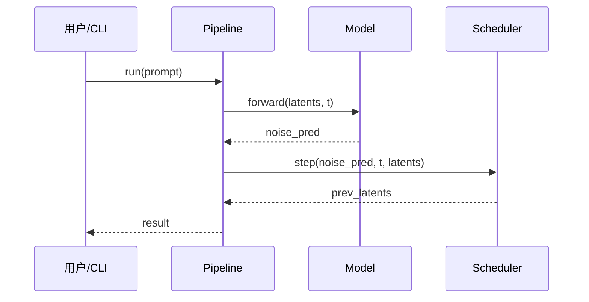

# Phase 5: 依赖安装与核心源码深读

**目标**：先完成依赖安装或明确跳过原因，再深入阅读核心源码，提取关键设计、数据流、算法实现，形成技术理解。不得在依赖未安装、入口不可导入且未标注边界的情况下，把调用链写成已验证实现。

## 5.0 依赖安装与可导入性检查

进入核心源码深读前，必须先执行 Phase 4 确定的依赖安装计划。

### 安装原则

| 项目 | 要求 |
|------|------|
| 隔离环境 | 使用项目专用 venv/conda/uv/npm/go module 环境，避免污染全局环境 |
| 最小依赖 | 先安装阅读目标相关的最小依赖集，不默认安装所有 GPU/大模型依赖 |
| 官方入口 | 优先使用 README、docs、Makefile、pyproject、package.json 中声明的安装命令 |
| 多语言仓库 | 前端、后端、Python、Go、原生库依赖分别检查，不把其中一个成功当成全仓库成功 |
| 跳过边界 | GPU、外部 API key、系统 C 库、依赖体积不满足时可以跳过运行，但必须记录原因 |

### smoke test

安装后至少执行以下轻量检查：

```bash
# Python：确认包和关键模块可导入
python -c "import package_name; print('import ok')"

# CLI：确认入口可解析参数
python main.py --help

# Node：确认依赖安装与脚本存在
npm run --silent

# Go：确认模块可解析
go test ./... -run TestNonExistent 2>/dev/null || true
```

> 上面的命令是模板，必须按实际仓库替换包名、入口和脚本。smoke test 失败时，先判断是依赖、平台、密钥、系统库还是源码问题；不得把依赖缺失错误写成架构结论。

## 扫描顺序（按项目类型选择）

### AI/ML 仓库

| 优先级 | 目录 | 关注点 |
|--------|------|--------|
| 1 | `models/`, `modules/`, `network/` | 模型结构 |
| 2 | `pipeline/`, `inference/`, `sample.py` | 推理路径 |
| 3 | `train.py`, `trainer/`, `losses/` | 训练路径 |
| 4 | `datasets/`, `transforms/` | 数据路径 |
| 5 | `configs/` | 关键超参 |
| 6 | `eval/`, `metrics/` | 评估方式 |

### Web/App 仓库

| 优先级 | 目录 | 关注点 |
|--------|------|--------|
| 1 | `app/`, `pages/`, `routes/` | 路由结构 |
| 2 | `components/` | UI 组件层 |
| 3 | `lib/`, `services/`, `api/` | 业务逻辑 |
| 4 | `db/`, `schema/`, `prisma/` | 数据模型 |
| 5 | `auth/`, `middleware/` | 权限/中间件 |
| 6 | `deploy/`, `Dockerfile`, `.github/workflows/` | 部署 |

### Library/CLI 仓库

| 优先级 | 关注点 |
|--------|--------|
| 1 | public API / exports |
| 2 | CLI entry |
| 3 | core engine |
| 4 | config parser |
| 5 | plugin/extension mechanism |
| 6 | tests as usage spec |

## AI/ML 仓库重点提取

| 维度 | 需要提取的内容 |
|------|---------------|
| 数据流 | tensor shape 变化、数据从输入到输出的完整路径 |
| 核心类 | 关键类与 `forward` 方法 |
| Loss | 损失函数组成与权重 |
| Tokenizer | 编码/解码方式 |
| Encoder/Decoder | 特征提取与重建 |
| Scheduler | 采样/扩散调度策略 |
| Sampler | 采样器实现 |
| Checkpoint | 模型加载/注册机制 |
| Tricks | EMA、mixed precision、gradient checkpointing、cache、分布式策略 |

## 代码摘录规范

| 规则 | 说明 |
|------|------|
| 长度限制 | 每段代码不超过 40 行 |
| 精选原则 | 只摘最能解释设计的片段 |
| 标注来源 | 必须标注文件路径和类/函数名 |
| 避免复制 | 不要大段复制 README |
| 博客落地 | 被选为关键设计点、主调用链节点或核心算法的源码，最终博客中必须直接插入代码框，不得只写文件路径和文字概括 |

### 摘录格式

```python
# src/models/backbone.py :: Backbone.__init__
class Backbone(nn.Module):
    def __init__(self, in_channels=3, hidden_dim=256):
        self.encoder = nn.Sequential(
            nn.Conv2d(in_channels, 64, 3, padding=1),
            nn.ReLU(),
            nn.Conv2d(64, hidden_dim, 3, padding=1),
        )
```

## 用伪代码提炼核心算法（强烈推荐）

对于**逻辑复杂的核心算法/流程**（训练循环、采样过程、调度逻辑、关键业务流程等），直接贴 40 行源码往往淹没在工程细节里。更好的方式是用**伪代码**提炼"它到底做了什么"，剥离掉错误处理、日志、类型转换等噪音，只留主干逻辑。

| 规则 | 说明 |
|------|------|
| 何时用 | 算法/流程逻辑复杂、源码被工程细节淹没时 |
| 写什么 | 主干步骤、关键分支、循环、数学操作；省略 IO/日志/异常 |
| 配对源码 | 伪代码上方标注它对应的文件::函数，让读者能回到源码核实 |
| 不要 | 不要把伪代码写成另一种语言的可运行代码；它是"解释"不是"实现" |

示例（对应 `src/schedulers/ddpm.py::DDPMScheduler.step`）：

```text
# 伪代码：DDPM 单步去噪 —— src/schedulers/ddpm.py::DDPMScheduler.step
function step(model_output, timestep, sample):
    α_t, α_bar_t ← lookup(timestep)
    # 1. 由预测噪声反推 x0
    pred_x0 ← (sample - sqrt(1 - α_bar_t) * model_output) / sqrt(α_bar_t)
    # 2. 计算后验均值
    mean ← coef1(t) * pred_x0 + coef2(t) * sample
    # 3. t>0 时加入随机噪声，t==0 时直接返回均值
    if timestep > 0:
        return mean + sqrt(variance(t)) * gaussian_noise()
    return mean
```

> 产出博客时，伪代码可用 html-blog 的 Algorithm 组件呈现，且**推荐与对应的 Mermaid 流程图放进同一个 `code-tabs`** 区块（一个 tab 看图、一个 tab 看伪代码），避免正文纵向堆叠。

## 用 Mermaid 时序图画核心调用链（强烈推荐）

主调用链除了文字描述，**强烈推荐**画成 Mermaid 时序图，直观展示对象间的调用与数据流（按复杂度灵活决定，不卡 Gate）：



> 时序图通过 `` shortcode 渲染。语法自检规则同 `code-map.md` 4.5。

## 关键设计提取

完成深读后，形成 3-6 个最值得讲的设计点：

| 设计点 | 文件路径/函数 | 为什么值得讲 |
|--------|--------------|-------------|
| 设计点 1 | `src/xxx.py::func` | 解决了什么问题 |
| 设计点 2 | `src/yyy.py::Class` | 什么巧妙之处 |
| ... | ... | ... |

---

## Gate 条件

进入 Phase 6 前必须满足：

1. **依赖安装阶段已完成**：已安装最小依赖并通过 import/入口 smoke test；或已因 GPU、外部密钥、系统库、依赖体积等原因明确跳过并记录未验证边界
2. **主调用链已完整提取**，从入口到核心实现（推荐配 Mermaid 时序图）
3. **3-6 个关键设计点**已识别，每个有代码证据
4. **代码摘录规范**符合（≤40行、标注来源、精选原则），且关键设计点已准备可直接插入博客的源码代码框片段
5. **复杂核心算法已用伪代码提炼**（若存在这类算法；纯 CRUD/简单逻辑可跳过）
6. **禁止假验证**：未安装成功或未通过 smoke test 的链路，只能写“源码阅读结论/未运行验证”，不能写“已验证运行”
7. **todo 状态**：Phase 5 标记为 `completed`，Phase 6 标记为 `in_progress`

不满足？补齐后重新检查 Gate。
