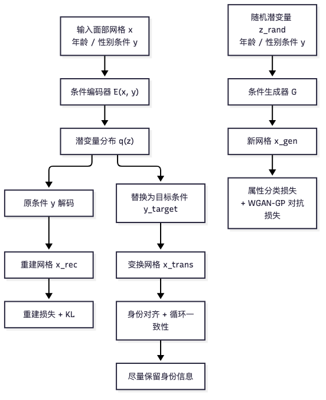
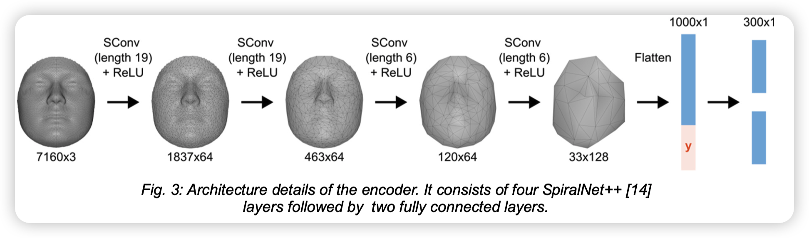
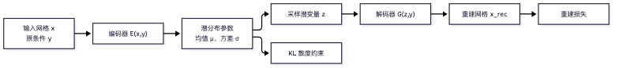
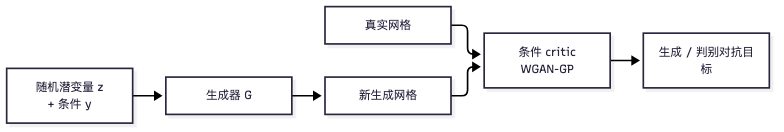
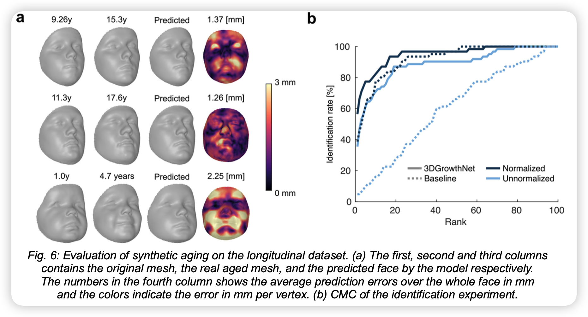
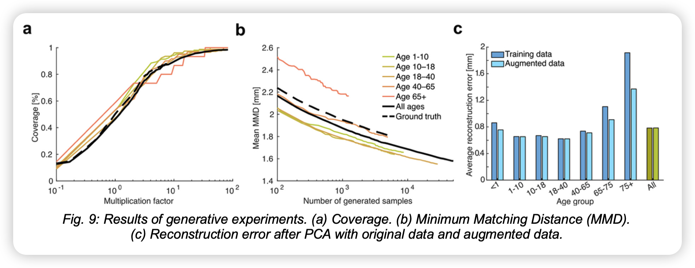
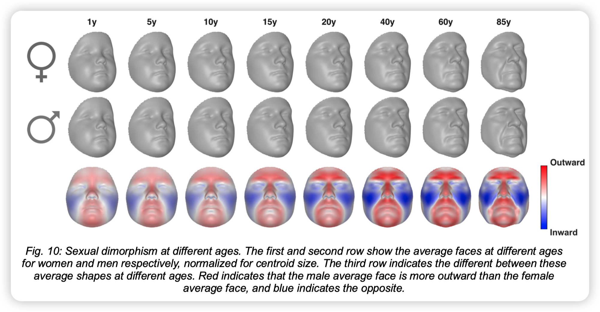
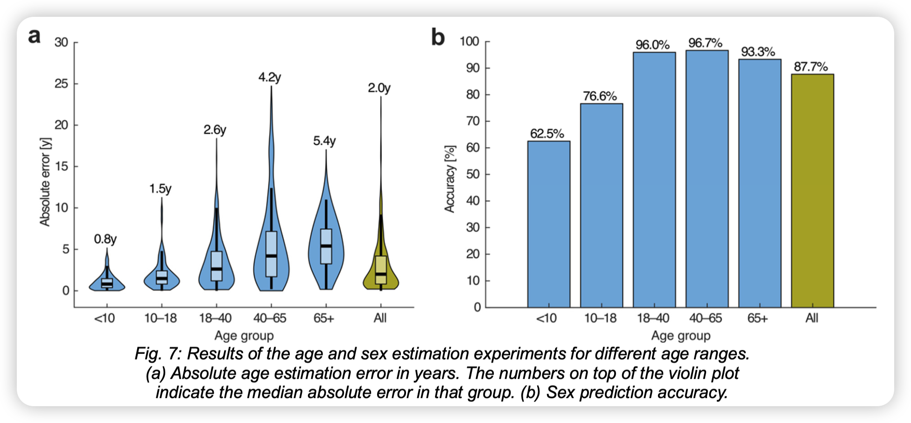

#+TITLE: 3DGrowthNet：连续年龄条件下的 3D 面部生长建模
#+SLUG: 3dgrowthnet
#+TYPE: paper-reading
#+STATUS: drafting
#+PROGRESS: 45
#+TARGET_ALIAS: categories/AI/数字人
#+TARGET_SUB_ID: auto
#+TARGET_HUB:
#+PIN: false
#+SOURCE_URL: https://doi.org/10.15221/25.27
#+TAGS: [数字人, 3D人脸, 面部生长, 条件生成]
#+CREATED_AT: 2026-10-09T15:49:37
#+UPDATED_AT: 2026-10-09T17:52:00
#+PUBLISHED_AT:
#+PUBLISHED_FILE:

* 3DGrowthNet：连续年龄条件下的 3D 面部生长建模

** 先看全局：这篇论文想做什么？

论文提出多任务几何深度学习框架，在稠密 3D 面部网格上实现连续合成老化、年龄/性别估计和条件形状生成（Abstract；Methods §2.1，PDF 第 1、3 页）。

先用一句话概括论文设计： *模型把输入面部编码成潜在表示，再把年龄和性别作为可控条件输入生成器；训练目标同时要求输出能重建输入、符合目标属性、尽量保留个体信息，并且整体形状像真实样本。* 这些目标鼓励模型学习条件控制和身份保持，但不等于各因素已被严格分离。

#+ATTR_HTML: :width 100% :max-height 380px :align center

这是方法的概念流程图。各分支的损失对象和训练阶段见下文“联合训练”。

组件各司其职：

- /年龄/性别分类器/ ：检查随机潜变量生成的合成网格是否符合指定属性；年龄头用 L2，性别头用 binary cross-entropy（Methods §2.5）。
- /年龄嵌入器/ ：将连续年龄转为网络可用的条件向量；以加噪年龄和分类器中间特征监督，使用三层全连接网络（Methods §2.7）。
- /CVAE 编码器/解码器/ ：表示输入网格并执行重建或条件生成；编码器由四层 SpiralNet++ 卷积和两层全连接组成，解码器采用镜像结构（§2.4）。
- /身份与循环约束/ ：以潜在表示对齐和网格循环重建，鼓励变换后保留身份相关信息并支持恢复（§2.4）。
- /GAN 判别器/ ：使用 WGAN-GP，使随机潜变量生成的网格接近真实形状分布（§2.6）。

/核心问题与解法速览/

-  *问题是什么？* 改变年龄条件时，如何生成合理的 3D 面部形状，同时尽量保留个体身份？另外， *个体年龄变换和按属性生成新面孔* 是不同任务。
- *作者的解决办法* ：将连续年龄嵌入、年龄/性别属性监督、CVAE 潜变量、身份与循环约束及 GAN 真实性目标整合到一个多任务 CVAE-GAN 框架中（Abstract；Methods §2.1–2.8）。
- *核心思想（直觉解释）* ：让潜变量承载输入个体的信息，让年龄/性别作为显式生成条件；再用互补的训练目标分别约束形状保真、条件正确、身份保持和分布真实性。它们共同鼓励一种分工，但不保证潜表示具有严格、纯净的语义解耦。
- *具体机制* ：先预训练年龄/性别分类器和连续年龄嵌入器，再分阶段训练 CVAE-GAN。cycle loss 以真实标签编码、随机标签变换、再次编码并恢复原标签；identity loss 对齐变换前后的潜表示。属性分类与 GAN 损失施加在随机潜变量生成的合成样本上（Methods §2.4–2.8）。

** 任务与表示：模型要区分哪些信息？

将一个带标注的三维面部样本记为 \((\mathbf{x}_i,a_i,s_i)\)：\(\mathbf{x}_i\in\mathbb{R}^{7160\times 3}\) 是由 7,160 个对应准地标组成的面部网格，\(a_i\in[0,88]\) 是年龄，\(s_i\in\{0,1\}\) 是论文采用的二元性别标签。把人口统计条件合写为 \(\mathbf{c}_i=(a_i,s_i)\)。训练集可写作

\[
\mathcal{D}=\{(\mathbf{x}_i,\mathbf{c}_i)\}_{i=1}^{N},\qquad N=5{,}443.
\]

模型包含条件编码器 \(q_{\phi}(\mathbf{z}\mid\mathbf{x},\mathbf{c})\) 与条件解码器 \(G_{\theta}(\mathbf{z},\mathbf{c})\)。编码器将输入网格及其条件映射为潜变量分布；从中取样 \(\mathbf{z}\)，解码器再根据指定条件生成网格。这里的 \(\mathbf{z}\) 是模型学习到的潜在表示，不预先等同于纯粹的身份编码。

论文涉及的任务可以具体写成以下形式。

1. /条件重建/ ：给定真实样本及其条件，编码并用原条件解码，得到
   \[
   \hat{\mathbf{x}}_i^{\mathrm{rec}}=G_{\theta}(\mathbf{z}_i,\mathbf{c}_i),\qquad
   \mathbf{z}_i\sim q_{\phi}(\mathbf{z}\mid\mathbf{x}_i,\mathbf{c}_i).
   \]
   目标是使 \(\hat{\mathbf{x}}_i^{\mathrm{rec}}\) 接近输入 \(\mathbf{x}_i\)，同时以 KL 项约束潜变量分布。

2. /个体条件变换（合成老化）/ ：对同一个输入个体，保持输入潜变量 \(\mathbf{z}_i\)，把原条件 \(\mathbf{c}_i=(a_i,s_i)\) 替换为目标条件 \(\mathbf{c}_t=(a_t,s_i)\)，生成
   \[
   \hat{\mathbf{x}}_{i\rightarrow t}=G_{\theta}(\mathbf{z}_i,\mathbf{c}_t).
   \]
   任务要求输出符合目标年龄条件，同时尽量保留输入个体身份。若以 \(\operatorname{ID}(\cdot)\) 表示外部身份特征，这一直觉目标可写为
   \[
   \operatorname{ID}(\hat{\mathbf{x}}_{i\rightarrow t})\approx\operatorname{ID}(\mathbf{x}_i),
   \qquad \operatorname{Age}(\hat{\mathbf{x}}_{i\rightarrow t})\approx a_t.
   \]
   这只是任务期望的数学表达；论文中的 identity、属性与 cycle loss 是对该期望的代理约束，并不意味着训练中直接获得了真实身份函数，也不保证生成结果等于该个体真实未来。

3. /按条件生成新面孔/ ：不输入特定个体网格，而从先验取样潜变量 \(\mathbf{z}\sim p(\mathbf{z})\)，给定年龄/性别条件生成
   \[
   \hat{\mathbf{x}}=G_{\theta}(\mathbf{z},\mathbf{c}),\qquad \mathbf{c}=(a,s).
   \]
   此任务要求样本整体符合指定条件及真实面部形状分布，但没有某个输入身份需要保持。

4. /属性估计/ ：论文还用重建误差搜索年龄或性别条件。给定网格 \(\mathbf{x}\)，其形式可概括为
   \[
   \hat{a}=\arg\min_{a\in\mathcal{A}}\mathcal{L}_{\mathrm{rec}}(\mathbf{x},a,s),\qquad
   \hat{s}=\arg\min_{s\in\{0,1\}}\mathcal{L}_{\mathrm{rec}}(\mathbf{x},a,s),
   \]
   其中搜索年龄时固定性别，搜索性别时固定年龄；论文年龄搜索范围为 0–88 岁、步长 0.1 年（§3.3）。

因此，核心不是笼统地说“把身份、年龄、性别解耦”，而是区分：条件 \(\mathbf{c}\) 如何输入模型；改变条件时潜变量及身份相关信息如何受到约束；以及生成结果是否符合条件、数据分布和实验评估。存在 identity loss 或属性分类损失，只能说明模型受到相应目标的训练约束，不能据此断言潜表示实现了严格统计独立或因果解耦。

** 关键点一：让年龄与性别成为可控条件

/3.1 预训练属性分类器：准备“检查器”/

原文 §2.5（PDF 第 5 页）说明，预训练年龄/性别分类器沿用编码器类型的卷积层，接两个多层感知机输出头；年龄头用 L2，性别头用 binary cross-entropy。分类损失作用于从潜空间采样、随机指定人口统计标签生成的合成网格，而非重建或个体条件变换网格。论文在主模型阶段使用该分类器提供属性监督。

分类器提供年龄和性别的属性监督，但不能单独保证 CVAE 潜变量不携带年龄信息，也不能保证年龄条件只改变年龄相关形态。模型中的身份约束、循环一致性与实验评估共同检验条件变换和身份保持。

分类器在训练主模型前预训练 100 epochs，学习率为 \(5\times10^{-5}\)（Methods §2.8）。

/3.2 连续年龄嵌入：把年龄变成模型可用的向量/ 

原文 §2.7（PDF 第 5 页）说明，年龄嵌入器把连续年龄映射为与年龄分类器最后线性层之前特征同维度的向量。方法将预训练分类器拆分为特征网络与最后的分类层，以加噪年龄作为输入，通过最小化分类层对嵌入特征的年龄预测误差训练嵌入器。嵌入网络包含三个全连接层，宽度为 16、32、64，各层后接 ReLU；年龄噪声标准差为 0.5 年。预训练 50 epochs，学习率为 \(10^{-4}\)（Methods §2.8）。性别标签随后与年龄嵌入拼接形成条件向量，并分别在编码器、解码器和判别器的指定层注入。

*本节小结* ：分类器回答“生成结果像不像目标属性”，年龄嵌入器回答“如何把连续年龄交给网络”。两者是条件控制工具，不是解耦已经成功的证明。

#+ATTR_HTML: :width 100% :max-height 240px :align center
（论文 Fig. 1/3）

** 关键点二：用 CVAE 学会表示与重建面部

要在改变年龄后尽量保持身份，模型首先要能表示和重建输入面部。论文 §2.4（PDF 第 4 页）定义主体为 CVAE：编码器根据网格及年龄/性别条件推断潜分布，采样潜变量 \(z\)；解码器结合条件生成重建网格。编码器由四层 SpiralNet++ 卷积层和两层全连接层构成，末层分别输出潜向量的均值与对数方差；解码器采用镜像结构。

#+ATTR_HTML: :width 100% :max-height 320px :align center

- /重建损失/ ：按对应顶点计算输入网格与重建网格之间的平方欧氏距离，并对顶点取平均（Methods §2.4）。
- /KL 项/ ：对批次中编码器得到的潜分布计算 KL 散度，使其受先验分布约束并支持潜空间采样（Methods §2.4）。

原文 §2.3（PDF 第 3 页）确认：数据来自四个中心，共 5,443 个 3D 表面扫描，年龄 0–88 岁；纵向子集为 60 名儿童，每人约六年后随访一次。因其他族群样本有限，分析仅保留自报 European、Australian 或 “white” ancestry 个体。网格用 MeshMonk 得到 7,160 个稠密准地标，并经 Generalised Procrustes Analysis 刚性对齐。§2.8（PDF 第 6 页）说明按 85%/10%/5% 划分 train/test/validation，并按年龄段分层；所有纵向个体均放入 test set。

*潜变量是否就是身份？* 不能这样预设。如果年龄/性别与网格共同进入编码器，潜变量可能仍包含人口统计信息；训练数据相关性也会影响表示。原文 §2.4 的 identity loss 通过对齐变换前后的特定潜表示来鼓励身份相关信息稳定，但不能证明潜在表示中已不存在年龄/性别信息。

** 关键点三：换目标条件，尽量保留身份

*** 条件变换的基本路径

对输入网格 \(x\)，先用真实条件 \(y_{true}\) 编码，再把目标条件 \(y_{target}\) 交给解码器：

\[z=E(x,y_{true}),\qquad x_{trans}=G(z,y_{target}).\]

这里的直觉是：\(z\) 提供输入个体信息，\(y_{target}\) 指定希望生成的属性。但这是设计意图，不是仅凭公式就能保证的信息分离。

*** 属性损失：输出要符合目标年龄/性别

分类器损失作用于从潜空间采样并随机指定年龄/性别标签得到的合成网格，而不是条件重建网格或个体条件变换网格（Methods §2.5）。年龄头使用 L2 损失，性别头使用 binary cross-entropy；该监督训练模型生成符合指定人口统计条件的合成样本。

*** 身份损失：改变属性时不要“换了个人”

原文 §2.4（PDF 第 4 页）比较原网格在真实标签下的潜变量，与变换网格在随机标签下重新编码的潜变量。作者将其解释为促进人口统计属性与个体身份在潜在空间中分离；该目标约束指定的编码表示接近，不足以证明所有身份特征均保持不变。

*** 循环一致性：条件换过去再换回来

原文 §2.4（PDF 第 4 页）：先以真实人口统计标签编码输入，再以随机标签解码成变换网格；将变换网格以同一随机标签重新编码，最后以原始标签解码回重建网格，并以网格重建误差计算循环一致性损失。它鼓励条件变化后信息仍可恢复，但不能单独证明中间轨迹等同真实纵向生长。

三类约束各自提供有限证据：

- /年龄/性别监督/ 要求输出符合指定条件，但不证明改变条件只影响对应属性。
- /身份约束/ 要求变换前后特定表示接近，但不证明所有个体特征都保持不变。
- /循环一致性/ 要求往返变换后恢复输入，但不证明中间变化符合真实生物规律。

** 关键点四：GAN 帮助生成更真实的形状

重建损失关心“这个输出是否接近这个输入”；判别器关心“生成样本整体是否像真实网格”。二者互补：只有重建目标可能得到平滑平均结果，只有对抗目标则不一定保留指定个体。

原文 §2.6（PDF 第 5 页）使用 WGAN-GP。判别器与分类器结构类似，增加线性层输出连续真实性分数；判别器及生成器损失基于新生成的随机潜变量样本，而不是重建网格。梯度惩罚约束 critic 的 Lipschitz 连续性。

#+ATTR_HTML: :width 100% :max-height 260px :align center

对抗训练约束分布层面的形状真实性，不会自动保证年龄方向正确，也不能单独保证身份保持。

** 联合训练：各个目标怎样协作？

以下按前向数据流说明论文的多任务训练；阶段安排和优化设置见 Methods §2.8。

1. 取一批真实面部网格及其年龄/性别标签。
2. 编码网格并采样潜变量，用真实条件重建输入；计算重建与 KL 项。
3. 将条件替换成目标年龄/性别，解码得到条件变换网格。
4. 通过随机人口统计标签解码变换网格，并重新编码、解码以计算 cycle consistency loss；对变换前后的潜在表示计算 identity loss。
5. 从潜空间采样并指定随机年龄/性别标签，生成不对应特定输入个体的新网格；在这些合成网格上计算属性分类损失。
6. 判别器以真实网格和随机潜变量生成的网格计算 WGAN-GP 损失；生成器以新生成网格计算对抗损失，并与其他已启用目标共同优化。
7. 按训练阶段逐步加入属性损失、循环一致性损失和身份对齐损失。

论文 §2.8（PDF 第 6 页）给出以下训练设置：年龄/性别分类器预训练 100 epochs，年龄嵌入器预训练 50 epochs；CVAE-GAN 共训练 500 epochs，批次大小为 32，初始学习率为 \(10^{-3}\)，每个 epoch 学习率乘以 0.99。主模型前 50 epochs 不使用年龄/性别分类损失、循环一致性损失和身份对齐损失；50 epochs 后加入属性损失，100 epochs 后再加入循环一致性与身份对齐损失。判别器每个 batch 更新一次，学习率为 \(10^{-6}\)。所有组件使用 Adam 优化器。

各损失约束的对象不同：

- /重建/ ：输入网格与按原条件重建的网格；逐顶点平均平方欧氏误差（§2.4）。
- /KL/ ：批次编码得到的潜分布与先验之间的散度（§2.4）。
- /年龄/性别/ ：随机潜变量与随机人口统计标签生成的网格；分别用 L2 和 binary cross-entropy（§2.5）。
- /身份/ ：原网格真实标签下的潜表示，与变换网格随机标签下重编码表示之间的差异（§2.4）。
- /循环/ ：真实标签编码、随机标签解码，再以随机标签编码并以原标签解码；比较所得网格与输入（§2.4）。
- /对抗/ ：WGAN-GP critic 比较真实网格与随机潜变量生成的网格，生成损失也作用于新生成样本（§2.6）。

原文 §2.8（PDF 第 6 页）给出主模型总损失：

\[
\mathcal{L}_{\mathrm{total}}=\mathcal{L}_{\mathrm{rec}}+\alpha\mathcal{L}_{\mathrm{KL}}+\beta_1\mathcal{L}_{\mathrm{cyc}}+\beta_2\mathcal{L}_{\mathrm{id}}+\beta_3\mathcal{L}_{\mathrm{age}}+\beta_4\mathcal{L}_{\mathrm{sex}}+\beta_5\mathcal{L}_{G}.
\]

论文设置为 \(\alpha=10^{-4}\)、\(\beta_1=10^{-2}\)、\(\beta_2=0.15\)、\(\beta_3=\beta_4=5\times10^{-4}\)、\(\beta_5=10^{-4}\)。判别器使用独立的 WGAN-GP 损失 \(\mathcal{L}_{D}\)，每个 batch 更新一次。其中年龄与性别分类损失作用于随机潜变量和人口统计标签生成的网格；判别器通过独立的 WGAN-GP 损失更新。

** 训练后可以走哪些推理路径？

/个体年龄变换/ ：给定个体网格和其年龄，编码得到潜变量；指定目标年龄后解码生成变换网格。由横断面数据学到的人群平均年龄关联，不自动等于准确预测某个人未来的真实生长轨迹。

/年龄/性别估计/ ：论文 §3.3（PDF 第 8 页）报告以重建误差搜索标签：年龄在 0–88 岁间以 0.1 年步长搜索并固定性别；性别估计则固定真实年龄，比较男/女标签的重建误差。

/条件新样本生成/ ：从潜先验采样 \(z\)，指定年龄/性别条件后解码新面孔。这不是特定个体的年龄变换，因为没有给定身份输入。

** 实验结果：哪些证据支持了哪些主张？

论文 §3（PDF 第 7–10 页）分别报告重建、纵向年龄变化与识别、年龄/性别估计及条件生成实验；纵向与识别评估见 Fig. 6，估计结果见 Fig. 7，生成评估见 Fig. 9。

#+ATTR_HTML: :width 100% :max-height 240px :align center
（论文 Fig. 6）

- /网格重建/ ：平均 RMSE 0.74 mm；同数据 PCA（保留 97% 方差）为 0.78 mm。对所有顶点计算平均 RMSE（§3.1，PDF 第 7 页）。
- /纵向年龄变化/ ：60 名儿童、随访约 6 年；尺寸归一化后误差 2.00 mm，未归一化为 2.40 mm；误差随初次年龄增加而下降（\(p=0.005, r=-0.35\)）。纵向个体全部在测试集（§2.3、§3.2，PDF 第 3、7–8 页）。
- /跨年龄身份识别/ ：归一化条件下 Rank-1 从 39% 提高至 57%，增加 18 个百分点（§3.2，PDF 第 8 页）。
- /年龄估计/ ：重建误差搜索的中位绝对误差为 2.0 年，预训练分类器为 2.30 年；搜索范围 0–88 岁、步长 0.1 年并固定性别（§3.3，PDF 第 8 页）。
- /性别估计/ ：重建误差比较男/女性别标签的准确率为 87.7%，预训练分类器为 89.7%；固定真实年龄，低龄组准确率较低（§3.3，PDF 第 8 页）。
- /条件形状生成/ ：coverage 随样本数增加至 98.7%，MMD 约 1.58 mm；在尺寸归一化形状上计算（§3.4，PDF 第 9–10 页）。

这些结果只支持对应数据和协议下的主张。纵向误差、跨年龄识别、标签估计和合成样本质量回答的是不同问题，不能合并成“模型已经完全解耦并准确预测个人成长”。

#+ATTR_HTML: :width 100% :max-height 240px :align center
（论文 Fig. 9）

#+ATTR_HTML: :width 100% :max-height 240px :align center
（论文 Fig. 10）

#+ATTR_HTML: :width 100% :max-height 240px :align center
（论文 Fig. 7）

** 结论、边界与正畸问题的联系

*关键点总结* ：根据论文方法，模型以年龄和性别作为显式条件，通过 CVAE 表示与重建面部，再结合属性监督、身份/循环约束和对抗目标训练。各目标共同鼓励条件控制与身份保持，但不构成严格解耦或真实生长因果的证明。

*把“解耦”说准确*

- *模型目标* ：属性变化时尽可能保留个体身份，并让结果符合目标条件。
- *可检验的证据* ：原文报告纵向误差、跨年龄身份识别、年龄/性别估计与生成质量指标；这些实验分别支持有限范围的主张，并非严格解耦的普遍证明。
- *不能直接推出* ：一个潜空间距离损失、分类器分数或循环重建结果，都不足以证明身份/年龄/性别在表征中严格独立，更不能单独证明模型学到了个体真实的因果生长机制。

*与正畸预测的联系* ：自然面部年龄变化可作为背景，但预测正畸治疗后的面部状态还需治疗方案、咬合与骨骼状态、治疗时长、依从性等信息，并区分自然生长和治疗干预。年龄条件下生成面部形状，不等同于回答某位患者接受某种治疗后的反事实结果。
