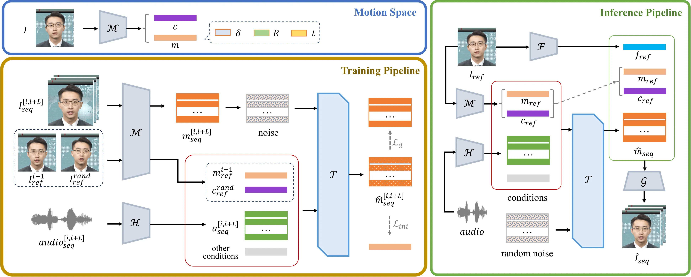
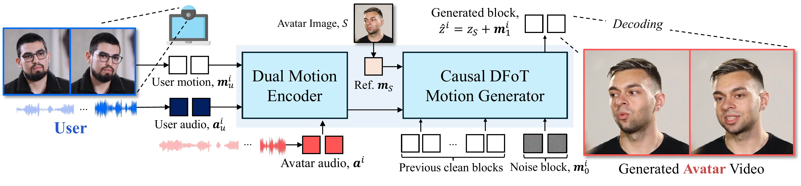

#+SLUG: about-digital-human
#+TITLE: 关于数字人
#+TYPE: original
#+STATUS: drafting
#+PROGRESS: 70
#+TARGET_ALIAS: categories/杂识
#+TARGET_SUB_ID: auto
#+PIN: false
#+SOURCE_URL: 
#+TAGS: [数字人, TalkingHead, 系统架构, 实时交互]
#+CREATED_AT: 2026-07-11T22:30:17
#+UPDATED_AT: 2026-08-25T15:22:28
#+PUBLISHED_AT: 
#+PUBLISHED_FILE: 

* 关于数字人

讨论数字人时，需要先区分两个层次：*数字人*（生成模型）和*数字人系统*（产品）。

** 数字人：一个生成任务

数字人本质上是一个视频生成任务：

1. *输入身份条件*：一张图片、一段视频，或一个固定的数字人资产
2. *创建形象*：根据输入条件生成数字人的外观
3. *输入驱动信号*：文本或语音
4. *输出表演视频*：数字人形象按照驱动信号表演出一段内容匹配的人物视频

** 输出质量的两个维度

对输出视频的要求可以从两个正交维度来理解：

*** 生成质量（从无到有，逐步覆盖更多身体部位）

- *唇部同步*（lip sync）：最基本——嘴型和输入的音频/文本匹配
- *面部表情*：不仅是嘴，还有眉毛、眼神等，符合表达的情绪
- *头部姿态*：点头、转头、侧倾等自然头部运动
- *手部动作*：手势跟随语义，如比划、招手
- *全身运动*：身体节奏、重心转移、步态

*** 工程性能（从离线到实时）

- *离线生成*：生成完整视频，不要求速度
- *近实时*：秒级延迟，可接受简单缓冲
- *实时交互*：毫秒级响应，支持双向对话、打断和持续流式输出

*** 实现方案：技术路线

- *结构化 Motion Policy*：不直接生成像素，而是生成结构化的运动参数。常用参数化模型：
  1. *FLAME*：头部/人脸参数化网格模型，输出表情与头部姿态系数
  2. *SMPL-X*：全身参数化网格模型（身体 + 手 + 脸统一），全身运动的通用载体
  3. *MANO*：手部参数化模型，手势生成的专用表示
  代表工作：EMAGE（face/body/hands/global motion 统一到 SMPL-X/FLAME）、Audio2Photoreal（音频生成的 face/body/hand motion 接个性化 renderer）、EMO2（把 MANO 当 End-Effector 生成手势）。
  优点：可解释、可控、动作可以单独评估；缺点：输出是 motion，仍需 renderer 才能变成最终画面。
- *Latent Inpainting（早期 2D talking head 路线）*：在 latent 空间只重绘嘴部/人脸区域，条件是 landmark、mask 或 latent 特征。代表：Wav2Lip（lip-sync expert 只改嘴）、SadTalker（3DMM 系数 + 3D-aware render）、AniPortrait。
- *Motion Diffusion（潜空间运动扩散）*：扩散模型在这里不生成像素，而是生成低维运动表示（motion latent），再交给轻量渲染链路——扩散从像素空间退到低维运动空间，是实时性的关键交换。代表：
  1. *Ditto*：motion-space diffusion，音频 → latent motion
  2. *VASA-1*：音频 → face dynamics latent
  3. *Avatar Forcing*：motion latent space 里的 Diffusion Forcing（DFoT），生成的其实是控制动作，不是画面
  4. JoyVASA（解耦表征 + 扩散运动生成）、DiffSHEG（扩散同时生成表情与手势）、ChatAnyone（motion diffusion + fast renderer，扩散留在紧凑运动空间、实时性交给渲染系统）
- *视频扩散基模（像素/latent 视频扩散）*：把通用视频生成大模型改造成数字人生成器。演进四阶段：Animate Anyone（ReferenceNet + pose guider 证明扩散可控人物视频）→ EMO（audio-to-video diffusion 直接驱动表情）→ 音频注入视频 DiT（OmniAvatar 基于 Wan2.1、HunyuanVideo-Avatar 用 MM-DiT、Hallo3、InfiniteTalk 长视频）→ 实时化（Live Avatar 14B 扩散做到 45 FPS、StreamAvatar 自回归适配、LLIA 用 consistency model + INT8 量化做到 78 FPS）。
- *不用扩散的路线*（对照）：LivePortrait（隐式关键点前馈，12.8ms 推理）、LHM/MATCH（前馈重建）、EGSTalker/GaussianTalker（3DGS 变形）、LiteAvatar（纯 CPU 2D 驱动引擎）。
- *LoRA 的用法（以 OmniAvatar 为例）*：音频经 Audio Pack 对齐视频 latent 后，以像素级多层 latent 注入 Wan2.1 DiT；同时在 attention 和 FFN 层加 LoRA（rank 128 / alpha 64）。用 LoRA 而非全量微调的核心原因不是省显存，而是*避免破坏基础模型的 prompt controllability*——文本提示仍要控制场景、动作、背景、情绪；全量训练会把模型过度拉向音频同步任务。消融显示 LoRA 与音频注入策略共同影响同步和运动质量。扩散基模路线的通用轻量适配套路：cross-attention / mask adapter / reference injection / 蒸馏 + LoRA。

* Ditto：把扩散搬进运动空间（[[file:../src/pages/paper-ditto.html][论文精读]] · [[file:../src/pages/ditto-talkinghead.html][源码解读]]）

Ant Group（ACM MM 2025）。核心思路是把扩散模型从图像空间搬到 motion space：Conditional DiT 只生成低维、可控的面部运动序列（音频经 HuBERT 提特征作条件），身份、纹理和像素细节全部交给 one-shot renderer——"谁在说话"和"怎么动"分开处理。两阶段：离线推理一次性处理整段音频；流式推理按音频 chunk 连续输出（cache + causal mask + 片段融合），online RTF 0.895、首帧延迟 385ms、10 步去噪。也支持 gaze/emotion/pose 显式控制。我们实际跑过它的开源实现：TensorRT/ONNX/PyTorch 三种权重形态，online 模式按 chunksize (3,5,2) 切音频逐块喂入。

* Avatar Forcing：扩散强制驱动的实时交互（[[file:../src/pages/avatar-forcing-2026.html][论文精读]]）

KAIST（CVPR 2026）。在上面 Ditto 基础上把"单向说话"推进到"交互"：在 motion latent space 中用 Diffusion Forcing（DFoT，per-frame 独立噪声）做因果自回归生成，条件三元组 = 用户音频 + 用户运动（从用户视频提取）+ avatar 自身音频，经 Dual Motion Encoder 融合，推理延迟 ~500ms。额外用免标注 DPO 提升表达性：drop 掉用户条件生成的运动天然低表达性，直接当 losing sample，人类评估偏好率 >80%。我们还实测过快手 Kling AI 的工业版 AvatarForcing：有界前瞻滑窗联合去噪 + 双锚 KV cache + 两阶段流式蒸馏，1.3B student 模型压到 34 ms/帧（详见[[file:../src/pages/avatarforcing-2026.html][精读五十一]]）。

** 数字人系统：从模型到产品

数字人系统更接近一个产品。除了表面的数字人渲染，底层还需要一整套组件来提供驱动输入：

| 组件 | 作用 |
|------|------|
| *ASR*（自动语音识别） | 把用户的语音输入转成文字 |
| *LLM*（大语言模型） | 理解上下文，生成回复文本 |
| *TTS*（文本转语音） | 把文字变成数字人的声音 |
| *Avatar 渲染* | 生成数字人的视觉形象 |

此外，系统通常还会集成外部工具和 Agent 能力（如 RAG 检索、API 调用），使数字人能像智能体一样完成复杂任务。

*** 完整 Pipeline

标准级联链路，全链路 stream→stream"边生成边消费"：

#+BEGIN_EXAMPLE
用户语音 → [VAD 切分] → ASR 流式转写 → LLM 流式生成
  → TTS 分段合成 → Avatar 逐帧驱动 → 视频编码 → WebRTC 下行 → 用户
用户打断沿反方向传播（清空 TTS 缓冲 / Avatar 帧队列 / 下行 buffer）
#+END_EXAMPLE

工程落地为六个 gRPC 流式服务：ASRService.TranscribeStream、LLMService.GenerateStream、TTSService.SynthesizeStream、AvatarService.GenerateStream、VoiceLLMService.Converse/Interrupt、RAGService。

*架构三范式*：
1. *级联管道*（CyberVerse、OpenAvatarChat）：模块可替换，但延迟逐级累加——级联批量 TTFA 13,730ms，流式优化后仍 3,232ms
2. *端到端统一*（A2-LLM）：文本+音频+面部运动统一进一个 LLM 的 token 空间（RVQ-VAE 离散化 + Motion Connector），TTFT 51ms、TTFA 536ms、RTF 0.703x，比流式级联快 6 倍
3. *混合*（Mio）：Thinker（LLM）+ Talker（Kodama-TTS）+ Face/Body Animator 分离

*** 延迟预算

人类停顿容忍约 200-500ms，超过 1s 对话就"不自然"。全链路五段分解：音频采集+编码 10-50ms / 特征窗口 100-2000ms / 模型推理 10-200ms / 视频编码+网络 20-350ms / 播放缓冲+渲染 20-100ms，总计 300ms-3s。

| 阶段 | 关键指标 | 优化方向 |
|------|---------|---------|
| ASR | partial/final 时延 | 流式识别、端点检测、热词 |
| LLM | first token、tokens/s | 小模型路由、缓存、流式输出 |
| TTS | TTFA、chunk 节奏 | 流式 TTS、短句切分（现役 TTFA ~100ms） |
| Avatar | 首帧、FPS、音画漂移 | 轻量模型、滑窗、GPU 队列隔离 |
| RTC | freeze、渲染延迟 | 分层编码、jitter buffer 控制 |

实测教训：FlashHead Lite 单 chunk 生成仅 0.514s，但端到端 TTFF 3.713s——VP8 编码每段 0.5-0.7s、发布队列积压 4.85s，瓶颈在编码与队列而非模型。

*** 打断与双工

OpenAvatarChat 双工打断：VAD 持续运行，检测到用户说话即对输出降音量并停止生成。关键坑：只取消 LLM 不够，TTS 缓冲、Avatar 帧队列、SFU 下行 buffer 必须统一清空，否则"人已换话题、数字人还在自说自话"。VAD 声学触发误打断由 LTS-VoiceAgent 的语义触发（用户说话中实时判断语义完整性才触发推理）+ 投机执行解决。

*** 传输层

WebRTC 建连：SDP Offer/Answer → ICE → STUN/TURN → DTLS/SRTP，线上必须自建 TURN（coturn）。媒体链 jitter buffer 消抖，RTCP Sender Report 把 RTP 时间戳映射到 NTP 做音画同步。降级优先级：先保声音、再保嘴型、最后保画质。

*** 工程化部署

插件化架构（PluginRegistry + YAML 配置驱动）；Go 编排 + Python 推理双进程隔离。CPU 实时方案：LiteAvatar 用 Paraformer 特征 → ONNX 32 维面部参数 → TorchScript 编解码器，纯 CPU 30fps（1 秒滑窗 + 重叠帧插值 + 静音回退中性姿态）。加速手段与代价：蒸馏 10-20×、TensorRT 2-3×、量化 1.5-2×。硬件基准差异巨大：LiteAvatar A10 上 25.19 FPS / 7.5GB，FlashHead Pro 同卡仅 4.8 FPS。

** 交互层级：从半双工到全双工

数字人按交互能力分三级（Synthesia 三级交互模型）：

1. *只能说*（Talk）：给定文本 + 图像生成说话视频。数字人"看起来活着但不响应"，用户说话时它只等自己的回合；长对话中会从"有趣"滑向恐怖谷。所有离线生成系统（SadTalker、Hallo、EMO）都在这一级。
2. *既能听又能说*（Listen）：加入用户音频输入，能倾听、能被打断。这是半双工 → 全双工的分界：半双工靠 VAD 检测静默后轮次切换；全双工边说边听，维护持续的双向交互状态。
3. *还能看*（See）：再加入用户摄像头/视频输入，能看见用户的表情与动作并做出反应。

双工的进化路线：Moshi（160ms）、GPT-4o Realtime API（232-320ms）、ByteDance Seeduplex（端点检测延迟 -250ms）。全双工的三条硬约束（Wan-Streamer 提出）：*因果性*（全链路不能窥探未来）、*流式性*（每 160ms 单元到达即产出）、*全双工性*（输入输出同时间轴共存）。

*Avatar Forcing 是典型的既能听又能看的模型*：条件三元组 = 用户音频 + 用户运动（从用户视频提取）+ avatar 自身音频，经 Dual Motion Encoder 融合成统一条件再驱动生成。但测试下来，它的"听"和"看"效果并没有那么好——这一点有数据层面的佐证：ViCo 数据集里 listener 的表情方差远低于 speaker，训练数据本身就缺乏表达性，模型容易学到被动、僵硬的倾听行为（Avatar Forcing 论文自己也承认，需要靠免标注 DPO 来弥补）。

** 实时性：传输层 + 推理层

实时交互的核心在于推理层与传输层的协同：流式 TTS 分块合成 + Avatar 异步渲染，让文本到视频的全链路能分段执行、减少首帧等待（传输层细节已在"数字人系统"一节展开）。

** 我们对 Avatar Forcing 的三点改造

*** 改造一：视频身份源（参考 Ditto 的人脸定位与拼回）

原版 Avatar Forcing 只支持单张图片作身份源，我们让它支持输入视频。做法参考 Ditto：
- *人脸定位*：移植 Ditto Source2Info._crop 的两阶段裁剪——RetinaFace 检测 → lmk106 粗对齐 → 裁剪 → lmk203 精对齐 → 512×512 旋转校正裁剪，ONNX 权重直接复用 Ditto 的（insightface_det / landmark106 / landmark203）。注意只在首帧定位一次，后续帧用固定 bbox（Avatar Forcing 是单参考帧架构，整段生成相对首帧，且裁剪与贴回共享同一 bbox 才能像素级对齐；Ditto 则是逐帧注册仿射矩阵，允许头部运动）。
- *拼回（pasteback）*：整段视频解码缓存为背景帧，生成的人脸块经仿射 warp 贴回原帧对应位置。不是泊松融合，是四边独立线性羽化的 alpha mask 混合（top 0.02 / bottom 0.08 / side 0.03——下巴侧是接缝必须羽化，头顶侧羽化过宽会让原始头发透出）。另加 AlignmentNet 参考 Ditto stitch network 思想（零初始化只学漂移）做贴回位置校正。
- *管线*：gRPC SetAvatar → 抽首帧 + FaceCropper 裁剪 → 视频帧缓存为背景 → 流式生成 → composite 贴回。

*** 改造二：Anchor Bank（流形吸引 + 转角限速）

解决长时流式生成中人脸逐渐偏离源视频的问题（代码文档定位为"清晰姿态流形"sharp pose manifold——漂移表现为画面越来越糊）：
- *建库*：身份源视频 25fps 抽帧（上限 2048 帧，超出均匀降采样），每帧 face crop 后过 motion autoencoder 提取运动方向 r_d，归一化为单位方向 + 模长存 npz（dirs [K,512] + norms [K]）。实验裁决：源视频帧 bank 清晰度最高（lap_face ~80 vs 生成帧 ~67），用生成帧建库无增益；单图身份一律无 anchor。
- *吸引*：推理时每个 block 的最后 3 个去噪步做软最近邻检索——top-32 softmax(余弦/温度) 加权质心作为目标方向，把当前生成方向 slerp 拉向锚点流形；拉力强度随偏离距离增大（阈值 c_hi 0.99 / c_lo 0.85 / pull_max 0.9，sweep+贝叶斯优化调出）。修正结果还会写回 KV cache，模型在被修正过的历史上继续生成。
- *转角限制*：所有锚点持续吸引可能拉过头，所以对方向转角逐帧限速——相邻帧 r_d 方向夹角超过 12° 就 slerp 限幅，锚点目标链另有 5°/帧的限制防止在 bank 边界震荡。这个限速是因果的，rate=0 也生效。
- *补偿*：锚点拉力会抑制音频驱动的运动，所以音频 CFG 从 2.0 提到 2.25 补偿。
- *伴随问题*：无 anchor 时静音段有 mouth-lock（闭嘴率 46-81%），anchor 后归零；贴回残余 jitter ~15px 地板是 3DOF 校正的极限，LoRA 解决不了。

实测 A/B（dhid_sync，40 case，c1/c4 两个身份）：

| 配置 | CSIM（身份） | LSE-C（唇同步↑） | flow（稳定性↓） |
|------|------------|----------------|---------------|
| AF + anchor + LoRA（正式配置） | .8147 / .8399 | 5.566 / 6.092 | .1245 / .1007 |
| 去 anchor 消融 | .729 / .795 | — | .257 / .278 |
| 外部基线（guanmu avatar_base） | .7816 | 4.987 | .2286 |
| FlashHead lite（对照模型） | .744 | 4.76 | — |

结论：anchor 对身份保持与运动稳定性的贡献成立（CSIM +0.05~0.09、flow 减半）；mouth-lock 消除。

*** 改造三：Cross-Attention LoRA（音频条件对特定人脸的适配）

- *挂载点*：DiT 8 个 block 的 cross-attention 的 Q 和 K/V 都挂 LoRA（rank 16 / alpha 32，有效缩放 2.0，共 16 个模块）——音频条件经 AudioMotionAttention 编码后走 K/V 进入注意力，LoRA 让音频特征对特定人脸学出专属分布（同一段音频驱动不同角色应有不同习惯性表情/头动）。
- *first-frame 微调*：训练身份条件 r_s 用段首帧静态广播，替代逐帧 GT 编码——逐帧编码时 r_s 与目标 r_d 余弦恒为 1.0，条件里就含答案，模型学会抄捷径（这是早期 t13-5 实验的根因），静态广播也与推理时的单参考帧一致。
- *音画 offset 双重测量*：训练前用两条独立链测源素材的音画偏移——StableSyncNet 滑窗（多窗中位数 + 抛物线亚帧拟合）+ 物理量互相关（嘴部运动能量 × 响度变化），两链分歧 >3 mel 帧即停机人工复核，按源视频聚合中位数回填 offsets.json，训练时校正音频切片。
- *三臂消融*（唯一变量 = sync 项）：ctrl（sync-weight 0，纯重建对照）/ base（wav2lip SyncNet_color）/ stable（SyncNet-v2 + 仿射对齐裁剪）。统一口径 bs=1 / 30 epochs / lr 1e-4。
- *多臂机制*：每个角色一个"臂"（如 q3_stable），训练产物 lora/<arm>_adapter.pt 入资产库；部署时把 LoRA 数学合并进基座权重生成 full-G 完整部署件（W' = W + (B@A)·α/r），切换角色 = config 指向另一 fullg + 重启（明确不做运行时热切换）。

三臂实测（krJDH 泛化素材，带贴回 LSE-C/D，GT 为真值上限）：

| 臂 | LSE-C（↑） | LSE-D（↓） | 说明 |
|----|-----------|-----------|------|
| ctrl（无 sync loss） | 5.29 | 9.92 | 纯重建 |
| base（SyncNet_color） | 6.16 | 9.46 | |
| stable（SyncNet-v2） | 6.97 | 8.70 | 双最优，超过 GT |
| GT（真值视频） | 6.28 | 8.92 | 上限参考 |
| 基座（未微调） | 3.76 | 4.61 | videoc1 对照 |

域内 videoc1 实测：基座 3.76/4.61 → stable 4.11/5.23 双提升。identity loss 的裁决：域内特异数据上加 ArcFace identity 零增益，仅泛化数据有效（CSIM 0.786→0.808 且 LSE-C 4.367→4.739 双升）。

*部署工作流*（从素材到上线）：双重 offset 测量 → 自动建锚帧库 + AlignmentNet（单图先 ffmpeg 转 2s 参考视频，零训练零手动）→ 泛化配方训 LoRA → merge 成 full-G 入库 → speed-run 生成 + LSE 评测 + 多指标打分（两重判定：指标 + 人工）→ CyberVerse 侧 config 指向 + 重启验证。AlignmentNet 细节：3conv + 8×8 池化 + FC 输出 (tx,ty,log_scale,rot)，末层零初始化，firstframe 双流 6ch（生成脸 + 源帧 warp 同坐标系），oracle 监督，微调 ~5ep/25s 达 1.18px。