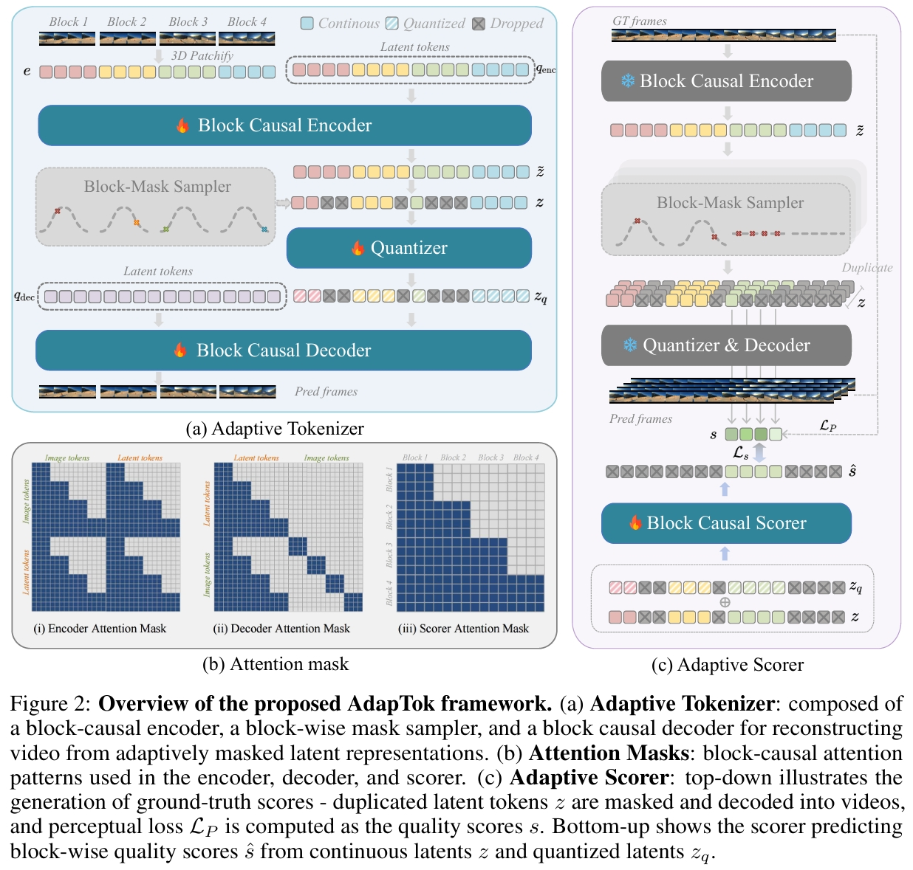
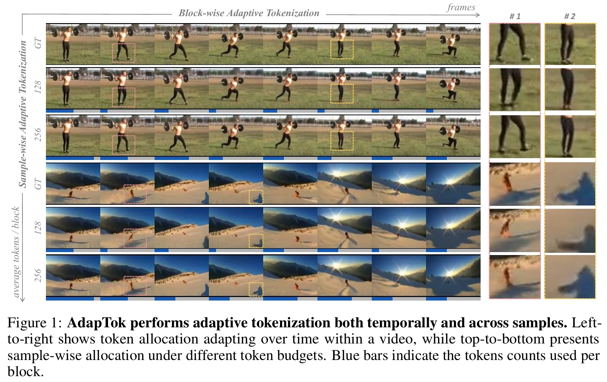

# AdapTok：自适应时间因果的 1D 视频分词器 快读

**来源**：<https://arxiv.org/abs/2505.17011>（代码 <https://github.com/VisionXLab/AdapTok>）
**作者**：Yan Li¹\*, Changyao Tian²³\*, Renqiu Xia¹, Ning Liao¹, Weiwei Guo⁴, Junchi Yan¹, Hongsheng Li², Jifeng Dai⁵, Hao Li³†, Xue Yang¹†
**机构**：¹上海交通大学 · ²香港中文大学 MMLab · ³上海 AI Lab OpenGVLab · ⁴同济大学 · ⁵清华大学
**发表**：arXiv v1 2025-05-22 / v2 2025-10-14；PDF 标注 “Preprint — Under review”，OpenReview 有评审页（forum `dkLto1KNFv`），最终收录会议未确认

---

## 问题

视频 tokenizer 给每帧分配固定数量的 token，忽略了帧间内容的信息密度差异：一个几乎静止的背景和一个剧烈运动的片段拿到同样预算，token 被大量浪费在时间冗余上。

现有路线各有取舍：

- **2D 空间 token**（如 ElasticTok）：token 数量与空间结构耦合，无法把“这段该给多少 token”当成一个全局预算分配问题来解。
- **固定 token 数的因果 tokenizer**：支持流式，但每帧等长 → 冗余帧吃满预算，动态帧反而不够。

理想视频 tokenizer 要同时满足三条：**时间因果性**（编码/解码只依赖过去帧，可在线流式）、**1D 潜在空间**（token 分配与空间结构解耦）、**自适应 token 分配**（按内容动态伸缩，且在全局预算下最优）。三者此前没有工作同时做到。

## 目标与贡献

1. **AdapTok**：一个同时具备时间因果性、1D 潜在空间与自适应 token 分配的视频 tokenizer。训练时用 **block-wise mask sampler** 随机丢弃每个块尾部的 token，让模型见过可变长度序列；推理时用 **block causal scorer** 预测不同 token 数下的重建质量。
2. **IPAL（Integer Programming for Adaptive aLLocation）**：把“每块分配多少 token”形式化为整数线性规划，在总预算约束下最小化整批的感知损失，得到全局最优分配（而不是启发式阈值/二分搜索）。
3. 在 UCF-101 重建与生成、Kinetics-600 帧预测上取得 Pareto 最优：**512 token 时 rFVD=60（多数 baseline 用 1024 都做不到）、1024 token 时 rFVD=36**；生成侧 633M 参数下 **K600 gFVD=11、UCF gFVD=67**；推理延迟 **50.9 ms vs ElasticTok 571.7 ms（约 11×）**。

## 模型结构

三个关键模块：

**1) Adaptive Tokenizer（自适应分词器）**

- **3D 分块**：视频切成互不重叠的时空 patch（patch size `4×8×8`），投影为 patch embedding。默认 `16×128×128` 片段 → `L = 1024` 个 token。
- **块因果编码器**：用可学习 latent token 把 patch 压成 1D 序列，注意力为 block-causal（当前块只能看自己与之前的块）。latent 序列被切成 `K = 4` 个 block，每块基础长度 `M = 512`。
- **Block-mask Sampler**：训练时每个 block 从截断高斯 `μ=256, σ=128, [32, 512]` 采样保留长度，随机丢弃块尾 token。
- **块因果解码器**：按被截断后的序列重建视频，因此天然支持任意可变长度。

**2) Adaptive Scorer（自适应评分器）**

一个因果 Transformer，输入连续 latent token 与量化后 token，输出每个候选 token 长度对应的**感知质量分数**（预测重建后的 LPIPS）。它为推理时的分配提供“边际收益”估计。

**3) IPAL：整数线性规划分配**

推理时对每个样本，用 scorer 预测各长度下的质量分数，然后求解：每个 block 恰好选一个候选长度，所有 block 的 token 总数等于预算，目标是最小化该 mini-batch 的总感知损失。因为有全局约束 + 离散选择，所以天然是 ILP；作者称其开销只占推理时间约 15%。

**关键设计直觉**：块尾丢弃迫使**靠前的 token 学习全局结构、靠后的 token 负责局部细节**（注意力图可视化验证了这一点），重建呈 coarse-to-fine —— 这也是它能“用更少 token 拿到更低 FVD”的原因。

## 训练流程

- **损失**：L1 重建 + 量化损失（SVQ）+ 感知损失（LPIPS）+ 对抗损失 + 自回归先验损失。
- **数据**：UCF-101 与 Kinetics-600，共 **< 0.5M** 公开视频；不做额外图像数据预训练。
- **超参**：250 epochs，batch size 128，Adam（β₁=0.5, β₂=0.9），学习率 warmup 到 `1e-4` 后 cosine 衰减到 `1e-6`。
- **评测指标**：主指标 FVD（rFVD / gFVD），重建另报 PSNR 与 LPIPS。
- **缩放配置**：

| 模型 | 平均 token | block 数 | token/block | 参数 | rFVD ↓ | PSNR ↑ | LPIPS ↓ |
|---|---|---|---|---|---|---|---|
| AdapTok-S | 512 | 6 | 8 | 59M | 87.32 | 24.23 | 0.151 |
| AdapTok-L | 768 | 12 | 12 | 259M | 36.36 | 25.72 | 0.144 |
| AdapTok-XL | 1024 | 24 | 16 | 913M | 32.43 | 26.29 | 0.103 |

## 实验结果

**视频重建（UCF-101, rFVD↓）**

| 方法 | 训练数据 | Tokens | rFVD |
|---|---|---|---|
| CausalTok † | <0.5M | 1024 | 37 |
| AdapTok (Ours) | <0.5M | **512** | **60** |
| AdapTok (Ours) | <0.5M | 1024 | **36** |
| AdapTok (Ours) | <0.5M | 2048 | **28** |
| OmniTokenizer † | <0.5M | 1280 | 94 |
| ElasticTok † | <0.5M | 1022 | 230 |
| OmniTokenizer（原设置） | 1.4M | 1280 | 42 |
| Cosmos-Tokenizer-DV | 100M | 1280 | 140 |

要点：**用 1.8× 更少的 token 达到 CausalTok 的水平**；512 token 的 60 已优于大多数 baseline 的 1024/1280 设置。（† 表示用与本文相同的数据与配方复现）

**视频生成（gFVD↓）**

| 方法 | 参数 | K600 | UCF |
|---|---|---|---|
| Phenaki | 1.8B | 36.4 | / |
| OmniTokenizer | 650M | 32.9 | 191 |
| CausalTok | 633M | / | 80 |
| **AdapTok-AR** | **633M** | **11** | **67** |

**消融：自适应训练与推理都必要**

| Tokens | Sampler | Scorer | rFVD ↓ | PSNR ↑ | LPIPS ↓ |
|---|---|---|---|---|---|
| 1024 | ✗ | ✗ | 37.13 | 25.92 | 0.111 |
| 1024 | ✓ | ✗ | 38.79 | 25.29 | 0.122 |
| 1024 | ✓ | ✓ | **36.36** | 25.72 | 0.114 |
| 512 | ✗ | ✗ | 509.95 | 14.38 | 0.368 |
| 512 | ✓ | ✗ | 121.88 | 22.89 | 0.170 |
| 512 | ✓ | ✓ | **59.96** | 24.06 | 0.144 |

**预算越低，自适应收益越大**：1024 token 时只比固定分配好一点点（37.13→36.36），512 token 时是量级差异（509.95→59.96）。

**分配策略对比**：ILP 36.36 优于 Fixed 38.79 / BiThr 42.12 / BiDelta 38.13。
**评分指标对比**：用感知损失（LPIPS）作评分为最佳（rFVD 36.28），优于 SSIM 37.12 / PSNR 36.56 / MSE 36.97。
**延迟**：AdapTok 50.9 ms/video vs ElasticTok 571.7 ms/video。

## 总结

一句话：**把“每帧给多少 token”从超参数变成一个带全局预算约束的优化问题（ILP），并用一个可预测重建质量的 scorer 去估计收益**，从而在保持时间因果性与 1D 潜空间的前提下拿到 Pareto 最优。

局限（作者自述）：

- 仍是离散 VQ-VAE 框架，未探索连续变体（如扩散式 tokenizer）。
- 只在 <0.5M 公开视频上训练，泛化未验证；后续要扩大数据规模。
- 推理策略（ILP）仍有进一步降延迟空间。

个人备注（可与“未来状态预测”那条线对照）：这里的“动作空间”是**每个 block 选一个 token 长度**，同样面对三个老问题 —— 粒度（候选长度集）、多对一（同一 token 数对不同内容收益不同，用 scorer 建模）、以及可逆性（目标预算 → 分配方案，正好是可解的 ILP）。

---

## 待读 / 疑问

- [ ] 论文最终收录会议（OpenReview `dkLto1KNFv` 被 403 挡住，需人工确认是否 NeurIPS 2025）
- [ ] AdapTok 与 ElasticTok 的“自适应”差异到底在哪一层（ElasticTok 是 2D 空间 token + 递归分配，本文是 1D + 全局 ILP）
- [ ] block causal scorer 的泛化性：换数据集/换 block 数后是否需要重训
- [ ] IPAL 的 15% 开销是在什么 batch size 下测的（附表 Table 10–12 有 runtime 缩放，尚未细读）
- [ ] 与库内 `titok-1d-visual-tokenizer-survey`、`compact-tokenizer-2026`、`maetok` 的关系是否需要交叉引用
- [ ] 是否补一张 rFVD vs token budget 的 Pareto 曲线图（Fig. 3）

## 参考资料

- [arXiv:2505.17011](https://arxiv.org/abs/2505.17011) — Learning Adaptive and Temporally Causal Video Tokenization in a 1D Latent Space
- 代码：<https://github.com/VisionXLab/AdapTok>
- 全文提取：`raw/adaptok/sources/adaptok.pdf`、`raw/adaptok/sources/adaptok.html`
- 图片：`drafts/assets/adaptok/framework.png`、`drafts/assets/adaptok/vis.png`
