#+TITLE: Animoji：Apple 的实时面部表情驱动动画
#+SLUG: animoji
#+TYPE: original
#+STATUS: outlining
#+PROGRESS: 50
#+TARGET_ALIAS: categories/AI/数字人/数字人工程解读
#+TARGET_SUB_ID: auto
#+PIN: false
#+SOURCE_URL: 
#+TAGS: [数字人, Animoji, ARKit, 面部动画, blendshapes]
#+CREATED_AT: 2026-09-02T11:10:40
#+UPDATED_AT: 2026-09-02T14:32:46
#+PUBLISHED_AT: 
#+PUBLISHED_FILE: 

* Animoji：Apple 的实时面部表情驱动动画

** 技术研发背景

camera 采集到的真实表情，迁移到动画形象上。

作用：
1. 克服社交焦虑，同时提供一定程度的隐私保护
2. 提高会议中视频的使用率（开着视频但以虚拟形象示人）
3. 增强会中互动体验：生动可爱夸张的虚拟形象
4. 增加视频通话功能的娱乐属性
5. 降低带宽与采集硬件的需求（传表情系数/姿态参数远比传视频流便宜）

** 友商

*** Apple Memoji

- iMessage 和 FaceTime 中可用（iMessage 的 Cow Memoji 语音消息；Memoji
  创建界面：摄像头实时预览 + 动物形象选择栏）
- 无 API，第三方视频会议软件无法使用 → 会议软件需要自建虚拟形象

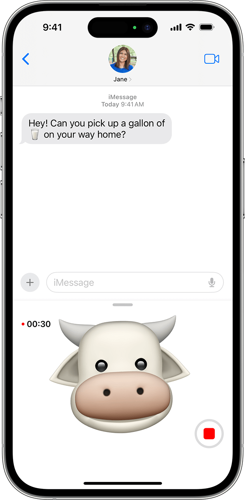
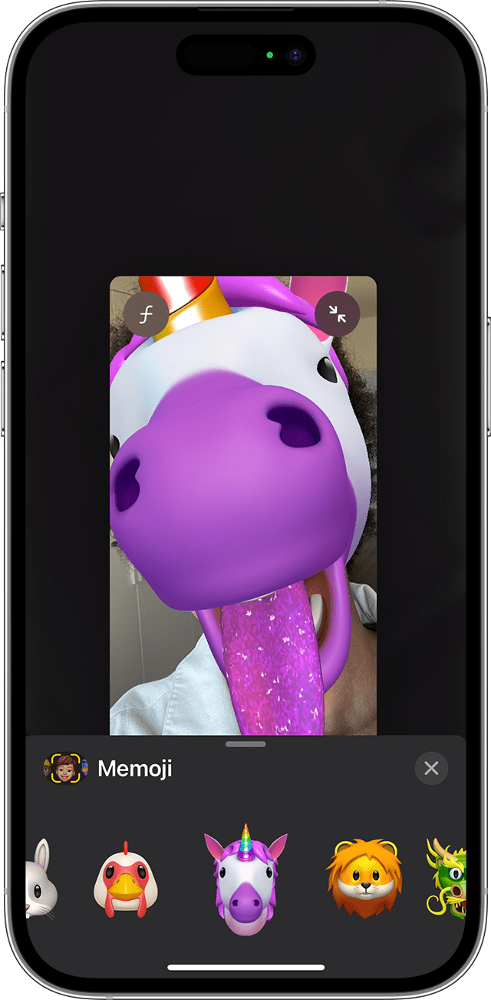

*** 飞书

- 视频会议"特效"设置中提供"虚拟形象"，与虚拟背景/美颜/滤镜并列
- 形象网格：预设动物/人物形象 + 眼镜/帽子等配饰；"钰杰 +"疑似自定义形象入口
- 细节开关："他人看我 / 我看自己"分开设置、视频镜像

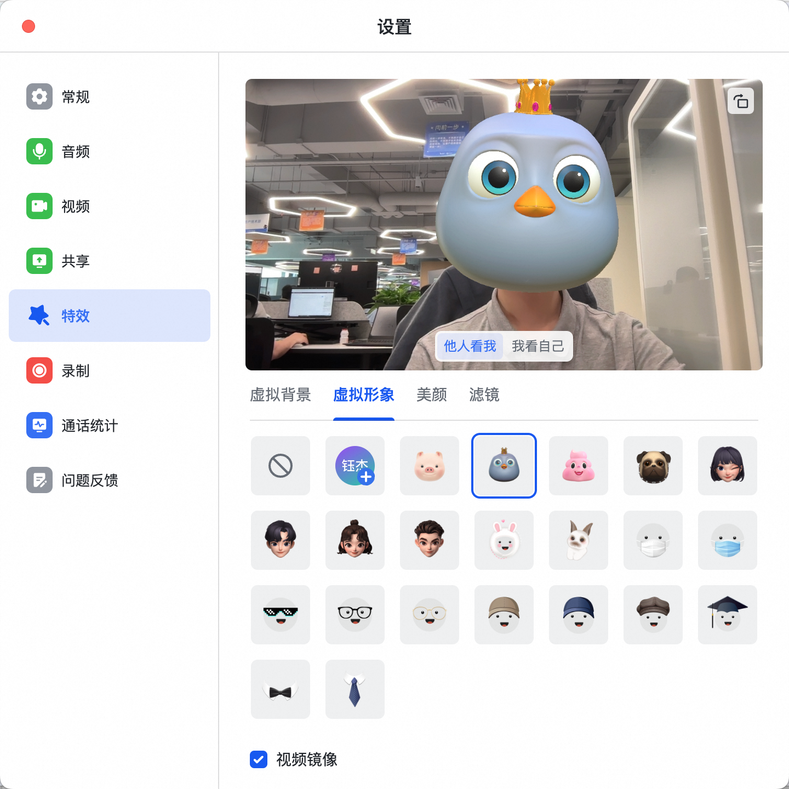

*** Zoom

- 形象较多：动物（狗/猫/狐/兔/熊/熊猫/鼠/牛…）+ 人物形象
- 支持编辑：形象右键菜单有 Edit / Duplicate / Delete；"+"新建自定义形象
- 开关：Mirror my video、"入会时自动开启形象"

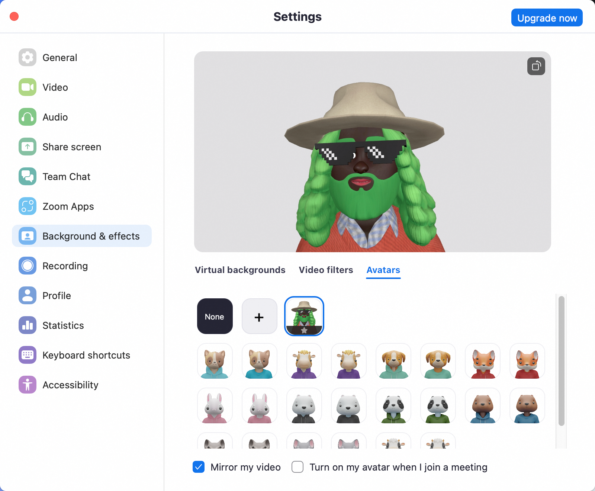
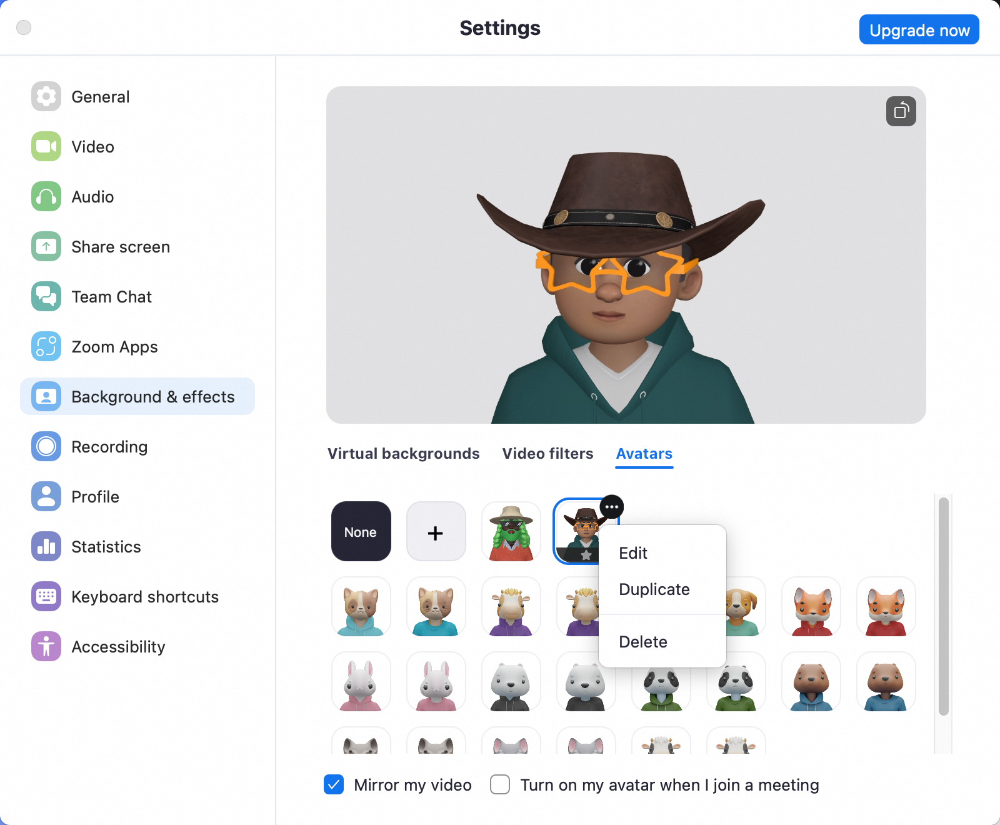

*** 腾讯会议

- 无表情迁移（只有头饰贴纸/边框，叠加在真实人脸视频上，不是 3D 形象驱动）
- 有头饰及边框：渔夫帽/贝雷帽/眼镜/口罩/兔耳朵等，部分 VIP 专属
- 同样有"我看自己/他人看我"、视频镜像开关

** 技术方案

第一个步骤是做视频驱动，生成 Animoji。管线：

1. 输入人脸（camera 视频流）
2. 人脸检测 + 关键点检测（52 个 shape keys）
3. 提取表情系数 + 头部姿态（Yaw / Pitch / Roll）
4. 表情系数与头部姿态融合，输入 3D 渲染引擎 Filament
5. 加载 3D 素材（如熊头模型），渲染后与原视频融合 → 最终效果

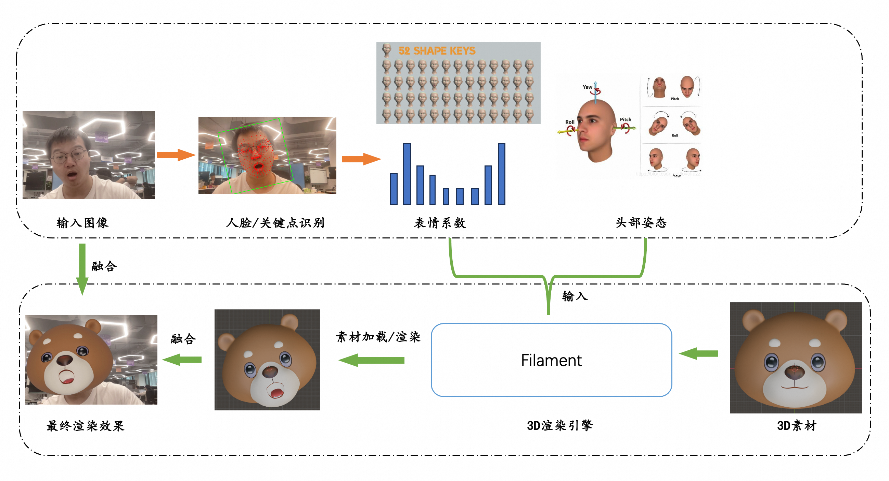

** 预制 3D 虚拟形象的不足与个性化方案

*** 预制形象的不足

- 人力资源：每个形象都要美术建模 + 绑定 morph target，成本高
- 形象受限，使用场景可能受限
- 无法个性化定制

*** 技术方案选型：个性化形象生成

- 方案 A：单帧视频直接生成 3D 模型——开源实现多（如 PanoHead、
  InstaLIP、TripoSR 等），但计算量巨大，无法实时应用
- 方案 B（选定）：离线生成参数化 3D 模型，实时只做表情动作驱动：
  1. text-to-image
  2. 2D → FLAME 3D 头部重建（Geometry Generation && Texture
     Generation）
  3. 表情系数空间转换（blendshape 表情系数转换到 FLAME 模型的
     表情系数）
  4. 驱动渲染

离线生成 + 实时驱动的分工：生成慢没关系（一次性、云端），驱动
必须在端上实时（52 维系数回归 + PnP + Filament 渲染，全轻量）。

*** 3D 重建（个性化形象生成管线）

- SD 模型 + ControlNet：
  - 个人图像风格化（上传照片 → Pixar 动画风格等）
  - 文生图
- 图生 FLAME 模型：
  - FLAME 模型：参数化 3D 人头模型（Max Planck Institute，
    SIGGRAPH 2017），三类系数——形状系数（identity）、表情系数、
    姿态系数（颈/眼）；与 BFM/3DMM 同族，拓扑统一、适合拟合
  - 只需要（离线）估计形状系数；表情和姿态使用 camera 实时输入
    驱动（不用重建的）
- albedo 贴图：
  - 3D 模型的 UV 纹理
  - 直接替换 2D camera 源中的人脸纹理（风格化，如 Pixar 动画）

TODO：表情系数空间转换具体怎么做（52 blendshape → FLAME 100
表情基的映射：线性回归？查找表？训练小 MLP？）；FLAME 系数到
Filament morph target 的转换链路。

**** 个性化形象生成管线图

Text Prompt → Stable Diffusion ControlNet（风格化/文生图）→ 2D
人脸 → Geometry Generation（Shape/Expression/Pose Coeff 拟合
FLAME）+ Texture Generation（albedo）→ 带纹理 3D 头模型。

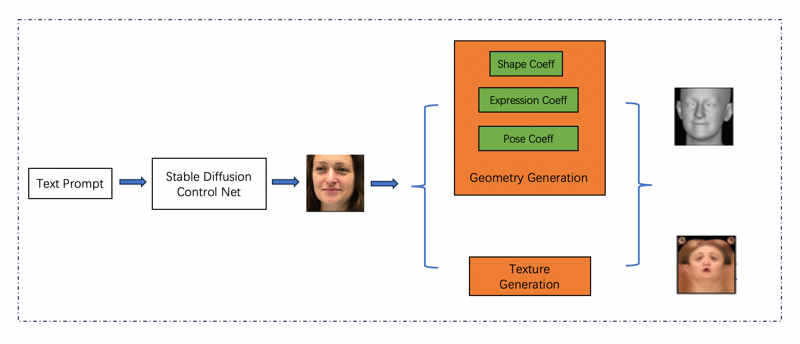

**** 表情系数空间转换管线图

实时驱动侧：camera 输入 → Face Detection → Blendshape（52）+
Head Pose → Expression Space Conversion → 模型表情系数 + 模型
姿态系数 → 3D Render（Filament）。即上一节 TODO 说的"空间转换"
落点。

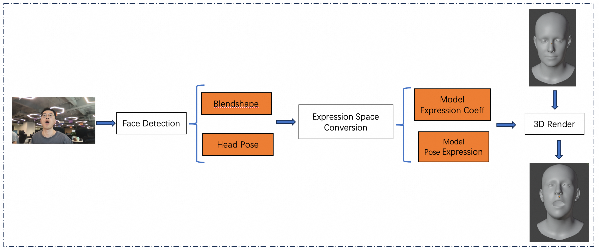

** 语音驱动

*** 视频驱动方案的不足

- 依赖用户摄像头数据，有些情况用户并不想开摄像头
- 合成视频后需编码传输，画质受网络影响

*** 语音驱动方案（talking avatar）

- 接收端收到语音，实时驱动 3D 形象：
  - 语音到表情系数的 deep net（音频特征 → 52 表情系数 + 头部
    姿态预测）
  - 形象化（随机眨眼、转动头部等），避免呆板
- 大大提高虚拟形象的使用场景（无摄像头也能有形象）
- 节省视频传输，节省带宽开销（只传音频 + 端上渲染）

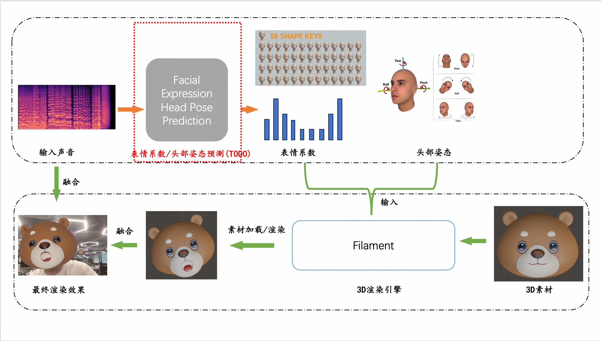

TODO：图里预测模块标了 "TODPO"，疑似内部模型代号或笔误（TODO
核实，也可能是某篇 audio-to-expression 论文的缩写）。

** 模块详解

*** 视频理解：人脸检测

- 基于 BlazeFace 模型进行检测，获得人脸候选框及五官特征点，轻量、快速
- 输出：896×1 的 score（每个候选框的置信度）+ 896×16 的回归量
  （每个候选框 4 维坐标 + 6 个特征点 × 2 维坐标）
- 5×5 深度可分离卷积取代 3×3 卷积，提高感受野同时降低计算开销
- deep low-resolution layers 不利于 GPU 加速；BlazeFace 与 SSD 相比，
  feature map 最小只到 8×8

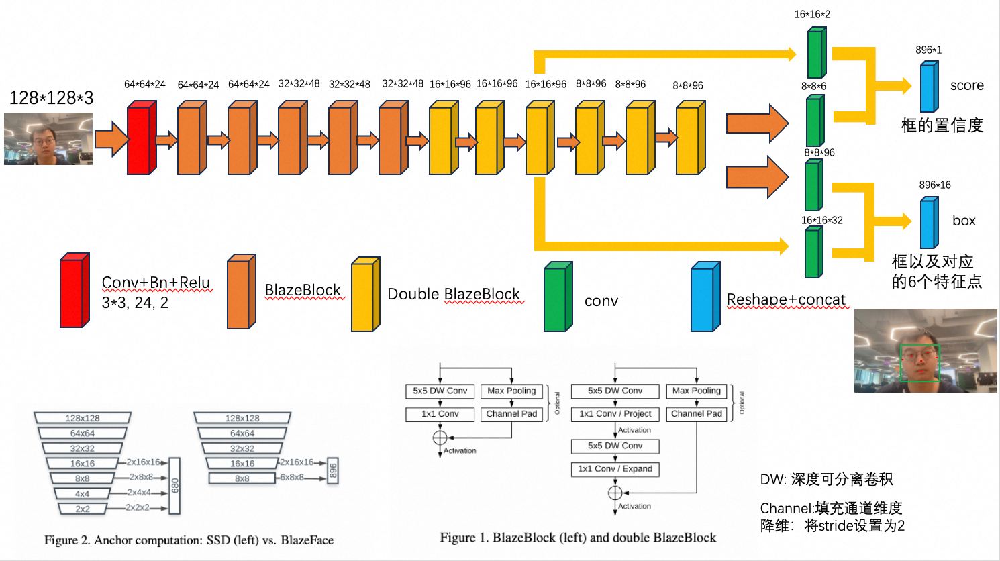

**** BlazeFace 是什么

Google 2019 年专为移动端前置摄像头设计的轻量人脸检测器
（arXiv:1907.05047），手机 GPU 上亚毫秒级。核心设计：

- 单阶段（one-shot）检测，针对"正脸、近景"的 selfie 场景裁剪：
  不需要 SSD 那种多尺度金字塔 + 多长宽比 anchor 的通用检测体系
- anchor 总数 896 = 16×16×2 + 8×8×6；每个 anchor 回归 4 维框 +
  6 个关键点（双眼、鼻尖、嘴、左右耳），对应 896×16 输出
- BlazeBlock / Double BlazeBlock 残差块：降采样不走 strided conv，
  而是独立的 MaxPool + Channel Pad 分支（strided depthwise conv 会
  跳过部分激活值）；主路为 5×5 depthwise conv + 1×1 pointwise conv
- 5×5 depthwise 为什么便宜：跨通道混合（贵的那部分）全部交给 1×1
  pointwise，depthwise 只做逐通道空间卷积，kernel 从 3×3 加到 5×5
  时总开销增加很小，感受野却大得多
- 特征图最小只到 8×8：低分辨率深层特征图空间并行度低，GPU 跑不快；
  停在 8×8 兼顾大脸检测与 GPU 效率

**** SSD 是什么

SSD（Single Shot MultiBox Detector，ECCV 2016）：单阶段目标检测的
开山工作之一。骨干网络之后接一组逐级递减的特征图（如 38×38 →
19×19 → 10×10 → 5×5 → 3×3 → 1×1），每层每个 cell 挂多个不同
尺度/长宽比的 default box（anchor），直接回归类别置信度 + 框偏移，
一次前向输出全部检测结果，省去 Faster R-CNN 式两阶段的 region
proposal。

- 大特征图管小物体、小特征图管大物体 → 靠"卷得深"换多尺度覆盖
- 代价：backbone 越深特征图分辨率越低（直到 1×1/2×2），GPU 并行度
  差、端上实时困难 —— 这正是 BlazeFace 停在 8×8 所针对的缺点
- 在本管线语境下：SSD 代表通用目标检测的重量级路线；BlazeFace 是
  为单一类别（人脸）+ 端上实时裁剪的专用轻量路线，用 896 个 anchor
  换掉 SSD 的数千个 default box

*** 视频理解：人脸特征点提取（Attention Mesh）

- 对人脸检测框进行放大、旋转等：利用眼睛位置修正人脸的旋转角度
  和候选框大小，再送入 landmark 模型
- 模型获得 478 个人脸关键点（xyz 三维）：
  - 468 点主网格（Mesh）
  - 嘴巴 + 左右眼 + 左右眼瞳孔由优化分支提供
- 耗时较高，需针对计算开销深入优化（剪枝、网络结构优化）

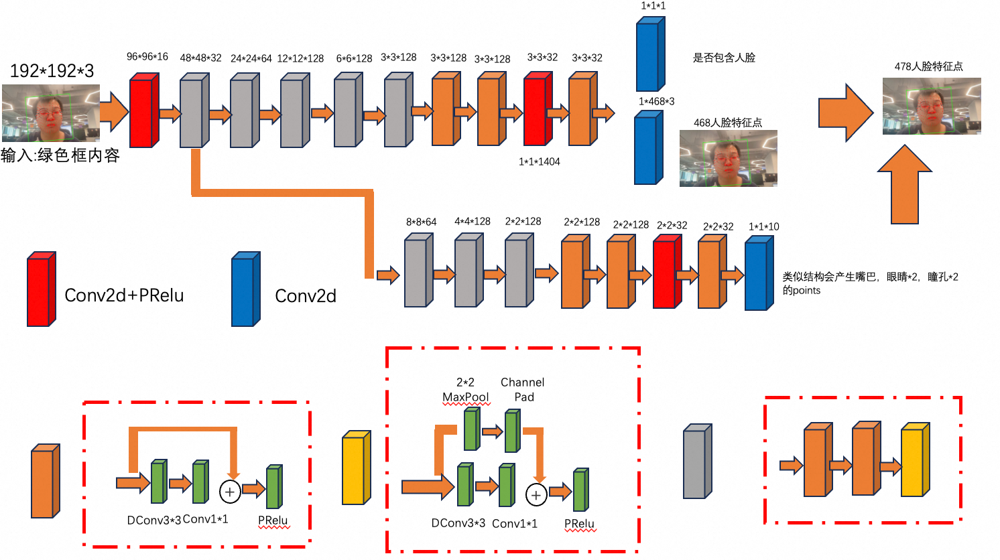

**** Attention Mesh 是什么

是一个模型，也有对应论文。Google MediaPipe Face Mesh 生态的两级演进：

- 基础模型：MediaPipe Face Mesh，论文 "Real-time Facial Surface
  Geometry from Monocular Video on Mobile GPUs"（CVPR Workshop 2020，
  arXiv:1907.06724）——轻量 backbone 输出 468 个 3D 关键点，
  顶点拓扑固定，可直接当 3D 人脸网格用
- Attention Mesh 本尊：论文 "Attention Mesh: High-fidelity Face Mesh
  Prediction in Real-time"（Journal of Computational Social Science，
  2021）。在 468 点模型基础上加 lips / eyes / iris 的 attention
  优化分支，输出 478 点（468 mesh + 10 个虹膜点，每只眼 5 个），
  眼动/注视方向估计更准；MediaPipe 里即
  face_mesh + refine landmark 两个 tflite
- 与本管线对应：输入 192×192 人脸裁剪图 → 468×3 主输出 + face
  presence 分类；优化分支产生嘴/眼/瞳孔点（图中 1×1×10 头及
  "类似结构"）；主干仍是 depthwise separable conv（DConv3×3 +
  Conv1×1 + PRelu 残差块）的轻量结构

*** 视频理解：表情系数识别（Blend Shape）

把人脸特征点的位置转换成 Blend Shape 系数：

- 输入：146 个特征点，只取 xy 坐标 → 1×146×2
- 网络：LN → 卷积块（Transport / Conv2d+Relu / Conv2d 组成的模块，
  含 skip 连接与 concat 特征融合）→ StrideSlice → Conv2D →
  Logistic
- 输出：52 维表情系数（blendshape coefficients）

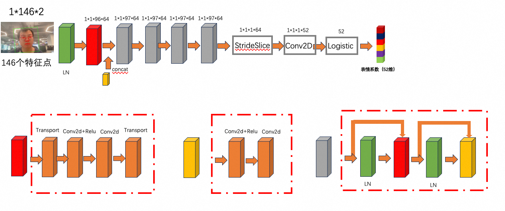

**** Blend Shape 是什么

3D 面部动画的标准变形方案（parke 水位模型的现代形态）：一张中性
人脸网格 + 一组预制的"目标形状"（每个目标形状对应一个语义控制量，
如 jawOpen、jawRight、mouthSmile…），第 i 个系数 w_i ∈ [0,1] 线性
插值该目标形状对顶点的偏移：

:   V = V_neutral + Σ w_i · (V_i − V_neutral)

- 52 个系数 = ARKit FaceTracking 的 ARBlendShapeLocationCoef
  ficients 集合，iPhone X 起用于 Animoji/Memoji；游戏引擎
  （UE MetaHuman、Unity）与 VRChat avatar 通用同一套命名
- 每个系数语义直观、可独立滑杆控制 → 上面两张图即工具里
  jawRight 0→1（下颌右移）、jawOpen 0→1（张嘴）的网格变形效果
  （左侧模型列表还出现了 DingTalk，说明是钉钉侧的形象调试工具）
- 对本管线的意义：表情从"像素/关键点"域压到 52 维语义参数，
  跨形象（不同 3D 素材）复用同一套驱动接口；也天然适合低带宽
  传输（作用 5）

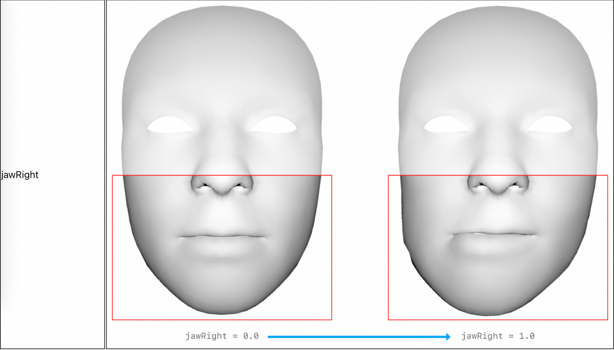
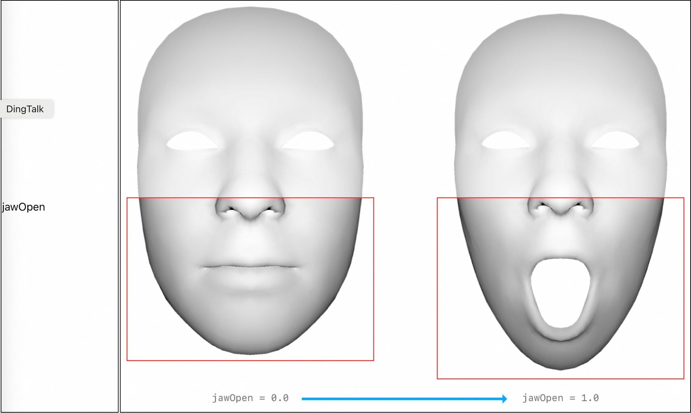

*** 视频理解：头部姿态估计

用相机投影模型 + PnP 从 2D 关键点解出头部的 R、T（即 Yaw/Pitch/Roll
+ 平移）。

三个坐标系、两级变换：

- 世界坐标系 → 相机坐标系（刚体变换，外参 [R|T]）：

  :   (X, Y, Z)^T = R (U, V, W)^T + T = [R | T] (U, V, W, 1)^T

- 相机坐标系 → 图像坐标系（内参 K，针孔投影）：

  :   s (x, y, 1)^T = K (X, Y, Z)^T,   K = [[f_x,0,c_x],[0,f_y,c_y],[0,0,1]]

- 合并：s (x, y, 1)^T = K [R|T] (U, V, W, 1)^T

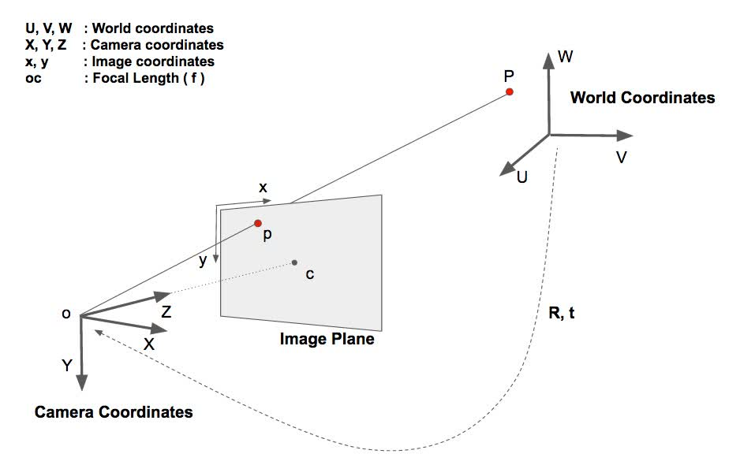

要点：

- 内参矩阵 K 主要和焦距有关，可设置成与渲染引擎（Filament）的相机
  参数一致 → 3D 素材渲染出来和真实人脸在图像上对齐
- [R|T] 即相机外参，也就是我们要估计的头部姿态：把"人脸"当作物体，
  它相对相机的旋转 + 平移
- 求解：已知 3D 人脸模型上 6 个关键点（标准 3D 模型的眼/鼻/嘴，
  世界坐标已知）+ 2D 人脸检测到的对应 6 个关键点 → PnP
  （solvePnP，EPnP/DLS）解 [R|T] → R 分解出欧拉角 Yaw（摇头）、
  Pitch（点头）、Roll（歪头）

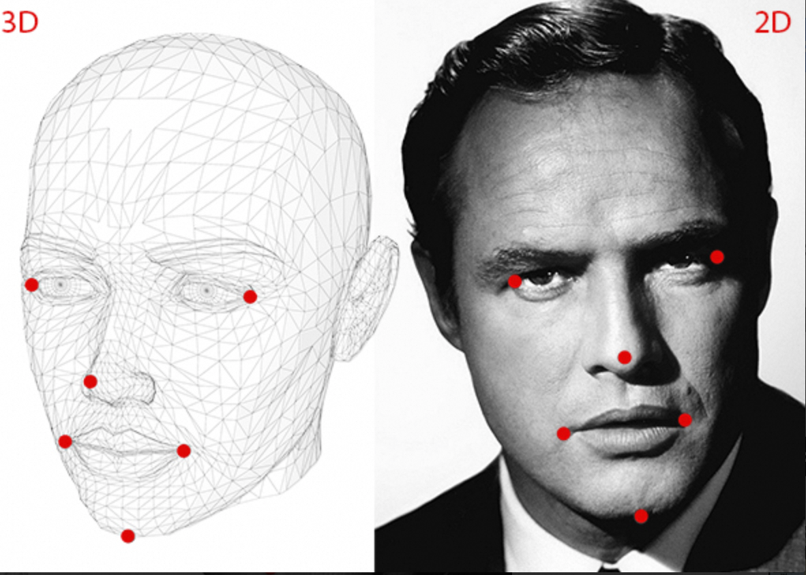
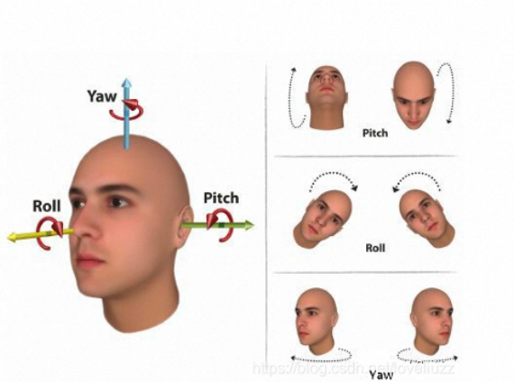

TODO：为什么用 2D 检测的 6 点而不是 Attention Mesh 的 478 点做
PnP（6 点是 BlazeFace 自带输出，免二次推理？）；欧拉角万向节锁与
旋转向量/四元数的选择。

*** 视频理解后处理：消抖

- 对象：表情系数、头部姿态
- 动机：3D 姿态驱动动画模型的场景下，表情系数和头部姿态的抖动会
  引起动画模型抖动，极大影响视觉感官效果
- 效果对比视频：[[file:assets/animoji/shaking-compressed.mov]]

**** Euro（One-Euro）滤波器

为解决关节点高频抖动，采用 Euro 滤波器消除抖动。Euro 是一种能够
实时滤除噪声的低通滤波器（CASPER 2019，HCI 领域经典）。核心是
带自适应平滑系数的一阶指数滤波：

\[
\hat{X_1} = X_1, \quad
\hat{X_i} = \alpha X_i + (1-\alpha) \hat{X}_{i-1},\ i \ge 2
\]

- 平滑系数 \alpha ∈ [0,1] 决定滤波器的截止频率：
  - 降低截止频率 → 大幅降低抖动，但出现延迟
  - 提高截止频率 → 降低延迟，但去抖效果大大降低
  → 需要根据输入信号改变的速率自适应调整 \alpha

自适应系数的作用是维持去抖效果与延迟之间的平衡：人眼对低速下的
抖动、高速下的延迟都非常敏感，因此低速时降低截止频率（优先去
抖），高速时提高截止频率（优先降延迟）：

\[
\alpha = \frac{1}{1 + \dfrac{1}{2\pi (f_{cmin} T_e + \beta \Delta X)}}
\]

- T_e：相邻两个时刻的采样周期
- f_cmin：最小截止频率
- \beta：速率系数
- \Delta X：样本变化速度

调 f_cmin 和 \beta 两个参数即可在去抖效果与延迟之间动态平衡。
（\Delta X 越大 → 分母越大 → \alpha 越小 → 平滑越强，即"变化快时
多平滑"？TODO：核对方向，经典 One-Euro 是速度越大截止频率越高、
\alpha 越大，延迟越小）

*** 性能和稳定性优化

- 复用前一帧的人脸检测结果，生成新的候选框用于特征点定位，
  节省人脸检测开销（约 -30%）
- 如果人脸特征点网络检测不到人脸（landmark 模型的 face presence
  输出为否），再回退使用人脸检测模型重新检测
- 即：首帧 BlazeFace 全图检测 → 后续帧跳过检测、由 Attention Mesh
  在上一帧框内直接出特征点 → 跟丢才重新全图检测

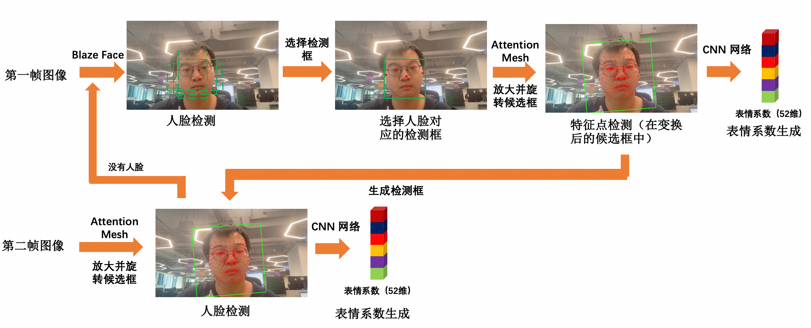

*** 3D 渲染引擎：Filament

轻量级、高实时性、跨平台的渲染框架。本管线中的使用流程：

- 初始化：初始化引擎 → 创建 Scene → 加载模型和素材（gltf）→
  设置相机参数（与姿态估计的内参一致）→ 设置光源
- 渲染 loop：头部姿态 → 设置变换（旋转/平移）矩阵；表情 → 设置
  表情系数；渲染 → 循环，直到结束 → 清理资源

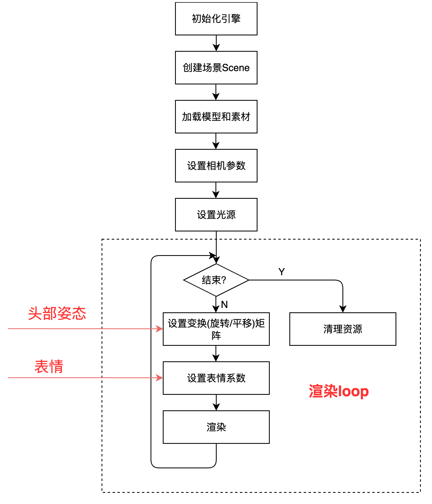

**** Filament 是什么

Google 开源的实时 3D 渲染引擎（C++，Apache 2.0，
github.com/google/filament），2018 年随 Sceneform 面世。定位一句话：
"把 PBR 级画质的实时渲染带到 Android/iOS/桌面/WebGL 的轻量引擎"，
对标 Unity/UE 渲染层，但只做渲染、不含编辑器和脚本。

- 物理渲染（PBR）：基于物理的材质模型（metallic/roughness 工作流），
  金属度、粗糙度、清漆、次表面散射等参数化材质，glTF 2.0 原生支持
- 基于物理的光照：支持 IBL（image-based lighting，环境贴图预积分）
  + 方向光/点光/聚光灯，户外白天到室内都能真实呈现
- 轻量：核心 C++ 无依赖，运行时二进制 MB 级；针对移动 GPU
  （Adreno/Mali）深度优化，分帧渲染设计让 CPU/GPU 并行流水
- 跨平台：Android、iOS、Linux、Windows、macOS、WebGL
- 多后端：OpenGL、Vulkan、Metal、WebGL/WebGPU
- API 面：Engine / Renderer / Scene / View / Camera / Material /
  Texture / Light / Entity-Component；材质用 material compiler
  （matc）离线编译成包体

为什么这个项目选它（对比常见替代品）：

- Unity/Unreal：画质和工具链最强，但体积大（几十 MB 起）、启动慢、
  授权复杂，不适合嵌入会议客户端做一个小功能
- 开源 C++ 引擎（bgfx/Ogre）：bgfx 是抽象层不是引擎（光照/材质
  都要自己搭）；Ogre 偏 PC
- Filament：体积小、移动端 GPU 优化、glTF 2.0 直接加载（含 morph
  target / 蒙皮动画），有 Java/Kotlin 绑定（Sceneform 曾基于它）
- 关键能力：morph target 动画 = 52 个 blendshape 系数直接驱动
  glTF 模型的 morph weights → 表情系数网络输出直接接渲染引擎，
  无需中间转换

** TODO

- [ ] 技术细节调研：表情系数定义（52 blendshapes？与 ARKit 52 个的对应）
- [ ] 对比表：各友商是否支持表情迁移/自定义形象/编辑
- [ ] 核实 Attention Mesh 论文（JCSS 2021）的 arXiv 号与 478 点精确
      构成（10 点是否全为虹膜）
- [ ] 确认 146 点的来源（478 筛选规则）、52 系数与 ARKit 列表的对应、
      146→52 回归网络的训练数据
- [ ] PnP 的 6 点选择依据
- [ ] 核对 Euro 滤波器自适应方向（\Delta X 增大时 \alpha 的变化）
  与公式准确性（经典 One-Euro 论文 f_c = f_cmin + \beta|ẋ|）
- [ ] 核实 Filament 细节：发布年份、Sceneform 关系、morph target
  驱动 API 名称（FilamentInstance setMorphWeights?）
- [ ] 核实语音驱动图中的 "TODPO" 是内部代号还是某论文模型
- [ ] 语音驱动技术调研：audio-to-blendshape 模型选型（Audio2Face、
  FaceFormer、EmoTalk 等路线）
- [ ] FLAME 论文引用补入参考资料（SIGGRAPH 2017）

** 参考资料

- Filament — https://github.com/google/filament
- Filament documentation (physically based rendering) —
  https://google.github.io/filament/

- One Euro Filter: Simple Speed-based Low-pass Filter for Noisy
  Input in Interactive Systems — Casiez et al., CHI 2012（上面笔记
  写 CASPER 2019，TODO 核对）

- BlazeFace: Sub-millisecond Neural Face Detection on Mobile GPUs —
  https://arxiv.org/abs/1907.05047
- SSD: Single Shot MultiBox Detector — https://arxiv.org/abs/1512.02325
- MediaPipe Face Mesh: Real-time Facial Surface Geometry from
  Monocular Video on Mobile GPUs — https://arxiv.org/abs/1907.06724
- Attention Mesh: High-fidelity Face Mesh Prediction in Real-time —
  Journal of Computational Social Science, 2021