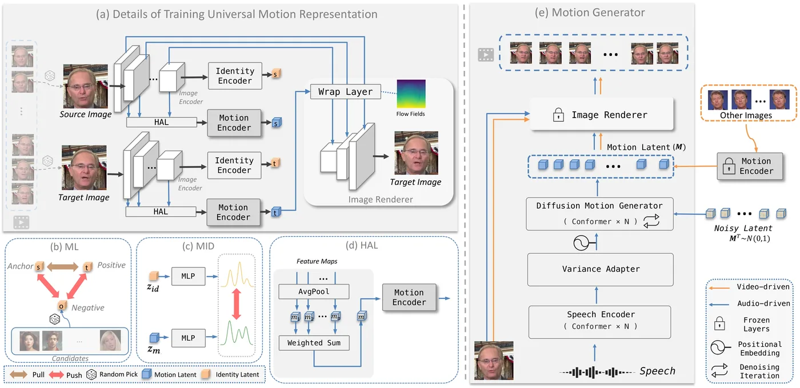

# AniTalker：身份解耦的多样化说话脸动画 快读

**来源**：https://arxiv.org/abs/2405.03121  
**作者**：Tao Liu, Feilong Chen, Shuai Fan, Chenpeng Du, Qi Chen, Xie Chen, Kai Yu（上交 X-LANCE + 思必驰）  
**发表**：ACM MM 2024（Melbourne，2024-10/11）

---

## 问题

现有说话脸生成的两大缺陷：

1. **只管"语言"不管"非语言"**：主流方法盯着唇同步，忽略头动、表情、眨眼等非语言线索（研究表明非语言线索对沟通至关重要）；
2. **运动表征太"显式"**：blendshapes / landmark 系数 / 3DMM 都是为单图处理设计的显式参数，表达力上限低，捕捉不了细微肌肉抽动级别的动态；可学习编码器（DAETalker/DiffDub）又绑定特定说话人或只管嘴部区域。

需要一个**通用、细粒度、跨角色**的运动表征：(a) 捕捉细微动作；(b) 去除身份信息、对任意角色适用；(c) 覆盖表情/头动/姿态等非语言线索。

## 目标与贡献

1. **自监督通用运动编码器**：同身份源帧→目标帧重建学运动，身份-运动显式解耦（度量学习 + 互信息最小化），几乎不需要标注数据；
2. **扩散运动生成器 + Variance Adapter**：运动空间上做 DDPM/DDIM 生成，多样性（噪声采样）与可控性（头部姿态/位置/缩放属性控制）兼得；
3. **55 小时数据从零训练**（对比 EMO 250h、GAIA 1169h），并泛化到卡通、雕塑、浮雕、游戏角色。

## 模型结构

两阶段：**先学运动表征，再做运动生成**。

### 第一阶段：通用运动表征（基于 LIA 骨架改造）

同一视频取源帧 I^s（供身份）+ 目标帧 I^t（供运动），随机采样偶尔相邻 → 网络被迫学细微动作。三个关键模块：

1. **度量学习（ML）**：身份编码器用 **AAM-Softmax**（margin m=0.2，scale s=30，余弦距离）学可判别的身份嵌入；锚-正-负样本自监督采样（负样本从其他身份随机选）。消融：Triplet 只有 26.455，AAM-Softmax 到 27.922——角度度量显著优于欧氏；
2. **互信息解耦（MID）**：用 **CLUB**（互信息上界估计器）最小化 I(z_id; z_m)——光约束身份编码器不够，必须主动把身份信息从运动编码器里"挤出去"。自监督运动迁移方法（FOMM/LIA 系）的通病就是身份泄漏，这里显式治了它；
3. **HAL（Hierarchical Aggregation Layer）**：聚合图像编码器全部中间层特征（各层不同感受野），AvgPool 后按可学习权重加权求和（softmax 归一），免人脸对齐、适应不同脸尺寸。消融发现权重最大的是最后一层（全局特征），**第 4 层出现局部峰值**——其感受野≈眼睛大小、嘴的一半，说明它在专门捕捉眼/嘴区域运动。

**运动投影器**：512→20 维，用 **LMD（Linear Motion Decomposition，LIA 的正交基分解）** 而非普通 FC——正交性相当于隐式正则，各维度运动解耦。消融：10 维不够（27.685），20 维达标（29.071），32 维无显著提升 → 选 20。

**渲染**：warp-based 渲染块（LIA 的 G block 设计），运动 latent 生成 flow field 对编码器 8 层特征（256²→1×1）逐层 warp + mask + toRGB。对比 VAE 渲染（GAIA 50M：30.497；EMO SD-VAE 84M：33.114），AniTalker 50M 拿到 **35.634**——VAE 感知压缩丢高频（发丝），且不为人脸定制。

总损失：`L_motion = L_recon + 0.1·L_percep + 1·L_adv + 0.1·L_MI + 0.1·L_ML`

### 第二阶段：运动生成（冻结第一阶段）

- **音频编码**：预训练 **HuBERT-large**，50Hz 下采样到 25Hz 对齐视频帧率；语音编码器 4 层 Conformer（512 dim，13M）；
- **扩散运动生成器（DMG）**：2 层 Conformer（1024 dim，25M），输入 = [语音特征 512 + 起始运动 128 + 肖像特征 128 + 噪声 latent 128 + 时间嵌入 128]；训练 1000 步，推理 **DDIM 50 步**（无 CFG）；
- **Variance Adapter**（借自 FastSpeech2）：残差分支 + 预测器，控 **K=2 组属性**：① 相机参数（脸在帧中的 x 位置用鼻子 landmark 的 x、脸尺度用眉-下巴距离）② 头部姿态（yaw/pitch/roll，3DDFA_V2 提取）；加了 LSTM 增强时序；推理时可直接输入目标值（如 pitch −90~90° 点头/抬头）；
- 运动生成阶段共 **40M 参数**（13+2+25）。

两条推理管线：**视频驱动**（face reenactment，零额外训练，驱动视频过运动编码器直接渲染）和**音频驱动**（扩散生成运动序列）。

## 训练流程

| 项 | 值 |
|---|---|
| 数据集 | VoxCeleb + HDTF + VFHQ 统一重处理（**不对齐**，保留自然头动；滤掉 <256²、模糊（Laplacian）、yaw>60°；每 ID 随机 2-3 clips） |
| 规模 | **4,242 个身份、17,108 clips、55 小时**（≈GAIA 的 1/4 身份数、≈EMO 的 1/5 时长，且**从零训练**不依赖预训练初始化） |
| 硬件 | **4 × A100 40G**；第一阶段 ~50h，第二阶段（带 EMA）~120h |
| 分辨率 | 256×256 |
| 音频 | HuBERT-large，5s/125 帧训练窗 |

## 实验结果

**视频驱动（face reenactment）**：Self-Reenactment PSNR **29.071** / SSIM **0.905** / LPIPS **0.079**，全面超过 FOMM/DPE/MTIA/FaceVid2Vid/LIA/FADM；Cross-Reenactment CSIM **0.586** 全场最佳——跨身份驱动时身份保持最强（这就是解耦的直接回报）。

**音频驱动**（MOS，10 人）：

| 方法 | MOS-F | MOS-LS | MOS-N | MOS-MJ | SSIM | CSIM | LSE-D |
|---|---|---|---|---|---|---|---|
| MakeItTalk | 3.434 | 1.922 | 2.823 | 3.129 | 0.580 | 0.719 | 8.933 |
| SadTalker | 3.772 | 3.963 | 2.733 | 3.883 | 0.504 | 0.723 | 7.967 |
| **AniTalker** | **3.832** | **3.978** | **3.832** | **3.976** | **0.671** | **0.725** | 8.298 |

四项主观指标全胜，自然度和抗抖动提升明显。唯一输的是 LSE-D（8.298 vs PC-AVS 7.597）——作者解释：没用 sync 指标做监督，且 LSE-D 只看短窗口对齐。

**运动表征消融**：20 维隐运动 vs 显式表征（同渲染器）——3DMM(EMOCA, 50维) 只有 20.911，Landmark(PIPNet, 136维) 22.360，**隐式 20 维 29.071**：更紧凑、更好、还天然时序稳定不需平滑。

**推理硬件**：**RTX 3060 Ti 8G** 就能推理，单次可生成 3 分钟视频（先出运动序列再逐帧渲染，不爆显存）。

**泛化**：只在真人脸上训练，但能驱动**卡通、雕塑、浮雕、游戏角色**（官方 demo 专门有 Statue/Cartoon 类别）——作者归因于身份-运动彻底解耦后学到的是"面部运动本质"。

## 总结

最重要的一句话：**身份和运动彻底解耦后，运动空间变成跨角色通用的"运动流形"（motion manifold）——同一坐标点在不同人/不同角色上都对应"向左转头/闭眼/发某个音"**；扩散模型在这个流形上采样，就有了多样性与可控性。

局限：
- 渲染逐帧独立生成，复杂背景下帧间不一致；
- 大角度转头时边缘模糊（warp 技术限制）；
- 仍然是**生成式渲染**（幻觉像素），商用交付的身份稳定性不如确定性渲染；
- 泛化到卡通是"结构上有脸就行"，拓扑残缺的极简形象（章鱼嘴弧线）未验证；
- 开源：代码 + HF 推理权重，训练脚本未放。

**对章鱼 mascot 场景的启示**：AniTalker 是非真人角色音频驱动里**目前最完整的开源方案**（有 cartoon/sculpture demo），20 维运动流形就是"语义驱动信号"的学出来版本。商用化路径：把它当运动生成器，输出 20 维运动/显式属性（yaw/pitch/roll/张嘴），喂给确定性渲染器（SVG/参数化嘴），绕开它生成式渲染的不稳定——与 VectorTalker 组合正好是"AniTalker 出运动、VectorTalker 出矢量渲染"。

---

## 待读 / 疑问

- [ ] cartoon/sculpture demo 的具体效果上限（有无伪影），需跑 demo 验证
- [ ] 20 维运动 latent 的各维度语义（论文只给流形可视化，未给单维含义）
- [ ] 训练脚本不开源，55h 数据管线能否自建复现
- [ ] 与 ChatAnyone 的显式关键点 + 隐式偏移路线对比（后者实时 30 FPS）

## 参考资料

- [arXiv:2405.03121](https://arxiv.org/abs/2405.03121)
- [GitHub: X-LANCE/AniTalker（代码 + demo + HF 权重）](https://github.com/X-LANCE/AniTalker)
- [LIA（骨架基础）](https://github.com/wyysf-98/LatentImageAnimator)
- [CLUB（互信息上界）](https://github.com/Linear95/CLUB)
- [VectorTalker 草稿](vectortalker-2024.md)（可组合的矢量渲染端）
