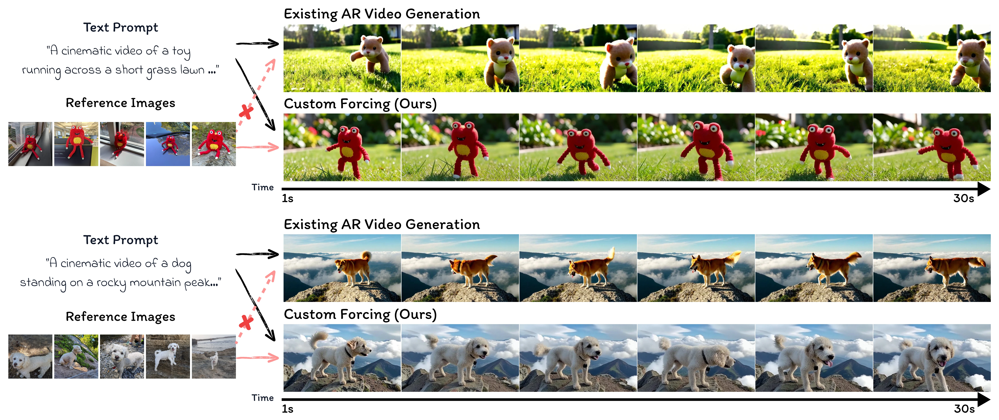
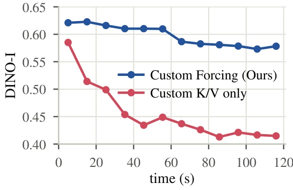

#+TITLE: Custom Forcing：自回归视频生成中的免训练主体定制
#+SLUG: custom-forcing
#+TYPE: paper-reading
#+STATUS: drafting
#+PROGRESS: 45
#+TARGET_ALIAS: categories/AI/数字人
#+TARGET_SUB_ID: auto
#+PIN: false
#+SOURCE_URL: https://arxiv.org/abs/2610.02914v2
#+TAGS: [数字人, 视频生成, 自回归生成]
#+CREATED_AT: 2026-10-09T15:51:08
#+UPDATED_AT: 2026-10-09T17:53:30
#+PUBLISHED_AT: 
#+PUBLISHED_FILE: 

* Custom Forcing：自回归视频生成中的免训练主体定制

* 1. 先看全局：这篇论文要解决什么？

自回归（autoregressive, AR）视频模型按时间顺序逐块生成视频，配合少步生成和有限历史缓存，能够支持实时、长时域的视频流。但仅凭文本提示时，模型通常生成的是“某一类主体的典型实例”，而非用户提供的那只宠物、那个玩具。对需要持续呈现特定主体的交互式生成而言，关键困难不是视频是否平滑，而是主体在不断把自身输出作为后续条件的过程中，会逐渐偏离外部参考图像；论文称之为 *identity drift*。因此，单纯保持与生成历史的一致，并不能保证身份仍与用户指定对象一致。（论文 Abstract；Introduction）

既有个性化方法要么针对每个主体优化模型，带来额外训练成本；要么依赖预训练条件网络或双向视频建模，需要联合处理一段视频，和“已输出帧不可回改”的因果流式生成不匹配。把参考图作为首帧也不够：主体身份会在后续 rollout 中逐渐丢失。作者提出 Custom Forcing：冻结自回归骨干，把参考图和场景 anchor 写入持久 KV cache，再在自注意力中加入两种互补调节——DVA 根据已完成片段测得的漂移动态放大参考影响，ACG 则利用有/无 anchor 的注意力差异，抵消文本提示引出的类别先验。（论文 Introduction；§3）

作者报告，在最长两分钟的评测中，固定 anchor 的 DINO-I 从约 0.58 降至 0.42，而 Custom Forcing 将其维持在约 0.58–0.62，且没有降低动态程度；在 30 秒比较中，1.3B 模型的结果接近 14B SkyReels-V3 的整体身份相似度，额外生成耗时相对固定 anchor 约为 11%–13%。本文的核心解读是：身份保持需要同时控制“参考信息读多强”和“应朝哪个特征方向修正”，而不能只把参考帧固定塞进上下文。（论文 Abstract；§4–5）

* 2. 任务与表示：问题如何形式化？

** 2.1 数据与符号

设用户提供同一主体的参考图集合为 \(R=\{r_i\}_{i=1}^{M}\)，文本提示为 \(y\)。提示描述场景和动作，但通常只以类别称呼主体，例如“a dog trotting down a forest trail”。视频在因果 VAE 的 latent 空间中分成按时间排列的 chunk \(x=(x^1,x^2,\ldots)\)，每个 chunk 有 \(F\) 个 latent 帧、每帧 \(L=h\times w\) 个 token。生成器 \(G_\theta\) 是冻结的 AR 视频扩散模型；历史条件由 KV cache \(C_{t-1}\) 表示，保存此前可见帧在各 Transformer block 中的 key/value。（论文 §2.1–2.2）

标准 AR 分解写作：

\[
p_\theta(x\mid y)=\prod_t p_\theta(x^t\mid x^{<t},y).
\]

其中 \(x^t\) 是当前 chunk，\(x^{<t}\) 是已生成历史，\(y\) 是文本条件。论文关注的是在不更新 \(\theta\) 的情况下，如何把主体参考 \(R\) 加入因果生成上下文并在长 rollout 中维持身份。（论文 Eq. 1；§2）

** 2.2 目标任务

目标是得到条件视频 \(\hat{x}=G_\theta(y,R)\)，使它既遵循场景/动作提示 \(y\)，又在整个生成时段保持与参考集合 \(R\) 中指定主体相似。这里“相似”由论文使用的 DINO-I、CLIP-I 等表征指标近似评估，“遵循提示”和运动程度则由 CLIP-T、Dynamic Degree 等指标分别衡量；这些代理指标不是对真实身份或自然运动的绝对保证。

该任务是在线因果生成：生成第 \(t\) 个 chunk 时只能依赖当前提示、持久缓存和已完成历史，不能回头修改已经输出的 chunk。因此漂移检测只能基于已完成 chunk，并用于调整之后的生成。论文不进行主体级梯度优化，而是保持骨干权重冻结、在推理阶段改写缓存读取方式。（论文 §2.2–2.3）

** 2.3 任务边界与假设

实验主要覆盖单主体视频，最长两分钟；主体参考为 5 张图像。方法依赖骨干已有的主体生成能力和可操作的持久 attention sink/KV cache。DINO 相似度只能提供主体整体偏离的在线代理信号，不能保证每个局部部件都保持一致；冻结骨干无法生成其本身不具备的外观能力。多主体和超过两分钟的情形未由本文实验验证。（论文 §6；Limitations）

* 3. 关键点：方法由哪些关键机制组成？

** 关键点一：Custom K/V——把外部身份参考放入持久上下文

*** 它要解决什么问题？

普通流式模型的 sink 通常保存最早生成的帧；随着历史窗口滚动，用户最初给出的外部主体参考并不一定持续可见。即使把参考图作为初始帧，生成历史与真实参考的差异仍会随 rollout 累积。作者因此将参考直接放进不会被淘汰的缓存区域，使每个后续 chunk 都能访问主体外观信息。（论文 §3.1）

*** 具体机制

生成前，将 \(M=5\) 张参考图各编码成一个 latent 帧，作为 *reference anchors* 写入各 Transformer block 的 KV cache。另使用 FLUX.2 [klein]，根据参考图和从文本提示导出的图像提示生成一张场景相关的 *custom anchor*；把它复制 4 份。总计 9 个 anchor 帧占据 persistent attention sink：参考图负责主体外观，重复的 custom anchor 负责开场场景与初始构图。它们位于生成历史之前，不会被滑动窗口淘汰。（论文 §3.2；Appendix Implementation Details）

*** 它如何与其他关键点配合？

Custom K/V 提供始终可读的主体参照，但本身是固定强度、固定内容的条件：读得太弱会漂移，读得太强会放大主体并抑制动作；文本仍可能把主体拉回类别典型外观。因此它是身份条件的存储机制，而非完整的漂移控制方案。DVA 调整参考值的强度，ACG 则利用缓存读取差异提供修正方向。（论文 §3.2–3.4）

*** 证据与边界

消融中的 Custom K/V only 已能提高主体定制效果，但 DINO-I 会随时间下滑：主实验约从 30 秒视频开头 0.579 降至末段 0.475；两分钟评测从约 0.583 降至末窗口 0.415。结果说明持久缓存能提供身份条件，却不能单独消除累积漂移。（论文 §4.2；§5.1）

** 关键点二：DVA——用在线漂移信号调节参考强度

*** 它要解决什么问题？

固定强度无法兼顾全程身份和运动：恒定弱引导会让身份逐渐漂移，恒定强引导则可能让主体变大、运动变弱。作者的思路是把已完成 chunk 的身份相似度作为反馈，偏离基准时才增强对参考图的读取。（论文 §3.3；Appendix Constant Gain）

*** 具体机制

对已完成 chunk 解码成像素帧，以冻结的 DINOv2-B 编码每帧，并与参考图特征计算余弦相似度。对 chunk 内帧及参考图求平均得到 \(s(t)\)。排除 custom anchor，因为它是场景初始化图而非用户身份参照。前 \(t_{base}\) 个 chunk 作为基线期，其平均相似度定义该视频自己的初始水平；之后依据当前相似度相对基线的下降来计算参考值放大。subject mask 限制放大作用于参考图的主体 token，避免同步强化参考背景。实现设置 \(t_{base}=5\)、\(\alpha_{inj}=300\)、\(\lambda=4\)。（论文 §3.3；Appendix Implementation Details）

其数据流可概括为：

#+BEGIN_SRC text
已完成 chunk → 解码帧 → DINOv2 相似度 s(t) → 与本视频基线比较
                                                  ↓
下一个 chunk ← KV attention ← 放大参考 anchors 的 value（subject mask 内）
#+END_SRC

*** 它如何与其他关键点配合？

DVA 调的是参考信息的 *强度*，根据上一段已完成视频反馈到下一段生成。它不直接提供“朝哪里修正”的方向，因此仍可能被类别先验牵引；ACG 用有/无参考 anchor 的 attention 输出差异补足方向控制。两者针对不同失效模式。（论文 §3.3–3.4；Appendix Time Ablation）

*** 证据与边界

在 30 秒实验中，DVA 单独使用后 DINO-I 在首/中/末窗口约为 0.600/0.598/0.598，基本停止持续下滑。若用常数放大替代自适应信号，虽然某些身份分数可能上升，但会导致主体膨胀、CLIP-T、主体/背景一致性及动态指标下降。将漂移传感器从 DINOv2-B 换成 ConvNeXt-B 后，报告分数变化最多 0.003，降低了“收益仅因传感器和评测器相同”的疑虑；但该结果仍是论文所测主体和协议下的证据。（论文 Table component ablation；Appendix sensor/constant-gain ablation）

** 关键点三：ACG——用 anchor 对比抵消类别先验

*** 它要解决什么问题？

即使 DVA 及时加强了参考影响，提示文本仍只写类别名称，模型仍倾向生成类别的典型成员。单纯提高参考权重可能牺牲运动，却没有显式处理这一偏置。ACG 要从注意力本身构造与参考主体相关的方向。（论文 §3.4）

*** 具体机制

对当前 query 分别计算包含 anchor 的注意力输出 \(z_+\) 与屏蔽 anchor 后的输出 \(z_-\)。两者差异反映当前 query 从 anchors 读取到的内容。ACG 从 \(z_-\) 沿与该差异相反的方向外推，并与 \(z_+\) 混合；对外推量做范数裁剪以限制幅度。该操作应用于每个 DiT block、每个去噪步的 self-attention，文本 cross-attention 不变。默认外推强度 \(\alpha=4\)，混合权重 \(\alpha_{acg}=0.25\)，裁剪上限 2.5，warm-up 为 5 个 chunk。ACG 不增加网络 forward，但需要第二次 attention read。（论文 §3.4；Appendix Implementation Details）

*** 它如何与其他关键点配合？

与 classifier-free guidance 依靠额外条件/无条件网络预测不同，ACG 的正负分支来自同一 self-attention 中是否屏蔽缓存 anchor；与 DVA 的 value scaling 不同，ACG 改变的是 attention 输出的引导方向。论文指出 ACG 放大 query 已经分配给 anchor 的注意力份额，而不是给所有 query 混入固定参考量。DVA 作用于下一 chunk 的参考读取强度，ACG 则修正当前 chunk 的 attention 输出。（论文 §3.4）

*** 证据与边界

消融中 ACG 单独使用能抬高身份相似度起点，但身份仍随时间下降；DVA+ACG 的 DINO-I 首/中/末为 0.619/0.626/0.616，较 DVA 单独方案各窗口提高约 0.02–0.03。对照同提示的 vanilla AR 视频，ACG 将与类别先验视频的相似度降低 0.015–0.040，支持其削弱类别先验的解释。用户研究未显示相对 Custom K/V only 的画质偏好显著差异，因而“没有质量损失”应限于该研究的评测设置。（论文 §4.3；Appendix Prior/User Study）

* 4. 训练过程：这些目标怎样共同优化？

Custom Forcing 本身不是主体级训练方法：自回归视频骨干保持冻结，不对每个用户主体做梯度优化，也不训练新增条件网络。它将参考图和场景 anchor 一次性写入缓存，并在推理 rollout 中运行漂移测量及 attention 调节。因此“训练过程”更准确地说是其推理时准备与逐 chunk 反馈流程。（论文 Abstract；§3；Conclusion）

| 阶段 | 输入/分支 | 使用的目标 | 更新对象 | 论文设置 |
|---|---|---|---|---|
| 主体准备 | 5 张用户参考图 + 文本场景提示 | 生成一张场景 custom anchor | 无主体级参数更新；用 FLUX.2 [klein] 生成 anchor | custom anchor 复制 4 份 |
| 缓存初始化 | 5 张参考图与 4 份 custom anchor | 将主体与场景上下文设为持久 sink | 写入各 block 的 KV cache | 共 9 个 anchor 帧 |
| 在线生成 | 文本提示、当前噪声 chunk、历史 KV cache | 冻结 AR 视频模型逐 chunk 生成 | 骨干冻结；不做主体微调 | Rolling Forcing，1.3B；832×480、16 fps；每 chunk 3 个 latent 帧 |
| 漂移反馈 | 已完成 chunk 解码帧与 5 张参考图 | DINOv2-B 相似度反馈给后续 chunk | 更新下一 chunk 的参考 value 缩放量 | 前 5 个 chunk 建基线；\(\alpha_{inj}=300,\lambda=4\) |
| 注意力修正 | 含 anchor / 屏蔽 anchor 两路 attention 输出 | 缓和类别先验并控制外推幅度 | 改当前 self-attention 输出，不更新参数 | \(\alpha=4,\alpha_{acg}=0.25\)，clip=2.5，warm-up 5 chunks |

该方法没有针对主体的训练损失或优化器更新；不应把 DINOv2 的相似度反馈误说成训练目标。论文另在 Deep Forcing 上测试相同 custom K/V 与超参数，显示该缓存操作可用于另一种带持久 sink 的 AR 骨干，但并不意味着无需适配即可兼容所有自回归模型。（论文 Appendix Implementation Details；Additional Quantitative Results）

* 5. 实验结果：证据回答了哪些问题？

主实验使用 100 个 prompts，短视频约 30 秒，长视频为 2 分钟。DINO-I、CLIP-I 衡量生成帧与参考图像的表征相似度；CLIP-T 衡量提示文本相似度；VBench Subject/Background Consistency 与 Dynamic Degree 分别从一致性和运动程度提供补充视角。论文对 30 秒视频按首、中、末约 10.5 秒窗口计算身份指标，对两分钟视频取对应时段窗口。（论文 §4.1；Evaluation Details）

| 要回答的问题 | 评测设置 | 指标 | 基线/对照 | 主要结果 | 可支持的结论与边界 |
|---|---|---|---|---|---|
| 持久 anchor 能否单独保持长时身份？ | 100 prompts；30 秒与 2 分钟 rollout | DINO-I 时间窗口 | Custom K/V only | 30 秒约从 0.579 降至 0.475；2 分钟约从 0.583 降至 0.415 | 固定身份参考可定制开端，但不足以阻断长期漂移 |
| DVA 与 ACG 是否互补？ | 30 秒组件消融 | DINO-I 首/中/末 | Custom K/V only、+DVA、+DVA+ACG | DVA 为 0.600/0.598/0.598；组合为 0.619/0.626/0.616 | DVA 稳定时间趋势，ACG 进一步提高身份分数；消融支持组件作用，但不能证明适用于所有骨干/主体 |
| 两分钟身份保持是否改善且运动未被压制？ | 2 分钟；100 prompts | DINO-I、Dynamic Degree | 固定 Custom K/V | Custom Forcing 约维持 0.58–0.62，末段约 0.578；固定 anchor 末段约 0.415；Dynamic Degree 与固定 anchor 相当 | 在该设置下身份显著更稳，未观察到动态程度降低；不等于所有运动质量均无损 |
| 与长视频/定制基线相比如何？ | 30 秒及原生长度基线比较 | DINO-I、CLIP-I/T、速度 | 双向个性化方法、I2V/R2V、SkyReels-V3 | 1.3B 模型全片 DINO-I 0.635，接近 14B SkyReels-V3 的 0.641；末窗口 0.616 对 0.564；每帧快约 9.4–28.5 倍 | 在论文协议下取得有竞争力身份保持与速度；各模型输入、长度和生成管线不同，速度不可脱离设置泛化 |
| 在线反馈带来多少额外开销？ | 单张 H100；30 秒/2 分钟 | 相对生成耗时 | Custom K/V only | 分别约 1.13× 与 1.11×；ACG 单独增加约 4% | 论文测得开销主要来自 chunk 解码和 DINO 漂移测量；硬件与实现条件限定该数字 |
| 用户是否偏好结果？ | 30 位参与者盲测 | 主体偏好、画质偏好 | 多个 I2V/R2V 方法及固定 anchor | 主体偏好总计 600 票中 58.5%；与 SkyReels-V3 的主体偏好差异不显著；画质相对固定 anchor 也无显著偏好 | 用户研究支持身份观感改善，但样本规模及被测方法范围有限 |

论文还在 Deep Forcing 上复现实验：Custom Forcing 将 DINO-I 从固定 anchor 基线的 0.556 提至 0.641（30 秒），两分钟从 0.518 提至 0.620；说明机制在另一种 attention-sink 骨干上也呈现改善。Deep Forcing 上 DVA 单独会降低 Dynamic Degree，而加入 ACG 后动态指标恢复并超过固定 anchor，显示组件交互可能随骨干而变。（论文 Additional Quantitative Results）

定性结果中，固定 anchor 会出现玩具外形改变、动物毛色/面部特征漂移等现象；DVA 延缓漂移，加入 ACG 后示例主体特征更接近参考图。该图示有助于理解失败类型，但不能替代定量评测。（论文 Fig. qualitative comparison）

** 主要消融与解释边界

DVA 单独在约 10 秒后阻止身份分数继续单调下滑；ACG 单独提高初始身份却无法阻止后续下降，组合更稳定。过大的 injection budget 或 ACG strength 会损害动态程度及主体/背景一致性；参考图数量与场景 anchor 数量之间也存在身份、场景稳定和运动的取舍。Constant-gain 消融显示固定大增益可能造成主体填满画面；因此收益来自自适应机制与选择性 subject mask，而不是简单地“越强越好”。（论文 Appendix ablations）

* 6. 结论：方法价值与适用边界

Custom Forcing 把用户参考图作为持久 KV anchor 注入冻结的自回归视频模型，再以 DVA 根据在线身份漂移调节参考读取强度，以 ACG 抵消类别文本带来的典型外观先验。两分钟、100 prompts 的实验显示，相比固定 anchor，身份相似度在后段保持得更好，且主骨干上的 Dynamic Degree 未下降；相对固定 anchor 的生成时间开销约 11%–13%。（论文 §4–6）

方法的价值在于把个性化从逐主体训练或额外双向条件网络，转化为推理时对缓存内容和注意力读取的控制，适合有持久 KV sink 的因果生成管线。其边界同样明确：身份反馈是整体 DINO 相似度，无法专门修复局部部件；冻结骨干的生成上限不会因注意力调节而消失；目前只评估单主体、最长两分钟。多主体、更长 rollout 及更广泛骨干兼容性仍需单独验证。（论文 Limitations）

** 论文与资源

- 论文：[[https://arxiv.org/abs/2610.02914v2][Custom Forcing: Training-Free Subject Customization for Autoregressive Video Generation]]
- 项目页：[[https://gustn9609.github.io/custom-forcing/][Custom Forcing project page]]
- 代码：提取到的论文正文未确认代码仓库链接；发布前需检查项目页与论文最新版本。