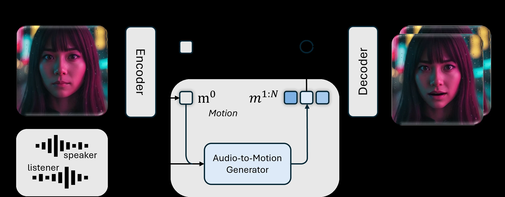
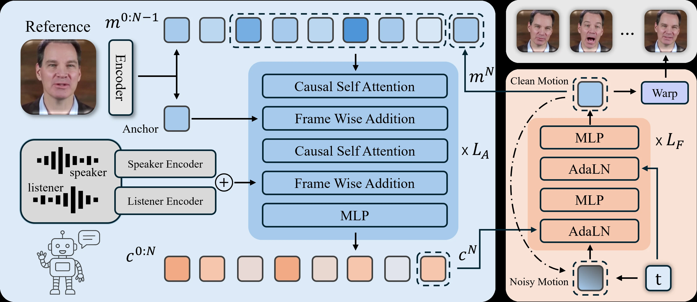

#+TITLE: DyStream：流式双人 Talking Head 生成
#+SLUG: dystream-2025
#+TYPE: paper-reading
#+STATUS: outlining
#+PROGRESS: 40
#+TARGET_ALIAS: categories/AI/数字人
#+TARGET_SUB_ID: auto
#+TARGET_HUB: digital-human-hub
#+PIN: false
#+SOURCE_URL: https://arxiv.org/abs/2512.24408
#+TAGS: [数字人, TalkingHead, Flow Matching, 实时交互, 自回归]
#+CREATED_AT: 2026-07-20T15:09:07
#+UPDATED_AT: 2026-07-20T15:09:07
#+PUBLISHED_AT:
#+PUBLISHED_FILE:

* DyStream：流式双人 Talking Head 生成

来源：https://arxiv.org/abs/2512.24408
作者：Bohong Chen（浙江大学）、Haiyang Liu（东京大学）
发表：CVPR 2026

** 问题

现有 talking head 方法基本都是 chunk-based——要拿到整段音频才能开始生成，导致系统延迟高达数百毫秒。说话者模式下还能接受，但「倾听者模式」需要即时的非语言反馈（点头、表情变化），延迟会完全破坏对话临场感。

技术核心难点：改成逐帧因果生成后，标准 Wav2Vec2 依赖未来上下文，强制因果会导致唇型同步质量大幅下滑。

** 目标与贡献

目标：系统级端到端延迟 < 100ms 的流式双人 talking head 生成。

1. 基于 Flow Matching 的自回归模型，逐帧生成，理论单 token 延迟
2. 定制 causal Wav2Vec2：用 LayerNorm 替换 GroupNorm，去掉卷积 PE 换 RoPE，lookahead 仅 60ms
3. HDTF 上 SOTA 唇型同步（Sync-C offline 8.13 / online 7.61），每帧 34ms

** 模型结构

两阶段框架：

*Stage 1 - Motion-aware Autoencoder*（基于 LivePortrait / LIA）
源图像 → 静态外观特征 v_app（身份）+ 动态运动特征 m（姿态+表情），decoder 通过 warping 合成帧。

*Stage 2 - Audio-to-Motion Generator*
- AR 主干：Causal Transformer（12 blocks，hidden 768，8 heads，182M）
- Flow Matching Head：6 层 MLP + AdaLN（80M），对运动 latent 概率建模
- 音频条件：speaker + listener 双轨拼接，element-wise addition 融合
- Anti-Drifting：训练时随机从序列末 10 帧选 anchor，推理固定用初始参考帧

** 训练流程

- AE：AdamW lr=1e-5，batch=48，latent dim=512，150k steps（H200）
- AR + Flow Matching：AdamW lr=2e-5，global batch=64，120k steps，12h（单张 H200）
- CFG dropout：speaker/listener 0.5，anchor 0.1；推理 5-step Euler + CFG
- causal Wav2Vec2 用 full-attention 版本做知识蒸馏训练受限注意力版本
- 数据：HDTF + Realtalk 开源约 50k clips + 内部 100k clips，512×512，25FPS

** 实验结果

HDTF-100，offline 对比：

| 方法 | Sync-C ↑ | 延迟 |
|------|----------|------|
| Sonic | 8.495 | 高（chunk） |
| INFP* | 6.894 | chunk |
| INFP-I (160ms) | 5.335 | 160ms |
| *DyStream（ours）* | *8.136* | *34ms* |
| w/o Flow Matching Head | 7.867 | 34ms |

Flow Matching Head 贡献约 +0.3 Sync-C；lookahead 60ms 是唇型质量关键。

** 总结

用自回归替换 chunk-based diffusion + 定制 causal Wav2Vec2，同时实现 <100ms 系统延迟和 SOTA 唇型同步。

局限：warping 导致眼镜等配件变形，手部遮挡面部时失败，需严格对齐人脸输入，长序列多样性不足。

** 待读 / 疑问

- [ ] Anchor conditioning 的具体实现（看 anchor_1.webp 图）
- [ ] dyadic（双人）场景如何建模 listener 和 speaker 的交互？
- [ ] Flow matching head 为什么比纯 AR 好 ~0.3 Sync-C？

** 参考资料

- [[https://arxiv.org/abs/2512.24408][arXiv:2512.24408]]
- [[https://robinwitch.github.io/DyStream-Page][项目主页]]
