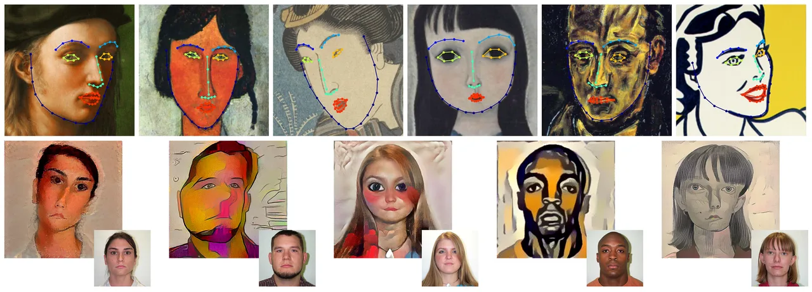

# The Face of Art：艺术肖像 Landmark 检测与几何风格 快读

**来源**：https://doi.org/10.1145/3306346.3322984  
**作者**：Jordan Yaniv, Yael Newman, Ariel Shamir（Reichman University，原 IDC Herzliya）  
**发表**：SIGGRAPH 2019（ACM TOG 38(4)），引用 89 次（OpenAlex，2026-09）

---

## 问题

自然图像的 68 点 landmark 检测已经很成熟（神经网络 + 300W 级标注数据集），但**艺术肖像**（绘画、素描、漫画、版画）上仍然是未解难题：

1. **纹理域差**：艺术脸的风格变化远大于真人照片（笔触、平涂、线条），在自然人脸上训练的模型直接失效；
2. **几何域差**：艺术脸的部件位置/形状被风格化扭曲——嘴可以歪、眼睛可以一大一小、鼻子可以省略，而现有检测器隐含"标准人脸几何布局"先验；
3. **没有训练数据**：艺术人脸没有大规模标注数据集，无法直接监督训练。

## 目标与贡献

1. **艺术增强（artistic augmentation）**：把自然人脸数据集"翻译"成艺术脸来训练——纹理用神经风格迁移、几何用随机部件形变，使检测器无需任何艺术脸标注就能在艺术肖像上工作；
2. **Artistic-Faces 数据集**：160 幅艺术品，覆盖多种流派/艺术家/风格，几何与纹理变化都很大，用于评估；
3. **几何风格分析 + 迁移**：landmark 检测打通后可量化艺术家的"几何风格签名"（Modigliani、Picasso、Margaret Keane、Léger、Foujita 等），并做几何感知的肖像风格迁移。

**对数字人领域的意义**：这是 MakeItTalk（2020）卡通角色 landmark 绑定的前端检测器（MakeItTalk 里引用键 `yaniv2019face` 即本文一作）——没有它，"音频驱动卡通画/漫画"这条链的第一环（自动定位 68 点）就断了。

## 模型结构

### 检测网络：deep heatmaps fusion（基于 ECT 改造，TensorFlow 1.x）

输入 256×256 人脸裁剪，输出 68 张 heatmap（sigma=1.5），三个输出头联合监督：

1. **primary_net**：conv5-128×2（带 pooling）→ conv5-128 → **多尺度空洞卷积**（dilation 1/2/3/4 四分支 concat，128 通道 → 256 通道两轮）→ 1×1 conv 512 → 256 → 68 张 64×64 heatmap；
2. **fusion_net**：concat(浅层 l3, 深层 l7) 融合多尺度特征，再三轮多尺度空洞卷积块（64/64/128 通道）→ 68 张 64×64 heatmap；
3. **upsample_net**：8×8 stride-4 反卷积（双线性初始化）把 64×64 上采到 256×256。

空洞卷积堆多尺度感受野是关键设计：艺术脸的部件位移大，需要大且不固定的感受野去关联远移的部件。

### 三阶段推理管线（`predict_landmarks.py`）

1. **estimation**：heatmap 网络出初始 68 点；
2. **correction**：PDM（point distribution model）做形状约束——把离群预测拉回人脸流形；
3. **tuning**：CLM（`g_t_all`）微调下颌线（可选连眉毛一起调）。

后两步就是摘要里说的 **feature-based landmark correction**：艺术脸部件间几何依赖弱（鼻子可以移位），纯回归头不敢强加部件间约束，所以把约束从网络里拆出来放到推理后处理，按特征分步修正。

### 几何风格应用

检测出的 68 点可以做两件事：(a) 统计某艺术家作品中 landmark 的分布偏移，定义**几何风格签名**（纹理签名 + 几何签名一起构成艺术风格指纹）；(b) 把一位艺术家的几何变形场施加到任意肖像上做**几何风格迁移**。

## 训练流程

**训练集**：IBUG 300W 系自然人脸（training split，GT bbox 外扩 25% 裁剪）——**不用任何艺术脸标注**。

**三重增强**（全部在数据侧解决域差）：

| 增强 | 做法 | 概率 |
|---|---|---|
| 基础 | 旋转 / 翻转 / 裁剪 | 恒开 |
| **纹理**（核心） | 裁剪图上做神经风格迁移，风格源取自 **Painter-by-Numbers**（Kaggle 艺术品数据集）的纹理；预先批量生成存为 `crop_gt_margin_0.25_ns` | p_texture=1.0 |
| **几何**（核心） | 按部件（嘴/鼻/眼/眉/颌）随机缩放（0.7–1.5 均匀）+ 随机平移，带空间冲突检查防止部件重叠——模拟艺术脸的部件位移 | p_geom=0.7 |

**超参数**（代码默认值）：batch 10，Adam lr 1e-3，100k iterations，step 100k × gamma 0.1 衰减；损失 = 三个输出头的 L2 heatmap 误差，权重 1 : 1 : 3（上采样头权重最高）；评估指标 NME 按眼距归一化。

预训练权重 `deep_heatmaps-60000` 放 Dropbox（见 README 链接）。

## 实验结果

> ⚠️ 官方项目页（faculty.runi.ac.il）提供的论文 PDF 服务端截断损坏，以下仅保留可核实部分；具体 NME 数值待补。

- **Artistic-Faces 数据集**：160 幅作品，按艺术家分子目录组织（评估脚本里可见 `Fernand_Leger` 等目录），几何+纹理变化都很大；
- 定性结论（摘要 + teaser）：框架能在绘画、漫画、波普（含 Lichtenstein《Woman with Peanuts》）等多种风格上检出 68 点，支撑几何风格签名分析和风格迁移演示；
- 消融逻辑（从训练配置反推）：纹理增强和几何增强是本文两大开关，训练命令里 `--augment_texture / --augment_geom` 可独立关闭对比。

## 总结

最重要的一句话：**艺术脸检测的域差不靠收集艺术数据解决，而靠在自然人脸数据上同时模拟"纹理风格化"和"几何风格化"两种艺术自由度**——域差被分解成两个可合成的增强维度。

局限：
- 仍然输出**完整 68 点人脸拓扑**——对缺部件的形象（无鼻、笔画嘴、极简 mascot）前提就不成立，检测会崩或产出无意义点位；
- TF1.x + contrib + menpo/menpofit + Python 2.7 环境，工程考古成本高（MakeItTalk 里为此单独开 `foa_env_py2` conda 环境）；
- 依赖人脸检测器给初始框（`use_gt_bb=False` 走检测框）。

**对章鱼 mascot 场景的启示**：这解释了 MakeItTalk 卡通路线的真实边界——它能处理"画风离奇的完整人脸"（毕加索都行），但处理不了"拓扑残缺的吉祥物"。几何增强把部件位置方差拉满，却没有改变"必须有 68 个部件"的输出契约。极简角色要驱动，还是回到参数化嘴 + 确定性渲染。

---

## 待读 / 疑问

- [ ] 论文 PDF 服务端损坏（runi.ac.il 每次只返回 1.37MB），Artistic-Faces 上的 NME/与 baseline 对比数值待从其他渠道补；
- [ ] 几何风格签名如何量化（landmark 分布统计的具体形式）；
- [ ] 对 Danbooru 系动漫脸（大眼无鼻高光）的实测表现——拓扑仍完整但比例极端。

## 参考资料

- [ACM DOI: 10.1145/3306346.3322984](https://doi.org/10.1145/3306346.3322984)
- [GitHub: papulke/face-of-art（推理）](https://github.com/papulke/face-of-art)
- [GitHub: papulke/deep_face_heatmaps（训练代码）](https://github.com/papulke/deep_face_heatmaps)
- [项目页](http://www.faculty.idc.ac.il/arik/site/foa/face-of-art.asp)
- [Artistic-Faces 数据集页](http://www.faculty.idc.ac.il/arik/site/foa/artistic-faces-dataset.asp)
