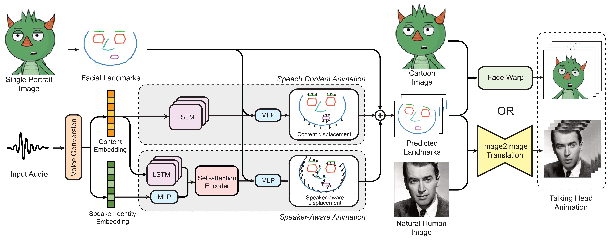
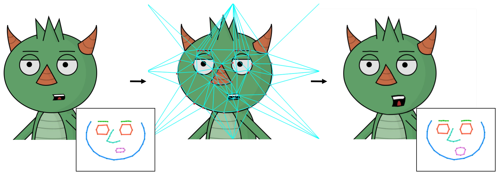
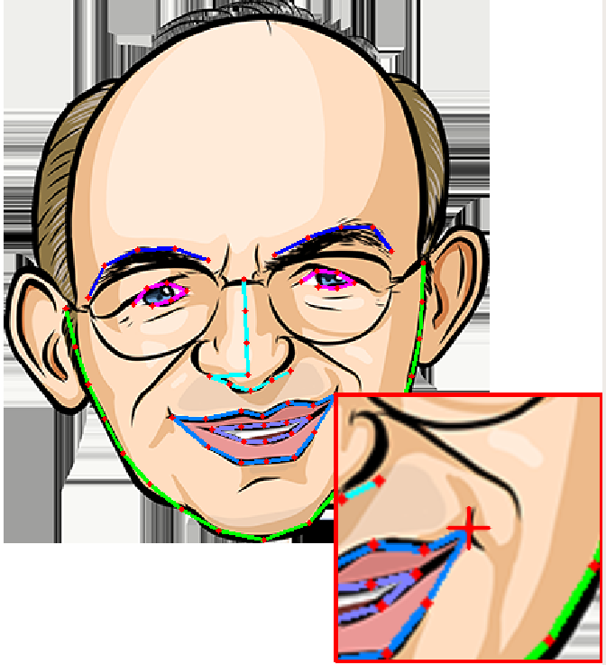

# MakeItTalk：Speaker-Aware Talking-Head Animation 快读

**来源**：https://arxiv.org/abs/2004.12992  
**作者**：Yang Zhou, Xintong Han, Eli Shechtman, Jose Echevarria, Evangelos Kalogerakis, Dingzeyu Li（UMass Amherst + Adobe Research）  
**发表**：SIGGRAPH Asia 2020

---

## 问题

音频驱动说话头当时有两条路，各有硬伤：

- **音频→像素端到端**：直接学音频到原始像素的映射，计算贵、缺表现力（只会动嘴，没有个性化表情和头部运动），且只能用于真实人脸；
- **传统卡通动画**：卡通角色需要人工 rigging + retargeting + 动画师介入，手动同步语音与口型。

核心矛盾：想要表达力（speaker-aware 的表情/头动）就想要更多监督信号，想要跨域泛化（卡通/绘画）就不能绑定人脸像素外观。

## 目标与贡献

1. **landmark 作为解耦中间表征**：音频先解耦成 content（说什么）+ speaker（谁在说），映射到 68 个 3D landmark 的相对位移，而非像素——这是跨域泛化的关键（只在真人数据上训练，却能驱动绘画/素描/漫画/卡通）。
2. **两套 landmark→图像合成**：卡通用 Delaunay 三角剖分 + GPU shader warp（实时、保锐边）；真人用 image2image translation UNet。
3. **speaker-aware 动态**：同一句话，不同 speaker embedding 产出不同头动/表情风格；定量指标 + MTurk user study 验证。

## 模型结构



四个模块串联：

1. **Voice Conversion**（AutoVC 式）：音频 → content embedding + speaker embedding 解耦；
2. **Speech Content Animation**：LSTM 把 content embedding 映射到"中性风格"的 landmark 位移（唇/颌与语音同步）。论文发现循环网络显著优于前馈网络；
3. **Speaker-aware Animation**：Transformer self-attention 编码器（窗口 256 帧 = 4 秒）+ MLP，用 speaker embedding 调制 landmark，补上个性化头动和表情；
4. **渲染端二选一**：
   - 卡通：68 landmark 做 Delaunay 三角剖分，像素绑成纹理，逐帧只动顶点（类比 vertex shader），GLSL C++ 实现，实时；
   - 真人：landmark 画成线段图与肖像拼成 6 通道 256×256，送 UNet 式生成器（30.7M 参数）逐帧翻译。



### Landmark 专题：手动还是自动？多少个点？

**68 个 3D landmark**（论文明说 "68 in our implementation"，代码 `reshape((68, 3))` 确认）。分两种情况：

- **真人/绘画肖像**：全自动。静态 landmark 用现成 3D 人脸 landmark 检测器提取，用户零操作；网络只预测相对位移。
- **卡通新角色（new puppet）**：**半自动、一次性**绑定，流程（`main_gen_new_puppet.py`）：
  1. **Face-of-art**（艺术人脸 landmark 检测器，单独的 Python 2 conda 环境）自动检测 68 点；
  2. 检测不准时用 **Landmark Adjustment Tool 拖拽微调**（不是从零手点 68 个点，是修正自动结果）；
  3. 估计闭嘴态 landmark 作为网络输入基准；
  4. Delaunay 三角剖分，产出 5 个模板文件：`_open_mouth.txt` / `_close_mouth.txt` / `_open_mouth_norm.txt` / `_scale_shift.txt` / `_delauney.txt`。



仓库自带 wilk / smiling_person / sketch / color / cartoonM / danbooru1 / bluehead / cuphead 等现成 puppet 模板，免绑定直接用。绑定一次之后，推理阶段完全自动（音频进、动画出）。

## 训练流程

分模块训练，数据集各不相同：

| 模块 | 数据集 | 说明 |
|---|---|---|
| Voice Conversion | **VCTK**（109 名英语说话人） | AutoVC 式内容/说话人解耦 |
| Content 分支 | **Obama Weekly Address**（6 小时视频） | 高质量 landmark（Bulat 检测器提取 + 仿射配准到正面模板），Laplacian 平滑；landmark 62.5 fps、音频 16 kHz |
| Speaker-aware 分支 | **VoxCeleb2 子集**：67 名说话人、1,232 个 clips（泊松盘采样选说话人），60/20/20 划分 | 不配准到正面模板——要学头部运动 |
| Image2Image Translation | **VoxCeleb2** 配对帧（同人随机 source/target 帧） | landmark 线段图 + 肖像 → 帧 |

硬件：**8 × NVIDIA GTX 1080 Ti 训练 20 小时**（image translation 网络，30.7M 参数）。推理：真人 ~22 FPS、卡通 ~28 FPS——消费级 1080 Ti 档即可。

训练代码开源不全：content 分支有，speaker-aware 和 image translation 标 Todo；但预训练模型全给了。

## 推理流程

```
音频 → voice conversion → content emb + speaker emb
  → content LSTM → 中性 landmark 位移
  → speaker-aware Transformer 调制 → 逐帧 68 landmark
  → 真人: UNet 生成 (~22 FPS) / 卡通: Delaunay shader warp (~28 FPS)
```

可调参数：`--amp_lip_x / --amp_lip_y / --amp_pos`（默认 2 / 2 / 0.5）放大唇部和头部运动幅度。卡通推理的 warp 是 Windows .exe，Ubuntu 上靠 wine 跑。

## 实验结果

- **landmark 预测 vs SOTA**（VisemeNet 等）：唇部 landmark 距离 D-LL 误差低 2×（vs Eskimez）和 2.5×（vs Chen）；
- **User study**：MTurk 324 人、6480 份响应；speaker-aware 研究（90 人）和真人动画研究（234 人）均显著偏好本方法；
- **消融**：去掉 speaker 分支 → 头动指标差 1.6×，唇同步指标也略降；
- **泛化定性**：VoxCeleb2/Obama 之外的人脸、SD 风格卡通、绘画、素描都能驱动。

## 总结

最重要的一句话：**用解耦的 landmark 相对位移做中间表征，是"只在真人数据上训练却能驱动任意画风"的全部秘密**——自由度只有几十维（68 点），比像素级方法小几个数量级，模型小、数据需求中等、跨域免费。

局限：
- 真人路线整图生成，**头动会扭曲背景**（无前景/背景分离）；
- 256×256 低分辨率；
- 卡通新角色需要一次性半自动 landmark 绑定，且依赖 Face-of-art 对"类人卡通脸"的检测能力；
- 头动幅度保守，有伪影。

**对章鱼 mascot 场景的启示**：MakeItTalk 的卡通路线 = 音频 → 68 landmark → Delaunay warp，是"直接驱动动漫脸"的经典答案；但对只有眼/眉/嘴的极简角色，68 点拓扑过参数化，Face-of-art 大概率检测不出完整 68 点拓扑——域差距仍在。参数化嘴 + 小映射表的确定性路线对这种角色更稳更轻。

---

## 待读 / 疑问

- [ ] Face-of-art 对极简 mascot（无鼻、笔画嘴）的实际检测效果？
- [ ] 68 点拓扑在缺部件的脸上，Delaunay warp 的退化行为？
- [ ] speaker embedding one-hot vs 连续 embedding 的后续工作对比

## 参考资料

- [arXiv:2004.12992](https://arxiv.org/abs/2004.12992)
- [GitHub: yzhou359/MakeItTalk](https://github.com/yzhou359/MakeItTalk)
- [Face-of-art（卡通 landmark 检测器）](https://github.com/papulke/face-of-art)
