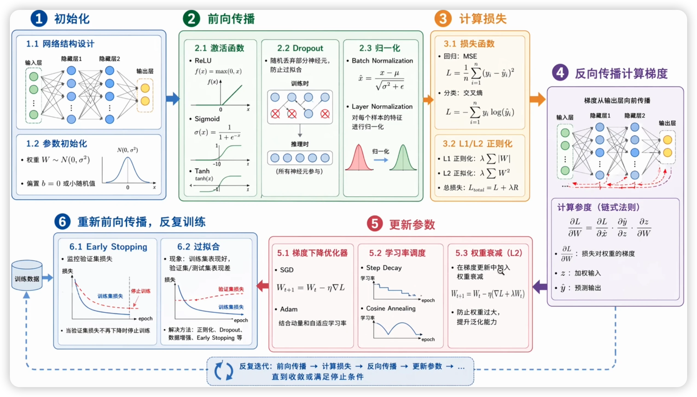
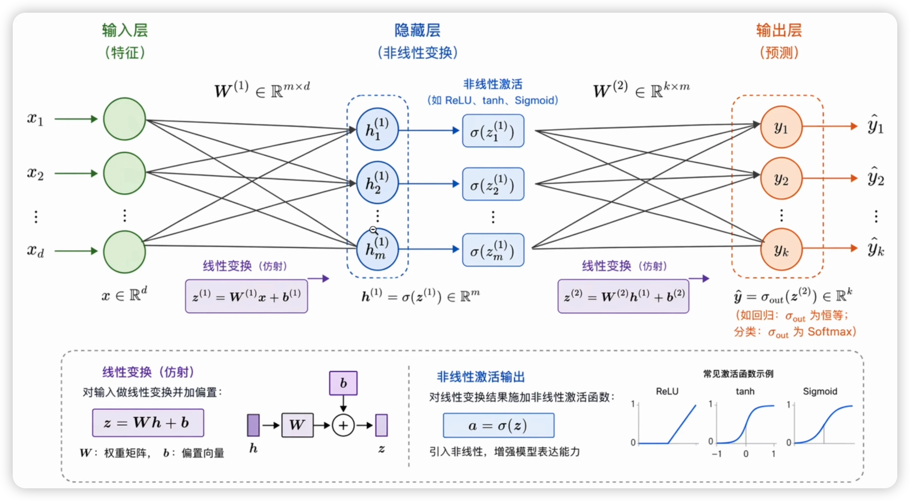
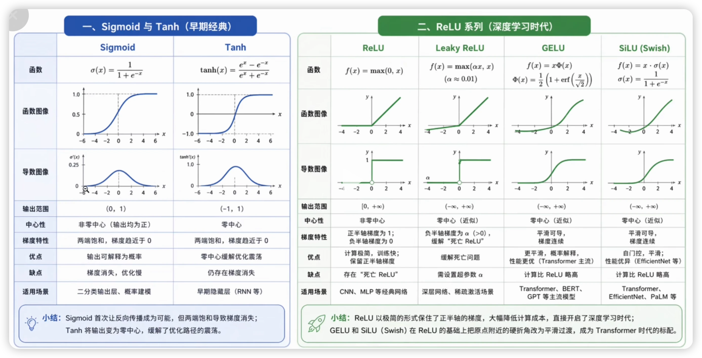
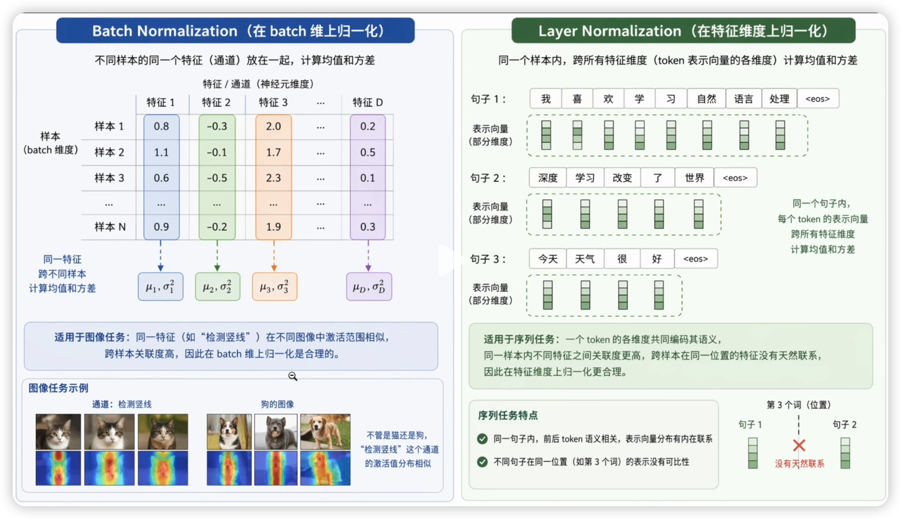
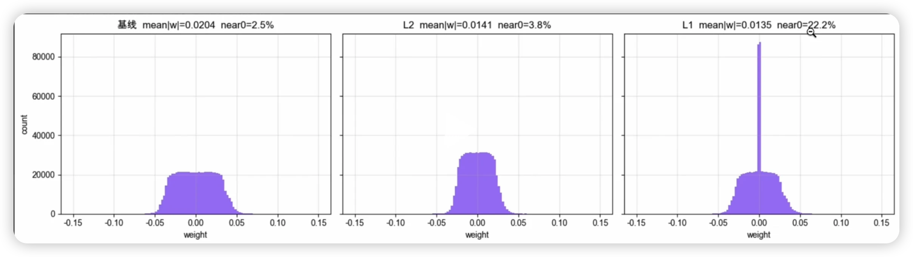

# 模型训练

说实话，我之前还真没有意识到，我没有理解模型到底要怎么去做训练。我肯定知道它的大概的一个过程，但是我没有能够去很好地表述它，如果问我这个问题的话我没办法说出来。

那就照着这个 PPT 来讲解一下，借机整理一下关于模型训练主循环的思路。

## 训练主循环

1. **初始化**：模型参数初始化。
2. **主循环**（真正训练的过程）：
   - 前向运行模型，输出结果；
   - 把结果拿去算损失函数；
   - 反向传播（backpropagation），梯度传到每一个参数；
   - 对每个参数做更新（一般用梯度下降）。

理想上，我们希望模型参数越来越逼近局部最优或全局最优，也就是说希望前向传播的输出能够接近我们真正想要它得到的值。

## 各组件

### 初始化

在模型初始化的过程中，我们首先肯定要完成模型的网络结构设计，这个是大部分工作的主要集中点。

### 前向传播

激活函数；CNN（卷积层 + 激活层 + 池化层轮流堆放，最简单的 CNN 就是这三层堆叠）；Transformer；还有 Dropout、归一化。

#### 归一化

归一化的作用是让每一层输出的激活值不要乱飘，能够更加稳定。值更稳就可以使用更大的学习率，得到更好的学习结果。但事实上，关于归一化为什么能起效果，其实还有很多讨论，没有完全确定它为什么能够生效（如 Santurkar 2018 指出 BN 的作用未必是原论文说的"internal covariate shift"）。归一化的话，现在比较常见的可能就是 BatchNorm 和 LayerNorm。而更近的 decoder-only LLM 里（LLaMA/Qwen/Mistral 等），LayerNorm 已被 RMSNorm 取代（BERT/GPT-2/T5 等仍用 LayerNorm）。

那还有一些像是 Group Norm 之类的模型，我就呃的的的层我就不太了解了，所以我们主要就来区分 Batch Norm、Layer Norm 还有 RMS Norm 这三个归一化的层.

其中 BatchNorm 在 CNN/视觉里最常见，它在一个 Batch 的各个样本内做归一化；LayerNorm 用于基于 Transformer 的模型，在单个 token 的特征维度内做归一化（不是跨 token 聚合），好处是不受 Batch 大小影响，适合复现。第三个是 RMS Norm，特点是去掉了计算均值的过程，减少了计算量，且效果不错。

设输入 x 形状为 (B, H)：B = batch 内样本数，H = 特征维（隐藏单元数）。下标 i 是样本，j 是特征。

**BatchNorm**——统计量下标是 **j（特征）**，沿 **batch 维 B** 聚合：

\[\mu_j = \frac{1}{B}\sum_{i=1}^{B} x_{i,j},\quad \sigma_j^2 = \frac{1}{B}\sum_{i=1}^{B}(x_{i,j}-\mu_j)^2\]

\[\hat{x}_{i,j} = \gamma_j \cdot \frac{x_{i,j}-\mu_j}{\sqrt{\sigma_j^2+\epsilon}} + \beta_j\]

**LayerNorm**——统计量下标是 **i（样本）**，沿 **特征维 H** 聚合：

\[\mu_i = \frac{1}{H}\sum_{j=1}^{H} x_{i,j},\quad \sigma_i^2 = \frac{1}{H}\sum_{j=1}^{H}(x_{i,j}-\mu_i)^2\]

\[\hat{x}_{i,j} = \gamma_j \cdot \frac{x_{i,j}-\mu_i}{\sqrt{\sigma_i^2+\epsilon}} + \beta_j\]

**RMSNorm**——= LayerNorm 砍掉减均值和 β，只除以 RMS：

\[\text{RMS}_i = \sqrt{\frac{1}{H}\sum_{j=1}^{H} x_{i,j}^2},\quad \hat{x}_{i,j} = \gamma_j \cdot \frac{x_{i,j}}{\text{RMS}_i}\]

> **关键区别**：BN 和 LN 公式形状一模一样，差只在"沿哪个轴算统计量"——BN 沿 batch 维（跨样本，下标 j），LN 沿特征维（单样本内，下标 i）。所以 BN 依赖 batch、推理要 running stats；LN 单样本自给自足。RMSNorm 是 LN 的简化（去均值、去 bias）。

### 损失函数

分两种：
- **有监督 loss**（对比 ground truth）：CE loss、MSE loss、L1 loss。
- **无监督/无参考 loss**（不直接对比 GT，如对抗损失、感知损失）。

**分类任务用 CE 不用 MSE**：MSE + sigmoid 输出时，梯度 $\partial L/\partial z = (\sigma(z)-y)\cdot\sigma(z)(1-\sigma(z))$，带了个 $\sigma(z)(1-\sigma(z))$ 因子——预测越自信（$\sigma(z)\to 0$ 或 $1$）它越趋零。于是"自信地错"时误差大但梯度趋零，模型学不动（sigmoid 饱和）。而且 MSE 把 $\sigma(z)$ 往 0/1 推，正好踩进饱和区。CE 的梯度化简后是 $\sigma(z)-y$，饱和因子被对数项抵消，错得越狠学得越快。所以**分类配 sigmoid/softmax 用 CE，回归用 MSE**。

还有正则化（控制损失输出）。

### 反向传播

链式法则，逐层求梯度。没什么好说的。

### 更新

优化器、学习率调度、权重衰减（weight decay）这三个。
- **学习率调度**：不同阶段给不同学习率，一般初期高（离目标远）、后期低。
- 优化器、权重衰减——见下方 TODO。

## TODO（知识缺口，待查）

- [ ] **归一化**：我的理解是不希望值无限大（越滚越大），但"归一化是什么"还没真正想清楚，要重新思考。
- [ ] **正则化**：知道是控制损失输出，但不知道怎么表述它到底是什么、解决什么问题。
- [ ] **优化器**：知道有这东西，但不是很了解，需要补。
- [ ] **权重衰减（weight decay）**：不知道是什么，需要查。

## 备注

- Dropout 的理解：解决过拟合——把一部分神经元丢掉，留出冗余量。
