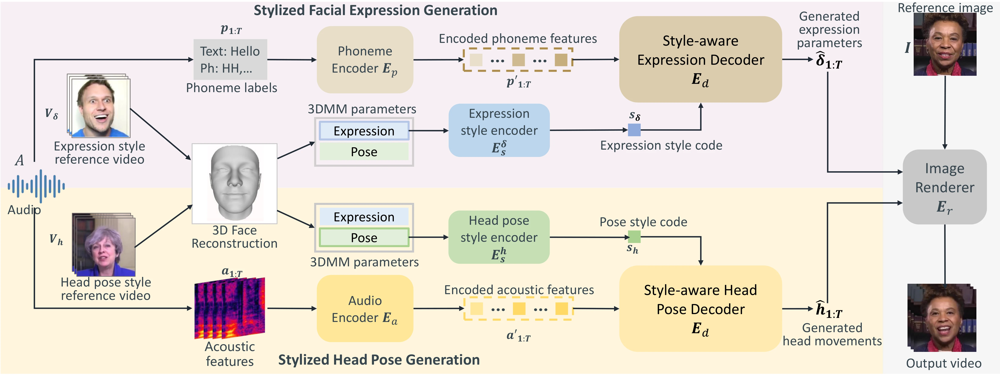
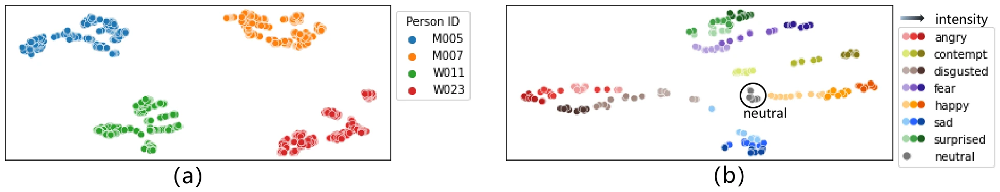

# StyleTalk++：说话风格控制的统一框架（快读）

**来源**：[arXiv:2409.09292](https://arxiv.org/abs/2409.09292)（TPAMI 2024）  
**作者**：Suzhen Wang, Yifeng Ma, Yu Ding, Zhipeng Hu, Changjie Fan, Tangjie Lv（网易伏羲 AI Lab）+ Zhidong Deng（清华）+ Xin Yu（UQ）  
**谱系**：Audio2Head (IJCAI 2021) → AVCT/One-Shot (AAAI 2022) → StyleTalk (AAAI 2023) → **StyleTalk++**

---

## 问题

现有 one-shot talking head 方法只学"人群平均"的口型/头动，**无法捕捉个性化说话风格**。作者把说话风格定义为：**面部表情风格 + 头动风格 = 全脸表情与头动的时空协同激活模式**（spatio-temporal co-activations）。已有工作的缺陷：

- 把风格当离散情绪标签（MEAD 基线、EmoTalk 类）——表示不了连续灵活的风格；
- EAMM / GC-AVT 从情绪参考视频迁移，但只在**静态帧级**迁移上脸（眼眉），忽略时序动态，嘴部形状不受控。

## 目标与贡献

给定 4 个输入：参考图 $I^r$ + 音频 $A$ + 表情风格参考视频 $V_e$ + 头动风格参考视频 $V_h$（两者可为同一段），让 one-shot 人像"用 A 的内容、按 V_e 的表情风格和 V_h 的头动风格"说话。三条贡献：

1. **Universal Style Encoder**：从任意参考视频的 3DMM 系数序列中提取时空风格码，triplet 约束保证泛化到未见风格片段；
2. **统一双支路 style-aware 解码**：表情支路（音素驱动 + 风格码 query + 动态 FFN）与头动支路（声学驱动 + Transformer-XL 递归）分别适配两种运动的特性；
3. 风格空间语义可解释（t-SNE 验证）且可编辑（插值调强度/造新风格）。

## 模型结构

全流程在 **3DMM 系数空间**（64 维表情 α + 头动 h={R,T} 6 维）生成，再渲染：

1. **3D 人脸重建**（共享模块，Guo et al. 2018 表达基 + BFM 身份基）：从风格参考视频提取逐帧表情/头动系数；
2. **Universal Style Encoder**：Transformer encoder（3 层 8 头，hidden 256）吃系数序列 → self-attention pooling 聚合成风格码 $s \in \mathbb{R}^{256}$；triplet loss（margin=5）让相似风格聚类。表情参考需 2-10s，头动参考需 5-20s；
3. **头动支路**：声学编码器（MFCC+FBANK+pitch+清音，41 维/窗）→ Style-aware 头动解码器基于 **Transformer-XL**：逐步递归预测，每步拼接 [音频特征, 上一步空间状态 $e_{i-1}$, 风格码]；
4. **表情支路**：**音素标签**替代声学特征（刻意剥离情绪/强度/节奏等风格干扰）→ 解码器以风格码为 query 做 cross-attention，FFN 换成 **style-aware adaptive FFN**（K=8 组并行专家权重按风格码 softmax 聚合，CondConv 思路）+ **上下面部解耦**（13 个嘴部系数低频高频特性不同，两个并行解码器）；
5. **渲染**：PIRenderer（mapping→warping→editing）。

## 训练流程

- **数据**：VoxCeleb + HDTF + MEAD（42 训练/6 测试演员）+ HeadMotion（751 单人视频）；256×256 @ 25FPS。
- **风格集构建**：MEAD 同演员同情绪同强度 = 一个风格；HDTF 同演员 = 一个风格 → 共 **1,104 个表情风格类**（供风格判别器预训练）。
- **头动 triplet 采样假设**：*同一人相邻片段 = 同风格，非相邻 = 不同风格*——直接假设了个人头动风格的时序稳定性。
- **损失**：头动支路 = SSIM 重建（把 6×T 序列当图，保速度/频率/幅度）+ triplet + 1D PatchGAN 时序判别器 + 头动风格判别器（100/1/10/10）；表情支路 = L1+SSIM 重建 + triplet + **改造 SyncNet 唇同步判别器**（PointNet 吃 404 个嘴部 mesh 顶点 vs 音素）+ 表情风格判别器（预训练分类器冻结）+ 时序判别器（88/1/1/1/1）。表情按 64 帧 clip 批序贯训练（承 AVCT）。

## 实验结果

- **MEAD/HDTF 自驱动**（表情/唇形）：SSIM 0.837/0.812，F-LMD **2.122/1.941**（全场最优，衡量与风格参考的表情匹配），M-LMD 3.249/2.412（最优），Sync_conf 最接近 GT；Wav2Lip 仅嘴部且 CPBD 虚高。
- **头动**（HDTF/HeadMotion）：SSIM 0.847/0.786、PSNR 27.58/26.75，全面超 MakeitTalk / Audio2Head / PHM。
- **用户研究**（36 人）：风格一致性两项均第一（表情 3.46、头动 3.64），自然度/同步仅次于 GT。
- **关键消融**：头动支路换成标准 transformer + teacher forcing 掉最狠（SSIM 0.786→0.566）——**递归是动态性的来源**；去掉空间状态转移（$e_{i-1}$）头动不稳；表情支路去掉风格码 query → 与参考一致性大掉，去掉动态 FFN → 动画不稳，去掉 D_sync → Sync_conf 3.474→2.305。
- **风格空间**：t-SNE 显示**同一说话人的表情/头动风格码各自聚类**（个人动态身份在风格空间可分！）；同情绪按强度分层；anger≈disgust、surprise≈fear 相邻；风格码线性插值平滑过渡。

## 总结

**一句话**：说话风格 = 表情与头动的时空协同模式，可以用一个 256 维风格码从任意参考片段中提出、跨身份注入 one-shot 生成，且风格空间语义连续可编辑。

**对「个人动态身份」课题的意义**：

1. **正面证据**：同人风格码聚类（t-SNE）+ 头动 triplet 的"个人风格时序稳定"假设，直接支持"动态身份存在且可参数化"；
2. **上限**：风格码是 clip 级低维全局向量，捕捉节奏/幅度/偏好，**到不了肌肉协同规则级**；没有 per-identity 机制——同一人在 MEAD 里不同情绪被拆成不同"风格"（1,104 类），而不是"一人一身份、情绪为其状态"；
3. **输入约束**：表情参考 ≥0.5s、头动参考 ≥3s，超过即提取失败——我们"单视频最低输入"的现实下界参考；
4. **工程可借鉴**：风格码当 decoder query、动态 FFN、上下面部解耦、SyncNet 改吃 mesh 顶点，都可搬进我们的注入管线；
5. **缺口确认**：它是"任意参考 → 迁移风格"，不是"锁定此人 → 学习并固化其动态身份"——多源融合 + per-person 固化正是我们的空间。

**作者自述局限**：极端头姿/侧脸参考失效；极端表情下 p/b/m 闭不住嘴；表情支路剥离了音频节奏导致表情节奏可能与音频不匹配；渲染器在大动作时有 artifact。

---

## 待读 / 疑问

- [ ] 表情风格判别器 = 预训练 1,104 类分类器：这个"风格"定义（情绪×强度）与"个人习惯"不是一回事，对比 Mimic 的 subject-specific 解耦看谁更接近动态身份
- [ ] 256 维风格码的信息瓶颈到底装了什么？做 code ablation（截断/扰动各维）能反推编码内容
- [ ] 头动支路吃声学特征、表情支路只吃音素——那表情的"节奏"来源被切断，与我们观察到的"个人表情节奏习惯"如何调和？（作者也承认这是局限）
- [ ] t-SNE 同人聚类现象可否直接复用为"动态身份评测指标"（同人风格码距离 < 跨人距离）？查后续论文是否有人做过

## 参考资料

- [arXiv:2409.09292](https://arxiv.org/abs/2409.09292) StyleTalk++: A Unified Framework for Controlling the Speaking Styles of Talking Heads (TPAMI 2024)
- 前置：StyleTalk (AAAI 2023, 10.1609/aaai.v37i2.25280)、AVCT/One-Shot (AAAI 2022, 10.1609/aaai.v36i3.20154)、Audio2Head (IJCAI 2021)
- 总课题草稿：`drafts/personal-dynamics-digital-human.org`（路线 B 第一篇精读）
