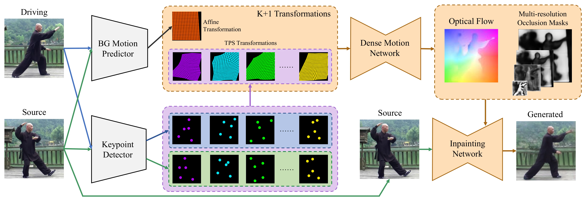
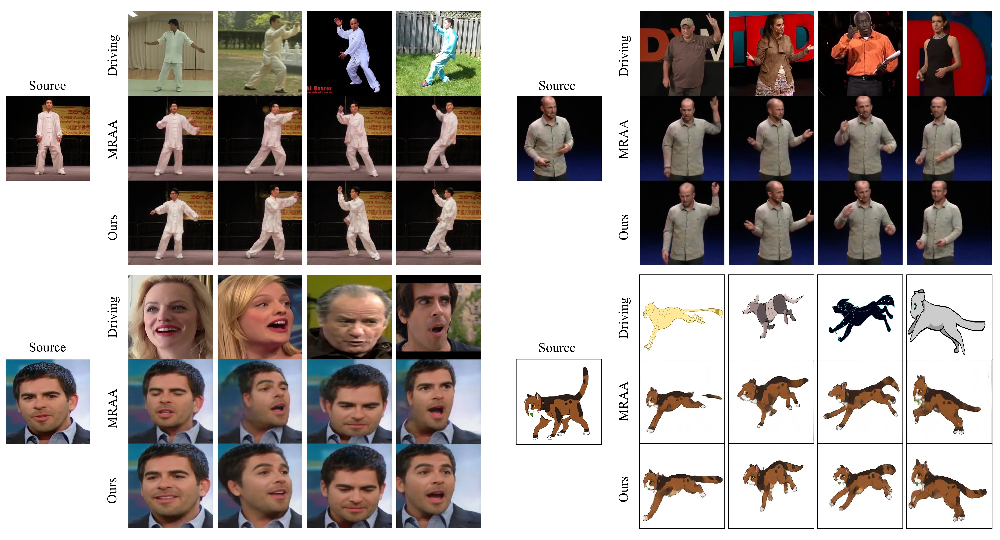

# Thin-Plate Spline Motion Model for Image Animation 快读

**来源**：https://arxiv.org/abs/2203.14367  
**作者**：Jian Zhao, Hui Zhang（清华大学软件学院 / BNRist）  
**发表**：CVPR 2022  
**代码**：https://github.com/yoyo-nb/Thin-Plate-Spline-Motion-Model

---

## 问题

无监督 motion transfer（FOMM、MRAA 一脉）要在**不假设任何对象拓扑**的前提下把驱动视频的运动迁到静态源图，但有两大瓶颈：

1. **大姿态差距**：FOMM/MRAA 用关键点邻域的**局部仿射**（线性）近似运动，表达不了复杂非线性运动（如张嘴时嘴唇是弯曲的），源/驱动姿态差大时 warp 误差大、遮挡区域暴涨，过度依赖 inpainting；
2. **inpainting 能力不足**：前人用**单一遮挡 mask** 作用于所有尺度的特征图，而不同尺度特征关注点不同（低尺度看结构、高尺度看纹理），单 mask 迫使网络在尺度间做权衡。

## 目标与贡献

1. **TPS 运动估计**：用非线性薄板样条（thin-plate spline）变换替代局部仿射，光流更灵活、对大运动更稳；训练早期对多组 TPS 变换做 **dropout** 防局部最优；
2. **多分辨率遮挡 mask**：hourglass 解码器每层预测对应分辨率的 mask，多尺度特征各自聚焦、融合更有效；
3. **辅助损失**（L_bg 背景仿射逆一致性、L_warp warp 后特征对齐驱动帧特征）明确模块分工。
4. 在 VoxCeleb / TaiChiHD / TED-talks / MGif 四类数据上多数指标 SOTA，**运动相关指标提升显著**。

## 模型结构

四个模块：

- **Keypoint Detector**：对源图 S 和驱动帧 D 各预测 K×N 个无监督关键点（**N=5 点/组**，每 5 点对生成一个 TPS 变换，共 K 个）；
- **BG Motion Predictor**：估计 1 个仿射背景变换，消除相机运动干扰（同 MRAA）；
- **Dense Motion Network**（hourglass）：把 K+1 个变换用 softmax 贡献图逐像素加权合成光流（公式：T(p) = Σ M_k(p)·T_k(p)），同时各解码层输出多分辨率遮挡 mask；
- **Inpainting Network**（hourglass）：用光流 warp 源图各层特征，按对应分辨率 mask 遮挡后经 skip connection 送入解码器补全缺失区域。

关键机制：

- **TPS 变换**：最小化二阶导数弯曲能量的非线性插值，径向基 U(r)=r²ln r²；比仿射能表达弯曲/非线性局部运动；
- **TPS dropout**：训练早期以概率 P 把某些 TPS 的贡献图置零（其余除 1-P 保持期望），防止网络只依赖少数变换陷入局部最优；若干 epoch 后移除；
- **测试用 avd 模式**（沿用 MRAA）：shape encoder 保源图形状 + pose encoder 取驱动帧姿态，MLP 重建关键点后再估光流——缓解跨身份姿态迁移问题。

运动表征维度：MRAA 为 (K+1)×6，TPSM 为 K×(6+5×2)+6；对比实验取 K=2/4/8 对齐 MRAA 的 K=5/10/20（维度 38/70/118 vs 36/66/126），**相近维度下运动指标更好**——TPS 每个变换信息密度更高。

## 训练流程

- **数据集**（按对象类型各训一个模型）：
  - **VoxCeleb**：名人说话视频，裁 256×256；
  - **TaiChiHD**：太极全身表演，256×256；
  - **TED-talks**（MRAA 提出）：上半身，384×384；
  - **MGif**：Google 搜来的**像素动画 .gif（动物奔跑等卡通运动）**——这是它对"非人对象"泛化的训练依据。
- **损失**：L = L_rec（VGG-19 多分辨率感知重建）+ L_eq（关键点等变性，随机 TPS 扰动）+ L_bg（正/反序仿射互为逆矩阵的约束，改写为 ‖A·A'−I‖ 防零解）+ L_warp（warp 后源特征 vs 驱动帧 encoder 特征逐层 L1）。
- **硬件/时长**：**2 × RTX 3090**，每数据集 100 epochs；VoxCeleb/TaiChiHD/MGif 各 3 天，TED-talks（高分辨率）8 天。
- 无监督自重建范式：同视频采两帧，一帧当源、一帧当驱动，重建损失优化。

## 推理流程

源图 S + 驱动视频 {D_t} → 逐帧 keypoints → avd 解耦（S 的形状 + D_t 的姿态）→ K+1 变换合成光流 → warp + 多分辨率 mask inpainting → 输出帧序列。驱动信号是**视频**，不是音频；任意图像皆可（训练域内对象类型）。

## 实验结果

- **视频重建**（Table 1）：VoxCeleb/TaiChiHD/MGif 全面 SOTA；TaiChiHD 上 vs MRAA **AKD −15.5%、MKR −28.0%**（运动更准）；TED-talks 运动指标（AKD）赢、身份指标（L1/AED）略输；
- **时序连续性**：MRAA 邻域仿射对关键点抖动敏感（出现"多一根手指"的帧间跳变），TPS 每变换由 5 点共同决定，更鲁棒、无跳变；
- **User study**（vs MRAA）：连续性偏好 71.3% / 63.9% / 80.9%（TaiChi/TED/Vox），真实性偏好 86.1% / 58.4% / 61.5%；
- **消融**（TaiChiHD）：TPS 替换仿射 → AKD/MKR 改善；+dropout → AKD 再降但 AED 略升（遮挡变大）；+multi-masks → L1/AED 改善；+L_bg/L_warp → AKD 回落，全方法四指标平衡。

## 总结

最重要的一句话：**把"关键点邻域线性仿射"升级成"多组 5 点 TPS 非线性变换 + dropout + 多分辨率 mask"，无监督 motion transfer 在大姿态差距下的运动精度和时序稳定性同时上台阶**——这是 FOMM→MRAA→TPSM 谱系里工程上最成熟的一版。

局限：
- **极端身份失配仍失败**（用长颈鹿驱动小狗）；
- 身份/细节保持（衣服、脸部纹理）略输 MRAA；
- 每类对象要单独训模型（人脸/全身/卡通各一个），跨域不是零成本；
- 只吃驱动视频，不吃音频。

**对章鱼 mascot 场景的启示**：TPSM 的无监督关键点不假设拓扑，且 MGif（像素卡通动画）证明它学过非人运动先验——用"人表演视频"驱动章鱼，TaiChi/Vox 模型不一定贴，但路线成立；若效果不够，可在 MGif 类卡通数据上 fine-tune。与"参数化嘴 + 映射表"路线互补：TPSM 给全身/头部运动，参数化嘴给精确口型。

---

## 待读 / 疑问

- [ ] MGif 预训练模型直接驱动极简 mascot 的实测效果？
- [ ] 与 LIA（隐式运动空间）在卡通域的正面对比？
- [ ] avd 模式对"源图无对应部件"（如章鱼无手臂）的退化行为？

## 参考资料

- [arXiv:2203.14367](https://arxiv.org/abs/2203.14367)
- [GitHub: yoyo-nb/Thin-Plate-Spline-Motion-Model](https://github.com/yoyo-nb/Thin-Plate-Spline-Motion-Model)
- [HF Space 在线 demo](https://huggingface.co/spaces/CVPR/Image-Animation-using-Thin-Plate-Spline-Motion-Model)
