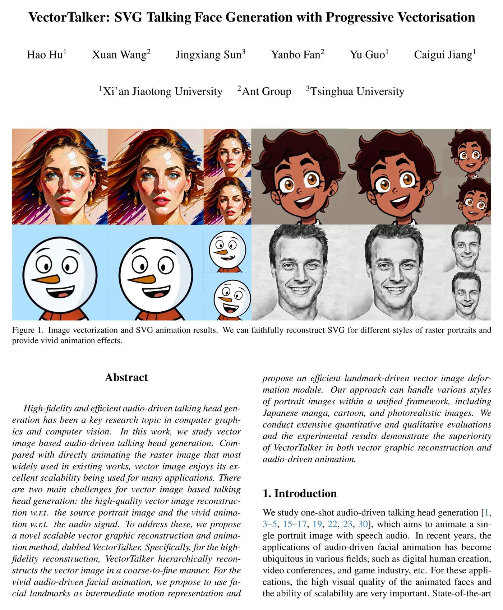
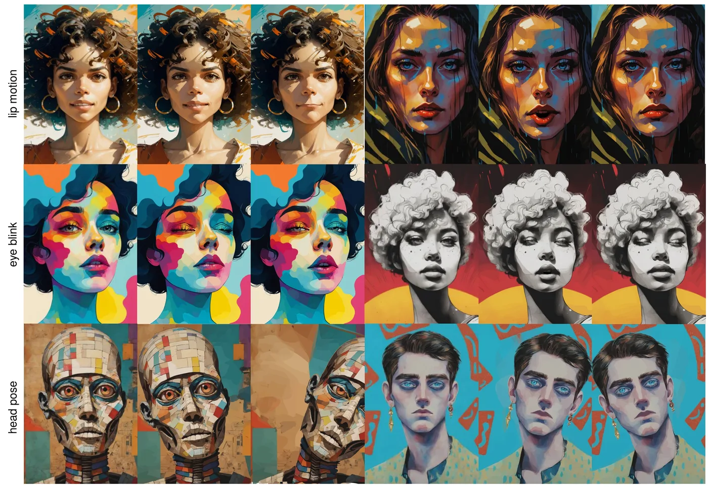
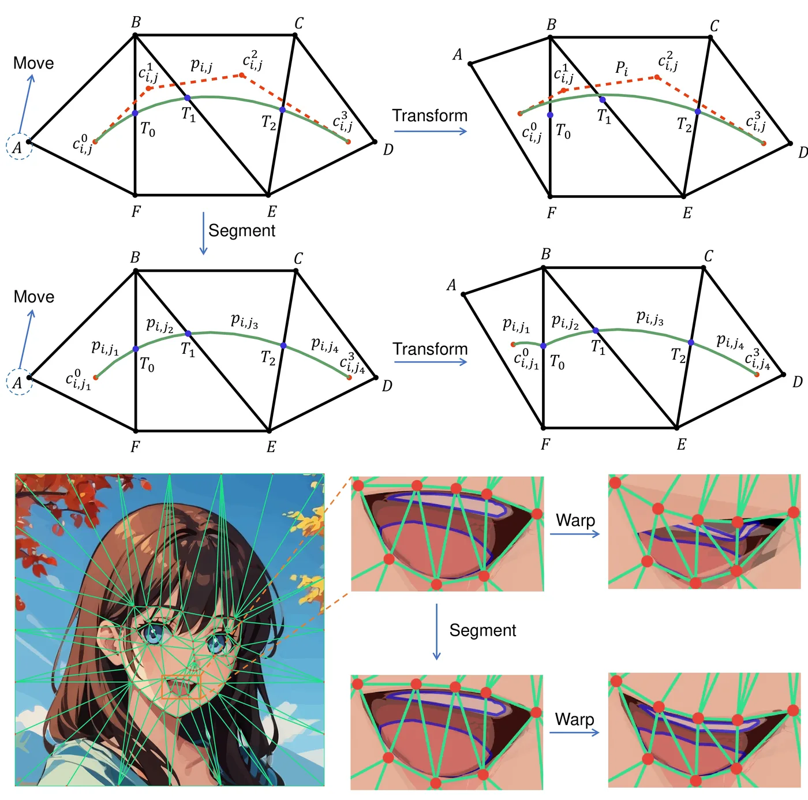

# VectorTalker：SVG 矢量说话脸生成 快读

**来源**：https://arxiv.org/abs/2312.11568  
**作者**：Hao Hu, Xuan Wang, Jingxiang Sun, Yanbo Fan, Yu Guo, Caigui Jiang（中科院计算所/国科大 + 中科视拓）  
**发表**：CVPR 2024（arXiv 2023-12）

---

## 问题

音频驱动说话脸几乎全在**位图（raster）空间**做：学一个光流/变形场逐像素拉扯。两个结构性缺陷：

1. **脸部结构复杂，逐像素光流难学**——结果有畸变和模糊；
2. **分辨率被训练分辨率锁死**——放大必糊，而商用场景（大屏、印刷、多分辨率投放）恰恰要无损缩放。

矢量图（SVG）天生解决这两点：数学基元（贝塞尔曲线）分辨率无关、可编辑。但**没人做过矢量空间的音频驱动说话脸**——本文是第一个。两个子挑战：(a) 位图→SVG 的高保真重建；(b) 矢量图上做音频驱动的生动动画。

## 目标与贡献

1. **首个矢量空间 one-shot 音频驱动说话脸框架**：位图先重建为 SVG，再在 SVG 上做动画；
2. **渐进式矢量化**（progressive vectorization）：粗到细的可微矢量化，重建质量全面超过 DiffVG / LIVE；
3. **曲线分割 + 语义分层**：把 MakeItTalk 式的 landmark 三角 warp 移植到矢量空间的两个关键工程修正。

## 模型结构



整个流程两阶段：**先矢量化，后动画**。动画端不需要训练——运动表征直接复用 landmark。

### 阶段一：渐进式矢量化（Progressive Vectorization）

SVG 用路径集合表示，每条路径由 L 段三次贝塞尔曲线（默认 **L=8**）闭合而成，每条曲线 4 个控制点。路径全部**初始化为圆**（半径 r），靠优化变形。

1. **粗到细目标栈**：对输入位图做 **l0 正则化图像平滑**，取 **N=5 级**递增强度，得到从"大片色块"到"接近原图"的平滑图像栈 {S^l}——每一级是不同抽象程度的目标；
2. **逐级加路径**：从最粗级开始，按当前重建误差图（error map）选位置、以更大半径初始化新路径，加入优化变量；用 **MSE 损失** 对平滑目标做可微渲染优化（渲染器 = **DiffVG**，Adam，坐标学习率 **1**、颜色学习率 **0.01**；每级 **200** 次迭代，最后拟合最细级 **400** 次；总路径数默认 **500**）；
3. **为什么粗到细**：随机初始化直接拟合原图会过早收敛到细小结构、损失保真度——先拟合大结构再逐级补细节。

**语义分层**：用 **SAM** 分割出前景掩码（foreground）和局部掩码（local，眼/嘴），路径集分成**背景 / 前景 / 局部**三层，从后往前合并。背景层在分割后做 **inpainting**（头动时不露空洞）。损失是四层 MSE 加权（λ1=λ2=λ3=λ4=1）：

```
L = λ1·L_back + λ2·L_fore + λ3·L_local + λ4·L_merged
（L_back 用 inpainting 后的背景目标）
```

### 阶段二：SVG 动画（landmark 驱动，无神经网络）

1. 用现成检测器（**foa = Face-of-art**，与 MakeItTalk 同源）在原图上提取面部 landmark，做 **Delaunay 三角剖分**；
2. 音频预测逐帧新 landmark（沿用 MakeItTalk 的音频→landmark 预测，不自训）；
3. 每个三角形由顶点偏移算出仿射变换，路径跟着变形；拓扑不变，"纹理"（曲线颜色形状）跨帧传递。

**核心难点——曲线分割（curve segmentation）**：贝塞尔曲线可能横跨多个三角形，控制点落在不同三角形里会被多个仿射变换同时拉扯，整条曲线形状失控（论文图例：只动点 A，整条曲线都变）。解法：求曲线与三角剖分线段的交点（解一元三次方程），用分裂矩阵 **M0 / M1**（de Casteljau 式，论文附录 C 给出显式矩阵）把曲线在交点处切开，保证**每段曲线完整落在一个三角形内**；分裂前后曲线形状严格不变，只是控制点变多。

**语义分层的回报**：动画时只 warp 前景层和局部层，**背景层固定不动**；眼睛和嘴单独重选 landmark 三角化——眨眼时眼睛被上前景层自然遮盖而不是被挤变形，张嘴时牙齿不会拉伸糊满整个嘴。



额外可控维度：**唇动、眨眼、头倾**（比 MakeItTalk 多了显式眨眼和头姿控制）。



## 训练流程

**没有"训练"，只有"逐图优化"**——这是本文与神经网络路线的本质区别：

| 项 | 值 |
|---|---|
| 可微渲染器 | DiffVG（抗锯齿、可微） |
| 优化器 | Adam；坐标 lr 1，颜色 lr 0.01 |
| 路径结构 | 每条路径 8 段三次贝塞尔曲线，初始化为圆 |
| 平滑栈 | l0 smoothing，5 级 |
| 总路径数 | 500（消融到 1000） |
| 迭代 | 每平滑级 200 次，最细级 400 次 |
| 损失 | 四层加权 MSE（背景/前景/局部/合并） |
| 分割 | SAM 出前景/局部掩码 |
| 音频→landmark | 复用 MakeItTalk 预测（foa 检测） |

矢量化是**每张输入图一次性的离线优化**（类似 NeRF 按场景优化）；动画阶段纯几何变换，逐帧只是仿射变换 + 渲染。

## 实验结果

**重建质量**（自建 20 张多风格肖像 benchmark：水彩/油画/漫画/真人，同路径数/曲线数/迭代数公平对比）：

| 方法 | MSE | LPIPS | PSNR | SSIM |
|---|---|---|---|---|
| DiffVG | 0.00213 | 0.290 | 27.799 | 0.857 |
| LIVE | 0.00194 | 0.269 | 28.291 | 0.864 |
| **Ours** | **0.00131** | **0.258** | **29.835** | **0.886** |

**消融**：
- 路径数 100→1000：MSE 0.00498→0.00101，PSNR 22.9→30.8——路径越多保真越高，500 是默认性价比点；
- 平滑级数 1→5：MSE 0.00213→0.00131——**1 级等价于直接用 DiffVG**，渐进本身就是增益来源；
- 曲线分割：不分割时动画"messy and distorted"（尤其人脸三角密集区），分割后结构保持。

**动画**：与 MakeItTalk 定性对比——矢量结果**任意分辨率保持锐利**，MakeItTalk 位图 warp 糊且畸变；语义分层让牙齿/眼睛运动合理。硬件论文未披露。

## 总结

最重要的一句话：**把说话脸动画从"像素拉扯"搬到"数学基元变换"——重建端用粗到细可微优化，动画端用曲线分割修正后的三角 warp，输出分辨率无关、可编辑的 SVG**。

局限：
- **每角色要离线矢量化优化**（每图 5 级 × 数百迭代），不是即拿即用；
- 路径数是精度-体积权衡，500 条路径对细节丰富的真人肖像仍偏粗（真人脸只是"expressive"，非照片级）；
- 音频→landmark 完全依赖 MakeItTalk 的模型，表情丰富度受上游限制；未来工作自述要加头发/情绪先验；
- 仍依赖完整人脸拓扑（foa 检测），极简角色同样过不去。

**对章鱼 mascot 场景的启示**：这篇对商用吉祥物产品**最对口**——品牌 IP 本来就是矢量资产（设计师交付 AI/SVG），可以跳过"位图→SVG 重建"，让设计师直接交付语义分层的 SVG（背景/脸/嘴/眼分图层、曲线已按三角剖分预切），动画端就是纯确定性渲染器；把音频→landmark 换成音素→嘴部曲线控制点，就是"生成建 rig、确定性驱动"的矢量版本。SVG 输出可直接进 Web/App/大屏，无损缩放免费。

---

## 待读 / 疑问

- [ ] 单角色矢量化优化耗时多少？（论文没报单图时间，500 路径 × 5 级 × 200+ 迭代的 DiffVG 优化，估计分钟级）
- [ ] 代码/权重是否开源？（arXiv 页未见链接，待查）
- [ ] 复用 MakeItTalk 的音频→landmark，speaker-aware 头动是否保留
- [ ] SVG 文件体积与路径数的实际关系（商用部署关心）

## 参考资料

- [arXiv:2312.11568](https://arxiv.org/abs/2312.11568)
- [DiffVG（可微矢量渲染器）](https://github.com/BachiLi/diffvg)
- [MakeItTalk 草稿](makeittalk-2020.md)（音频→landmark 上游）
- [Face-of-art 草稿](face-of-art-2019.md)（landmark 检测 foa）
