#+TITLE: 视频生成推理加速
#+SLUG: video-gen-acceleration
#+TYPE: survey-chapter
#+STATUS: published
#+PROGRESS: 100
#+TARGET_ALIAS: categories/AI
#+TARGET_SUB_ID: auto
#+PIN: false
#+SOURCE_URL: 
#+TAGS: [推理加速, 视频生成, Diffusion, 注意力优化, 系统优化]
#+CREATED_AT: 2026-08-31T10:34:22
#+UPDATED_AT: 2026-08-31T21:16:54
#+PUBLISHED_AT: 
#+PUBLISHED_FILE: video-gen-acceleration.html

* 视频生成推理加速

来源：ChinaSI 2026（中国空间智能大会，2026-08-28~30，武汉）报告 *Efficient Long Visual Generation*，11 张幻灯片照片（~/code/digital_human/assets/acceleration/）。本文以报告的 10 个工作为线索，逐个回溯原始论文与代码库核实数字，按演讲顺序整理成一篇加速技术全景。

** 为什么视频生成这么慢

视频扩散模型的推理成本来自四个正交维度的叠加：

1. *注意力复杂度*：3D full attention 处理时空 token，复杂度 O(N²)。720P、几秒长的序列 N 巨大，注意力占推理耗时 >70%
2. *去噪步数*：标准采样 50 步迭代，每步一次完整前向
3. *模型体积*：主流基座 14B 级，单卡消费级 GPU 放不下，CPU offload 又慢两个数量级
4. *系统开销*：Python 算子调度、多卡通信、KV cache 随时长线性膨胀

四个维度对应四个加速层：算子/内核层（量化、稀疏注意力）、训练层（蒸馏、范式重构）、管线层（记忆表示、缓存管理）、系统集成层（并行、编译、流式引擎）。报告的 10 个工作恰好覆盖全部四层。

** 十个工作总览

| 工作 | 层级 | 核心技术 | 训练需求 | 代表加速 | 质量口径 |
|------|------|----------|----------|----------|----------|
| FPSAttention | 内核 | FP8 量化 × 稀疏注意力协同 | QAT 微调 | E2E 4.96× | VBench 不降 |
| BLADE | 训练 | 步数蒸馏 × 稀疏注意力协同 | data-free 蒸馏 | E2E 14.10× | VBench 涨 |
| LSM | 管线 | 3D 记忆存成 diffusion latent | 两阶段训练 | E2E 10.57× + 显存 55×↓ | WorldScore 最高 |
| WorldAttention | 系统 | HSA 混合稀疏 + 分层 KV | 三阶段训练 | kernel 14.02× / E2E 2.21× | 超 prior SOTA |
| ZipAR | 推理调度 | 空间局部性行间并行 | 零训练 | 延迟 -82% | CLIP 可无损 |
| NAR | 训练范式 | 邻域自回归（next-neighbor） | 从头训练 | 吞吐 13.8× | FID 更低 |
| FlashAR | 后训练 | 对角线并行 + 垂直头 | 25 epochs + 0.05% 数据 | 22.9×（34B） | GenEval -0.19 |
| DAX | 系统集成 | SP + SageAttn + compile + INT8 + TeaCache | 零训练 | E2E 36.4×（8 卡） | 无量化指标 |
| TurboDiffusion | 模型×系统 | rCM 蒸馏 + SageSLA + W8A8 | rCM 蒸馏 | 199×（单卡） | 视觉对比 |
| Inferix | 推理引擎 | block-diffusion + 分层 KV + 流式 | 零训练（需 BD 模型） | 无数字 | 提出 InterVBench |

一条隐藏主线是*团队谱系*：Bohan Zhuang 组（ZIP Lab / 浙大 / DAMO）贡献了 FPSAttention、BLADE、WorldAttention、ZipAR、NAR、FlashAR、Inferix 七个工作，朱军组（清华 / 生数 / Berkeley）贡献 TurboDiffusion，Microsoft 贡献 LSM，RiseAI-Sys 贡献 DAX。两个学术生态分别押注"协同设计"与"模型-系统协同"路线，两个工程项目（DAX、Inferix）负责把学术成果组装成可部署的引擎。

** FPSAttention — FP8 量化与稀疏注意力协同设计
- 论文：FPSAttention: Training-Aware FP8 and Sparsity Co-Design for Fast Video Diffusion（NeurIPS 2025 Spotlight，arXiv:2506.04648，ZIP Lab / Bohan Zhuang 组）
*** 问题背景
- 视频 Diffusion 用 3D full attention 处理时空 token，复杂度 O(N²)；720P、几秒长的序列 N 巨大，注意力占整个推理耗时的 >70%，生成一段 5 秒视频可达分钟到小时级
- 两条现成的单点加速路线各有硬伤：
  - *FP8 量化*（training-free）：FP8 动态范围优于 INT8，但降精度不经训练适配会引入显著数值偏差，关键高幅值 token 上失真最重
  - *稀疏注意力*（training-free，如 STA 滑窗 tile）：削减冗余计算，但只顾"跳过"
- *内在矛盾*（论文最核心的洞察）：稀疏化负责筛选并保留注意力权重极大的关键元素，量化恰恰在这些高幅值数据上失真最大。两者简单拼装（naive combination）导致 VBench Total 掉 21.1%，复杂语义任务近零分。所以必须训练感知地协同设计
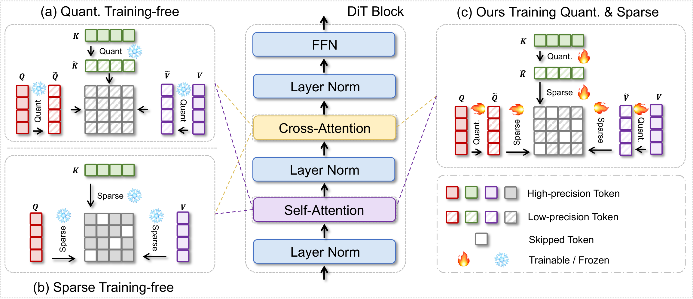
*** 核心方法
- *统一的 3D tile-wise 粒度*：时间/高/宽三轴切成 3D tile，同一 tile 结构同时承载量化与稀疏——量化以 tile 为 scale 单元（per-tile scaling = tile 内最大绝对值 / FP8 最大可表示值），稀疏以 tile 为注意力窗口单元。吞吐最优 tile (6,8,8)，精度最优 (24,32,32)，粒度本身是精度-速度的调节旋钮
- *稀疏机制*：基于 STA 的局部性——每个 query tile 只 attend 局部邻域内的 key tile，窗外 tile mask 为 -∞ 完全跳过（tile-wise masked attention），不是低精度降级
- *噪声调度自适应*（denoising step-aware）：early/late 去噪步对粗量化和高稀疏更容忍，mid 步需要细精度低稀疏。策略：early 步粗 tile + 稀疏窗口 → mid 步细 tile + 稠密窗口 → late 步取中间配置。这把"每步同等计算"改成按噪声水平分配算力
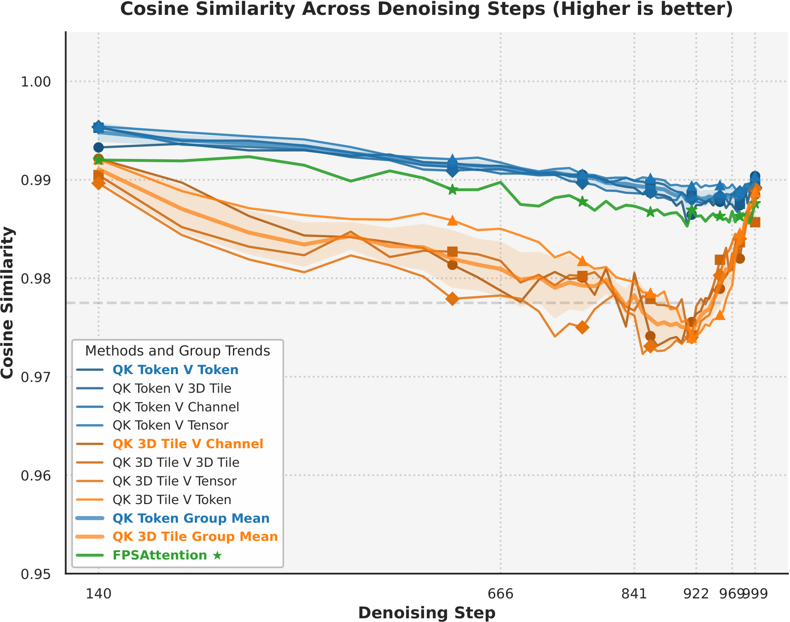
- *原生 kernel*：Triton 实现，融合量化与稀疏到 FlashAttention 风格 pipeline，跑在 Hopper Tensor Cores 上（FP8 GEMM）。训练时对关键 tile 保持高精度（trainable），次要 tile 低精度/停止，形成梯度可控的混合精度训练
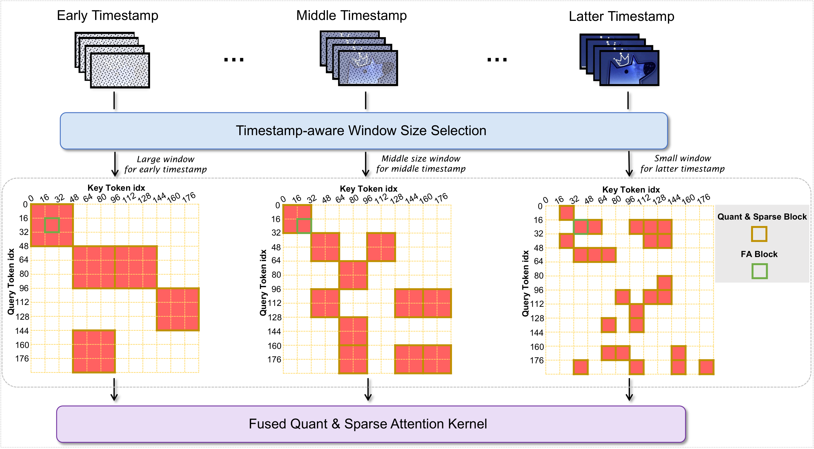
*** 关键指标（论文口径，Wan2.1-14B 720P，H20）
- 加速：kernel 7.09×、E2E 4.96×；对比 FP8-only 1.84×/1.26×、STA 5.15×/3.60×（BF16 基线 1×）
- 质量不降反微升：VBench Total 1.3B 0.8019→0.8160（超 SageAttention 0.8011、STA 0.7597）；14B 0.8153→0.816。分维度：Imaging Quality 0.7103 vs Sage 0.6699 / STA 0.6626；Aesthetic 0.624 vs Sage 0.6104
- 消融关键发现：去掉训练感知（naive 组合）VBench 掉 21.1%——协同训练是整个方法成立的前提，不是锦上添花
- 指标核对：照片 kernel 7.89×/E2E 4.88× vs 论文 7.09×/4.96×；STA 照片 5.19× vs 论文 5.15×。以论文为准
*** 训练/工程约束
- 需要 QAT（Quantization-Aware Training，量化感知训练）微调：非 post-training，不即插即用
- *QAT 具体做什么*：让模型在训练时就"知道"自己以后会被压到 FP8 + 被稀疏跳过，主动学出量化鲁棒的权重。训练循环里：
  1. 前向插"假量化"（fake quantization）——权重/激活模拟压到 FP8 精度再还原，同时保留高精度影子副本（shadow weights）记梯度
  2. round 不可导，用 straight-through estimator（STE）让梯度直接穿过量化节点照常回传
  3. per-tile scaling 因子在训练中持续校准，让 tile 内数值分布落进 FP8 能精确表示的区间
  4. 几千步后，模型把对输出重要的计算路径挪进高精度 tile，不敏感部分让给低精度/跳过 tile
  - 一句话：PTQ 是"先训完再硬压"（事后截肢），QAT 是"训练时就知道要过苦日子，提前长好"（适应性进化）
- QAT 成本：数据为筛选的高质量视频集（480P/16fps/5s）；lr 5e-6；2000 步后 loss 与基线轨迹对齐；14B 用 8×H20 节点（最多 64 节点）训约 7 天
- *trade-off 视角*：训练是一次性成本，收益是永久的——微调后的权重 + FP8 kernel 成为新推理引擎，之后每个视频都享受 4.96×。对比 training-free 路线（SageAttention E2E 1.26×）：免训练但天花板低；FPSAttention 押注"付一次训练费换速度质量双赢"
- 硬件门槛：依赖 Hopper 架构（H100/H20/H200）的硬件 FP8——FP8 Tensor Cores 和 FP8 GEMM 指令是 Hopper 才有的。*A10 这类 Ampere 卡跑不了完整版*：无 FP8 单元，量化部分软件模拟反而更慢；只有稀疏 tile 注意力一半可用（不依赖 FP8，约 STA 级 ~3.6× kernel）。老卡实操：方法论（tile 统一粒度、噪声自适应调度）可借鉴，量化协同换成 INT8 或只留稀疏。超参（tile 尺寸、窗口、调度点）需调
- 局限（作者自述）：只在 Wan2.1 架构上验证，未泛化到其他视频 DiT
- 开源：代码在项目页 [[https://fps.ziplab.co/][fps.ziplab.co]]，无独立 GitHub 仓库
*** 为什么质量反而上升（易误读点）
- 诚实口径：论文的硬 claim 是"质量不降"；14B 0.8153→0.816 基本持平。真正的提升在 1.3B（+0.014）
- *主因——QAT 的副作用*：微调本质是在 curated 高质量数据上额外训了几千步，相当于顺手做了一次 aesthetic 微调。Wan2.1 原基线没在这种数据上精调过。证据：提升集中在 Imaging Quality（0.7103 vs Sage 0.6699）和 Aesthetic 这些对训练数据质量最敏感的维度
- *次因——量化噪声当正则化*：训练中的量化噪声 + 稀疏跳过类似 dropout，对生成分布有轻微平滑作用
- 正确理解：不是"加速还白赚质量"，是"付了训练费，质量至少没丢，小模型略赚"
*** 链接
- [[https://arxiv.org/abs/2506.04648][arXiv:2506.04648]] · [[https://fps.ziplab.co/][项目页]] · [[https://neurips.cc/virtual/2025/poster/117878][NeurIPS 2025 Spotlight]]

** BLADE — 块稀疏注意力 × 步数蒸馏
- 论文：BLADE: Block-Sparse Attention Meets Step Distillation for Efficient Video Generation（ICLR 2026，arXiv:2508.10774，ZIP Lab / Bohan Zhuang 组——与 FPSAttention 同组）
*** 问题背景
- 视频扩散两条正交加速轴：*步数蒸馏*（50 步 → 8 步，砍迭代次数）和 *稀疏注意力*（跳过不重要的 attention block，砍单步开销）。乘起来本该是十几倍
- *单独/朴素组合的失效模式*：蒸馏过程对稀疏性不可知（distillation is agnostic to sparse attention）——先蒸馏再插稀疏，student 没在稀疏约束下训过，质量崩；蒸馏后再单独训稀疏注意力又需要极贵的高质量视频数据，违背 data-free 蒸馏的初衷
- BLADE 的答案：把稀疏注意力*塞进蒸馏训练循环里*联合训练，全程 data-free
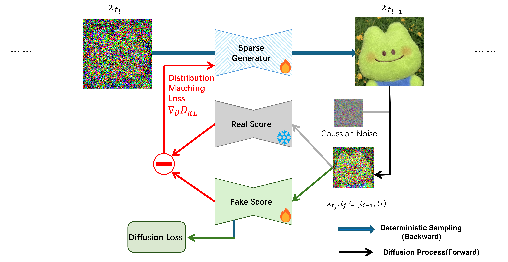
*** 核心方法
- *ASA（Adaptive Block-Sparse Attention）*——动态、内容感知的稀疏掩码：
  - *Efficient Attention Prober*：复用主干 Q/K 投影（不是独立网络），token 先按 Gilbert 曲线重排保留空间局部性、切成 b=128 的 block，每 block 采 k=16 个代表 token 算低分辨率注意力图，MaxPool 聚合成 block 级重要性矩阵 P。开销 O(N²·(k/b)²)——仅为全注意力的 1/64
  - *Threshold-based Mask Generator*：P 每行归一化降序排序，累计到阈值（90%/95%）即停，保留最小必需 key block 集合，生成二值 mask
  - *上下文增强*：K 与 MeanPool_n(K) 拼接，原始 K 区用二值 block mask，pooled 区加固定 ln n 加性 mask 软引导注意力——稀疏不等于丢全局上下文
  - 对比 STA（固定局部窗口）：ASA 动态感知内容，同等稀疏度下 PSNR/SSIM 显著更优
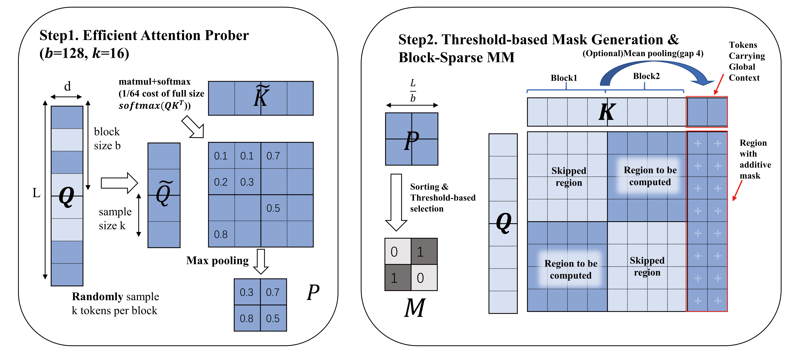
- *TDM（Trajectory Distribution Matching）蒸馏*——data-free 步数蒸馏框架：
  - teacher = 预训练 50 步模型；student 同架构同初始权重，但 self-attention 换成 ASA
  - 不要求实例级轨迹对齐（与 DMD/DMD2 的区别），匹配 student 中间样本与 teacher 在每步扩散分布
  - *fake score model*：student 真实 score 不可解析，并发训一个小网络近似它——student 输出干净目标→加噪→fake score 学着从噪声还原（初始化未明说，推测继承 teacher）
  - 稀疏作正则：student 在动态稀疏约束下生成轨迹，权重更新向 teacher 分布对齐——稀疏不再伤质量反而约束了蒸馏
*** 关键指标（VBench-2.0，8 步 student）
- Wan2.1-1.3B：基线 0.563/1× → BLADE 0.570/**14.10×**（对比 FA2 0.580/9.37×、STA 0.528/10.53×——STA 快但掉分，BLADE 快且涨分）
- CogVideoX-5B：基线 0.534/1× → BLADE 0.569/**8.89×**（对比 FA2 0.539/7.93×）
- 消融关键发现（CogVideoX-5B）：蒸馏单独 0.539 / 稀疏单独 0.539 / 联合 0.569——两个"各 +0.005"的单点手段联合后 +0.035，协同效应远超线性叠加
- 指标核对：照片数字与论文一致（14.10× / 8.89× / 0.569 / 0.570 均对上）
*** 训练/工程约束
- data-free：不用视频数据集，只有 teacher 生成引导信号 + 1 万条文本 prompt
- 蒸馏 250-500 迭代，8×A800(80GB)；推理 ≥24GB 显存，训练 ≥80GB
- *与 FPSAttention 同组（ZIP Lab），路线互补*：FPSAttention = 量化×稀疏协同（需 QAT+数据）；BLADE = 蒸馏×稀疏协同（data-free）。前者吃 Hopper FP8，后者 Triton kernel 通用性更好
- 局限（作者自述）：只验证了中等长度序列，分钟级长视频（数十万 token）未验证；Triton kernel 未完全兑现理论加速，CUDA 版是未来工作
- 开源：[[https://github.com/ziplab/VIDEO-BLADE][github.com/ziplab/VIDEO-BLADE]]（代码+LoRA 权重，HuggingFace GYP666/BLADE；支持 CogVideoX-5B、Wan2.1-1.3B-Diffusers）
*** 链接
- [[https://arxiv.org/abs/2508.10774][arXiv:2508.10774]] · [[https://github.com/ziplab/VIDEO-BLADE][GitHub]] · [[https://openreview.net/forum?id=O9J20MsmRl][OpenReview ICLR 2026]]

** Latent Spatial Memory — 隐空间空间记忆
- 论文：Latent Spatial Memory for Video World Models（arXiv:2606.09828，Microsoft，又名 Mirage）
*** 问题背景
- 视频世界模型（单图 + 相机轨迹 → 长视频）的核心难题是 long-term scene consistency：没有显式空间记忆，再强的生成器也会几何漂移——单帧都漂亮，投影回统一世界坐标就对不上
- 已有答案：维护显式 *RGB 点云记忆*（Spatia、Voyager、WonderWorld 一系）——记录每个观测表面点的 3D 坐标 + RGB 颜色。但生成器工作在 VAE latent space，于是每个 conditioning 步都要走 *render-and-encode 往返*：点云 z-buffer 栅格化成 RGB 图 → VAE 重新 encode 成 latent 才能喂给主干
- 三重代价：(1) profiling 显示显式记忆维护是管线主要效率瓶颈（照片口径：占 >60% 时间）；(2) 点云随锚定帧近似线性膨胀，长轨迹耗尽显存；(3) RGB 三通道丢失语义/纹理信息，表示本身有损
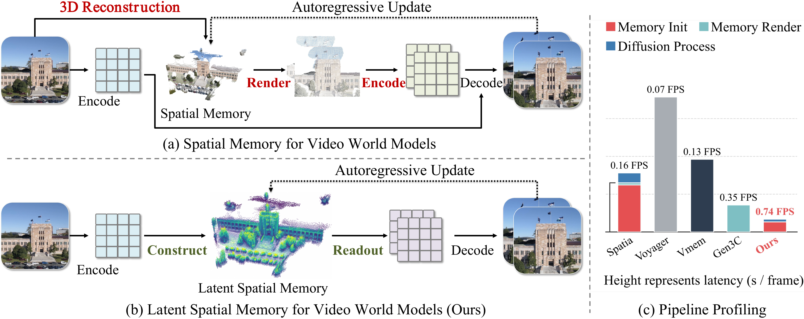
*** 核心方法
- 核心洞察：既然扩散主干本来就吃 latent，为什么记忆要绕道像素空间？*把 3D 记忆直接存成 diffusion latent*——一个由 latent 特征向量构成的 3D 点库
- *写入*（初始化 + 每 chunk 更新）：RGB 帧 → VAE encode 成 latent → DepthAnything 3 估深 → 深度引导反投影，把 latent cell 提升到 3D 世界坐标写入记忆。更新时 SAM 3 分割出的动态物体和天空被排除，防止运动实体污染持久记忆
- *读取*：把 3D latent 记忆投影到目标相机位姿的 latent 分辨率网格（z-buffering 定可见性），一次投影直接得到 target-view latent 特征张量 + visibility mask——完全替代 render-encode 往返
- *注入*：readout + mask 拼接喂给 ControlNet-style 侧分支，把记忆特征注入扩散主干。软几何提示而非硬约束（这也是对深度估计噪声鲁棒的原因）
- 关键路径安排：像素空间操作只出现在 chunk 级记忆更新（每 chunk 一次），per-step conditioning 循环里只剩单次 latent 分辨率投影；cache 尺寸按 VAE 压缩比的平方（s²）缩小
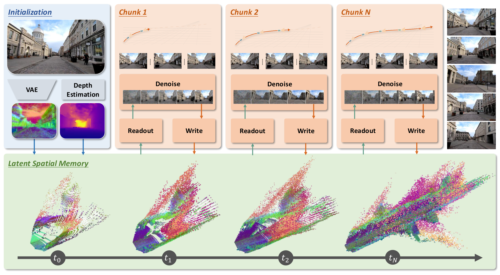
*** 关键指标（Wan2.2-TI2V-5B 基座）
- 配置：每 chunk 9 latent 帧 @44×80 = 33 RGB 帧 @704×1280；UniPC 40 步；效率测于单 H100、5 chunk 自回归 rollout
- 效率：E2E **10.57×** 加速 + 3D cache 显存 **55×** 降低（vs RGB-cache 基线）；首 chunk 摊销一次性 setup 后 cache 读取稳定在 0.25s/帧，cache 每 chunk 增长 <0.5MiB；差距随 rollout 变长持续拉大，RGB 基线在长轨迹上直接耗尽显存
- 质量（WorldScore）：Avg **70.36** 全场最高（vs Spatia 69.73、Voyager 66.08）；3D Consistency 92.21 / Photo Consistency 93.95 领先——隐空间记忆不只快，几何一致性反而更好
- RealEstate10K：标准 NVS SSIM 0.779 / LPIPS 最佳；闭环协议（相机离开再回到起点）PSNR_C/SSIM_C 最佳——长 horizon 漂移最小的证据
- 消融（WorldScore Avg）：full 70.36 → 换回显式 RGB 点云 67.71（-2.65：latent 表示本身有质量优势）；去动态物体过滤 61.20（-9.16，最大坑：运动实体留在记忆里会被 splat 回未来帧）；像素分辨率 lift 60.85（必须在 latent 分辨率做反投影）；单阶段训练 63.18（两阶段必要）
- 指标核对：照片 10.57×/55× 与论文一致
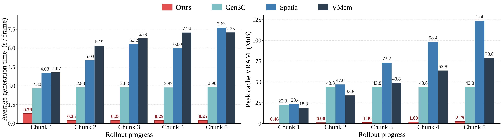
*** 训练/工程约束
- 训练：32×A100、global batch 64、AdamW、bf16、flow-matching 目标；数据为 RealEstate10K 视频（深度+位姿标注，动态区域按推理时同样流程剔除）
- *两阶段训练*：stage 1 冻结主干只训 ControlNet 侧分支（从 Wan2.2 对应 block 初始化）；stage 2 解锁 LoRA。单阶段联合训会因早期 conditioning 信号不成熟而劣化收敛
- 外部依赖：DepthAnything 3（深度）+ SAM 3（动态分割）。鲁棒性消融：换 MapAnything/UniDepth 深度源仍 competitive——侧分支把投影 cache 当软提示，方法不押注特定深度模型
- 任务边界：这是 *world model 管线级* 加速（消掉像素空间往返瓶颈），不是通用 kernel/蒸馏加速；适用单图+相机轨迹的 scene generation，与 FPSAttention（kernel 级）、BLADE（训练级）处在加速栈的不同层
- 开源：[[https://github.com/microsoft/LatentSpatialMemory][github.com/microsoft/LatentSpatialMemory]]
*** 链接
- [[https://arxiv.org/abs/2606.09828][arXiv:2606.09828]] · [[https://github.com/microsoft/LatentSpatialMemory][GitHub]] · [[https://microsoft.github.io/LatentSpatialMemory/][项目页]]

** WorldAttention — 缓存与计算的系统协同设计
- 论文：WorldAttention: An Efficient Attention Architecture for Interactive Video World Models（2026，arXiv 编号未定——引用键仍是占位符；DAMO Academy / 浙大 / HKUST，通讯作者 Bohan Zhuang——*FPSAttention、BLADE 之后该组第三次出现*）
*** 问题背景
- 任务设定：自回归扩散（autoregressive diffusion）范式的*交互式*视频世界模型——文本指令可中途切换、低延迟长时长 rollout，面向 embodied AI 与仿真规划
- 两难困境：*滑窗注意力*有界复杂度但丢弃历史，牺牲长程交互一致性；*全历史 cache* 则注意力 O(N²) 计算爆炸 + KV cache 随帧数线性增长撑爆显存
- 系统级观察（照片口径）：KV 重配（re-caching）与数据搬运（data movement）才是主要延迟源——光优化 kernel 不够，cache 层和计算层必须协同设计
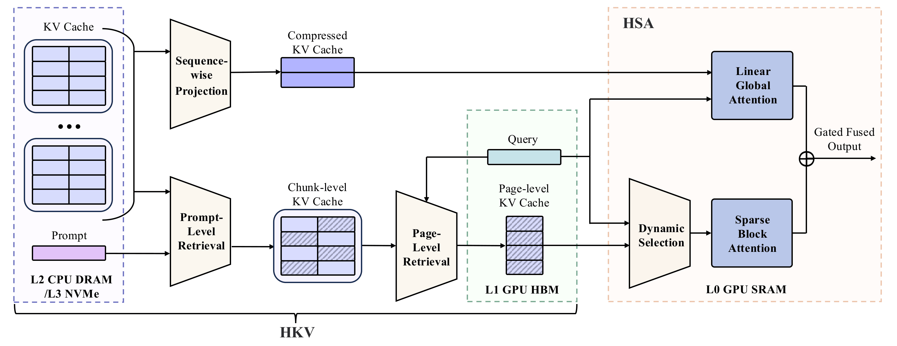
*** 核心方法
- *HSA（Hybrid Sparse Attention）*——双分支 + 门控融合：
  - 线性分支：Linformer 式低秩投影——K/V 沿序列轴投到低秩基（按 segment 增量压缩，压缩 cache 与 token cache 并行维护），提供全窗口的 dense 低秩视野
  - 稀疏分支：全 token 分辨率，但只在路由选中的 block 内计算。*路由是 head-adaptive 的*（源码确认）：对每个 head 的 block 注意力分布算 Gini 系数，覆盖阈值 τ_h = τ_min + mean(Gini)·(τ_max−τ_min)——注意力尖锐的 head 保留更多质量、弥散的 head 保留更少，*不是固定 Top-K*
  - 门控融合：per-token、per-head 地混合两分支输出
- *HKV（Hierarchical KV Cache）*——历史放 GPU 外，按需分页取回：
  - 组织：完成的 rollout 段 = chunk，chunk 切成固定帧数的 page，每页带 mean-key 索引
  - 两级检索：Stage 1 用 prompt 嵌入余弦相似度筛 chunk → Stage 2 页级亲和度（Q̄·K̄/√d）全局 top-K_p 选页。跨 chunk 池化后再 top-K（单 chunk 内选会退化）
  - temporal RoPE 细节（源码确认）：页 key 池化前先去时间旋转（derope），检索装回 GPU 时重旋转到重放槽位（rerope）——位置编码不能带错
  - 多层存储：GPU HBM 在线 cache（容量受 K_p 页预算封顶，*不随视频长度增长*）→ CPU DRAM（LRU 有界）→ NVMe（全量备份，重装未改动 chunk 零成本）
  - "交互式"的关键：prompt 切换时从历史检索最相关的 K_p 页装回——新指令进来，旧上下文里挑相关的用
- 定制 kernel 把理论效率翻译成实际性能；训练用 per-layer 自蒸馏（MSE(HSA_out, dense_out.detach())，比端到端分布匹配更直接地训 HSA 参数）
*** 关键指标
- 质量：VBench-Long subject consistency **0.9472**、InterVBench **0.9668**，超 prior SOTA
- 效率（单 H100）：HSA kernel **14.02×** vs FlashAttention-3；+HKV 后 E2E **2.21×**；推理维持 **22.0 FPS**
- 指标核对：照片 14.02× / 22.0 FPS / E2E 2.21× 与 README 一致；照片"vs 7.1 FPS"基线数字 README 未披露，标注待核（论文未公开 arXiv）
*** 训练/工程约束
- 需要三阶段训练（causal → HSA warmup → HSA tune，8×GPU，逐阶段接续 checkpoint）——非即插即用，与 FPSAttention 同样要付训练费；基于 Self-Forcing + DMD 蒸馏框架，基座 Wan（repo 含 1.3B/14B 配置）
- *迁移到别的模型要改什么*（源码梳理）：
  1. 注意力换 HSAAttention——*非无损替换*，新增可训练参数：线性分支低秩投影矩阵（K/V 各一，跨 head 共享）+ 双分支融合门控（per-token、per-head）。路由本身免训练（Gini 阈值每步前向现算）
  2. HKV 缓存管线是工程量大头：chunk/page 切分、mean-key 索引、两级检索、CPU DRAM/NVMe 分层、RoPE derope/rerope 换算——纯系统工作，不碰权重，但侵入推理框架
  3. *前提：基座是自回归范式*。它建立在 Self-Forcing + DMD 之上，面向逐块 rollout；标准全序列视频 DiT（一次去噪整段）得先自回归化改造。repo 直接包了 Wan，换基座自己搬
- 训练信号：per-layer 自蒸馏 MSE(HSA_out, dense_out.detach())——每层每步直接对齐稠密注意力，比端到端分布匹配收敛快；总训练量级比 FPSAttention 的 QAT（64 节点×7 天）轻，但绝非即插即用
- *开源状态要看清*：Apache-2.0 核心代码已放（模型/HKV 管线/测试齐全），但**推理管线、HSA kernel、可视化、demo 均未放**——14.02× 的 kernel 恰恰还没开源。现在动手 = 拿到架构和缓存管理，kernel 要自己写或等放
- kernel 版本依赖：SM90（H100）上 Triton 3.1 缺该 block-sparse kernel 所需的 shared-memory encoding，auto 后端会回落到 torch 参考实现——实际加速取决于 Triton 版本
- NVMe 层可选；不开就是有界 CPU cache，无磁盘 I/O
- *加速预期要现实*：14.02× 只是 kernel 层；E2E 2.21× 的兑现率低于 FPSAttention（kernel 7×/E2E 5×）——因为它的目标是"长视频不爆显存 + 交互实时"，不是极限加速。注意力之外（VAE、MLP、去噪步数）都不受益
- *收益边界：什么场景值、什么场景不值*：
  - HKV 检索依赖"页数远大于预算 K_p"——历史只有一个 chunk 且页数 ≤ K_p 时，全局池化选页 = 全选，检索退化（源码注释明说）。短上下文（<30s，几十页）下 HKV 趋近零收益，甚至退化为"GPU→CPU→GPU 搬运"的纯开销；收益曲线随 rollout 长度增长（gap widens with horizon），分钟级历史 + 小预算才是它的主场
  - HSA 线性分支不依赖窗口长短（62× 序列压缩照常），但绝对节省随窗口变小；稀疏分支看窗口内 block 密度——64 token 一 block，2048 token 窗口才 32 个 block，路由余地小；视频天然帧长 1560 token，13 帧＝2 万 token、上百 block，稀疏才有肉
  - 有限窗口（滑窗式硬截断）= 丢弃历史 = 论文里的反面基线设定；HKV 的"有限"是预算封顶+相关性检索——*有限而不失忆*，与滑窗的本质区别
  - 三档结论：短上下文有限窗口 → 不值，直接 FlashAttention+滑窗；长上下文+页预算 → 全吃满，本来就是主场；大滑窗 → 等于只买 HSA kernel，HKV 白装
- 任务边界：面向 prompt 可切换的交互式长 rollout，贡献在系统级（cache 层 × kernel 层协同）；与 LSM（管线级记忆表示）、FPSAttention（kernel 级量化稀疏）互补
*** 链接
- [[https://github.com/alibaba-damo-academy/WorldAttention][GitHub]]（arXiv 未挂、无项目页/论文页）

** ZipAR — 空间局部性并行解码
- 论文：ZipAR: Parallel Autoregressive Image Generation through Spatial Locality（ICML 2025，arXiv:2412.04062，浙大 + 上海 AI Lab + Adelaide；通讯 Hong Zhou / Kaipeng Zhang，末位作者 Bohan Zhuang——*Zhuang 组第四次出现*）
*** 问题背景
- AR 视觉生成（GPT 式 next-token prediction：LlamaGen、Emu3-Gen、Lumina-mGPT）能复用 LLM 基建，但采样慢得离谱：每 forward 只出 1 个 token，一张 512² 图 = 1024 步串行；Lumina-mGPT 768 = 2352 步
- *Raster 顺序的依赖是训练目标强加的，不是视觉内容本身需要的*：逐 token 生成时第 i 行首 token 必须等第 i-1 行全部完成——但这两块区域在空间上可能隔了半张图
- 证据（注意力图实证，Lumina-mGPT-7B / LlamaGen-XL）：注意力质量呈斜线带分布——显著权重落在"前一行的同列 token"上（固定间隔 = 图像宽度），即视觉相关性由空间邻近决定，与 raster 生成顺序无关
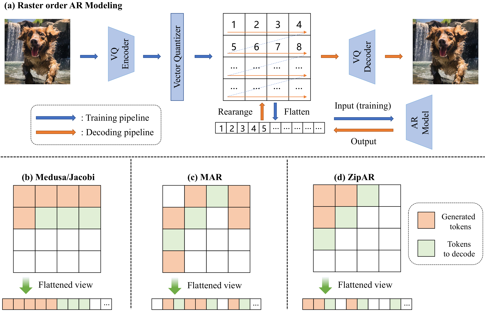
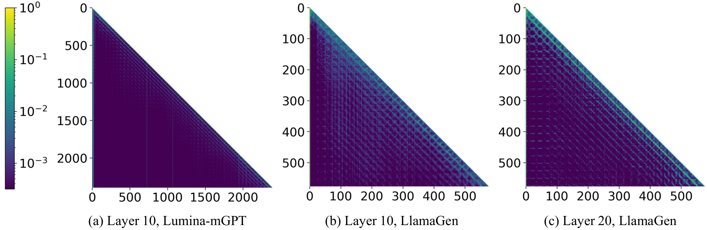
*** 核心方法
- *行间并行*：不再等整行解码完才开始下一行。当第 i 行已生成的 token 数超过窗口 s，就认为第 i+1 行同列 token 的上下文"够用了"，触发下一行并行启动——多个行同时在飞行中，一个 forward 出多个 token
- 窗口内 = 空间相关；窗口外 = 视为无关。与 Medusa（辅助多头）/ Jacobi（顺序相邻多token）/ MAR（随机序多token）的对比：ZipAR 按*空间*相邻并行，且全部 token 由原模型头产出——不需要任何新参数
- *自适应窗口 + 拒绝采样*（防质量崩的关键）：固定 s 对所有位置/所有 prompt 都不是最优（保留 95% 注意力所需窗口随位置和输入变化）。做法：从 s_min 起试——用窗口 k 生成的 token 不立即接受；下一步拿到更大窗口 k+1 的预测后，计算两窗口下采样概率之比，类比 speculative decoding 的接受准则：满足则接受并按 NTP 续行；不满足则迭代扩窗，直到满足或前行完成
- 纯推理侧改动：改的是解码调度逻辑，不碰模型权重
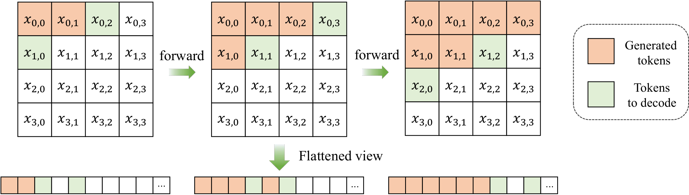
*** 关键指标（A100，batch=1）
- LlamaGen-XL-512（MS-COCO）：NTP 1024 步 / 33.17s / CLIP 0.287 → ZipAR-3 **185 步（-81.9%）/ 5.86s（-82.3%）/ 0.281**；ZipAR-15 562 步 / 18.98s / **0.287（CLIP 无损）**
- vs SJD（此前并行解码 SOTA）：ZipAR-7 324 步 + CLIP 0.285，完胜 SJD 635 步 + 0.283
- Lumina-mGPT-768：2352 步 / 91.70s → ZipAR-11 588 步（-75%）/ 50.32s（-45%）/ 0.312
- Emu3-Gen：最高 **-91%** 步数；ImageNet 256 类条件生成：LlamaGen-XL ZipAR-12 331 步 / FID 3.67（vs NTP 3.87——*步数砍 42% FID 反而更低*）
- *分辨率越高赚越多*：文本引导模型的加速比高于类条件模型，归因于更大的特征图——空间局部性红利随分辨率放大
- 指标核对：照片"1024 → 184 步，33.17s → 5.51s"与论文表 185 步 / 5.86s 有出入（照片疑为另一配置），以论文为准；照片 CLIP 0.287→0.280 vs 论文 ZipAR-3 为 0.281；"ZipAR-16 延迟降 47%"对应论文 ZipAR-15 的 42.7%——照片数字偏乐观，标注差异
*** 训练/工程约束
- *零训练、即插即用*——本草稿已调研的 5 个工作中唯一免训练的：无 QAT、无蒸馏、无新参数、无新头。代价全部转移到推理调度代码
- 适配范围：仅适用 *next-token prediction 训练的 raster 顺序 AR 模型*（LlamaGen/Emu3/Lumina-mGPT 一系）；BERT 式掩码模型（MaskGIT/Muse/MAR）和 next-scale 模型（VAR）不在射程内
- 边角工程：无行尾 token 的模型（如 Emu3）要"临时给最后一个 token 赋邻域近似值"
- 窗口 s 是质量-速度旋钮：激进（ZipAR-3）掉一点点 CLIP（0.287→0.281），保守（ZipAR-15）无损但只赚 45%；自适应窗口在同等步数下 FID 恒优于固定窗口（消融图）
- *加速的本质*：砍 forward 次数，不砍单次 forward 成本——与 FPSAttention（砍单步 kernel）、BLADE（砍步数+单步）正交，理论上可与二者叠加
- 局限：只是 image AR 的解码调度；报告把它放进视频加速语境，应理解为"AR 视觉生成通用加速件"，直接用于视频 AR 模型（如视频版 AR）需要处理时间维窗口定义
*** 链接
- [[https://arxiv.org/abs/2412.04062][arXiv:2412.04062]] · [[https://github.com/thisisbillhe/zipar][GitHub]] · [[https://openreview.net/forum?id=S09B5wNa6J][OpenReview ICML 2025]]

** NAR — 邻域自回归建模
- 论文：Neighboring Autoregressive Modeling for Efficient Visual Generation（ICCV 2025，arXiv:2503.10696，浙大 + 上海 AI Lab + Adelaide——*ZipAR 同一作者班底（Yefei He 一作、Bohan Zhuang 通讯），Zhuang 组第五次出现*）
*** 问题背景
- 与 ZipAR 同一个诊断：NTP 的 raster 串行依赖过度指定——但 ZipAR 止步于推理侧绕过，NAR 从训练侧根治
- *关键动机差异（为什么不能只做推理侧）*：NTP 模型只学过"raster 下一个 token"的条件分布。ZipAR 式推理侧并行（含 PAR/Jacobi）一次预测多个不同位置 token 时，各位置的条件分布差异很大，单头硬出多 token 质量崩——论文消融：单头 NAR FID 66.31（灾难级），vs LlamaGen-L 3.80。*推理侧调度的天花板是训练目标划定的*
- NAR 的答案：改训练目标本身——next-token → next-neighbor，从"从零开始的 outpainting"视角重建 AR 建模
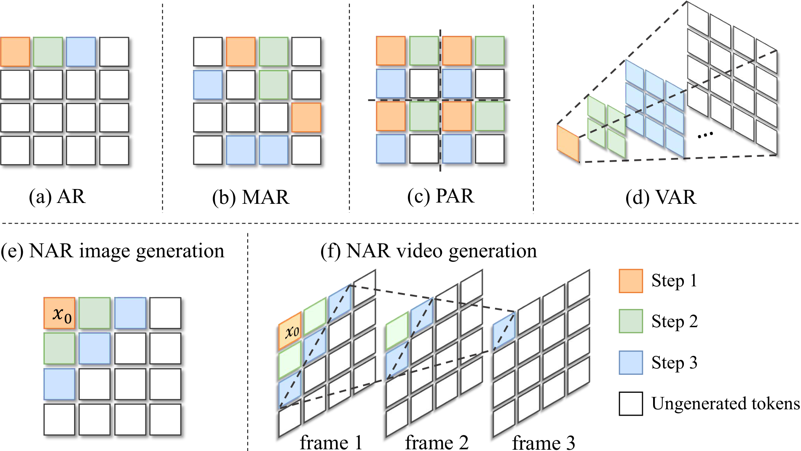
*** 核心方法
- *邻域自回归*：生成 = 从左上角初始 token 起的渐进 outpainting，每步预测已解码区域的*全部相邻 token*（边界一圈），解码区域像波纹一样从起点向外扩。形式化：第 i 步生成集合 S = {x_i | D(x_i, x_0) = i}，D 为曼哈顿距离
- 步数公式：n×n 图像 2n−1 步（vs raster 的 n² 步）；t×n×n 视频 **2n+t−2 步**（vs t·n²）——256 token 图 31 步 vs 256 步
- *维度导向解码头（dimension-oriented heads）*——方法成立的核心：
  - 问题：多个等距 token 分布在不同维度上，条件分布各不相同，一个头建模不过来
  - 方案：图像 = 2 维 → 水平头（同行下一个 token）+ 垂直头（下一行同列 token）两个额外头，每个 = 1 个 Transformer block + FC 输出层，拼在主干后面；视频 = 3 维 → 时间/行/列三头
  - 解耦让每个头只学一个维度的条件分布
- *混合 logits 采样*：从第 3 步起两个头对同一位置各有预测（重叠区），把多头的 logits 混合采样而非取单头——类模型集成。消融：单水平头 FID 75.91 / 单垂直头 25.73 / 混合 **3.06**——混合是数量级差异，不是锦上添花
- *邻近感知注意力掩码*：训练时跨步 token 间用因果掩码（远 token 只依赖近 token，保自回归性）；同一步内的 token 之间用双向注意力（并行生成的 token 互相看见，保一致性）
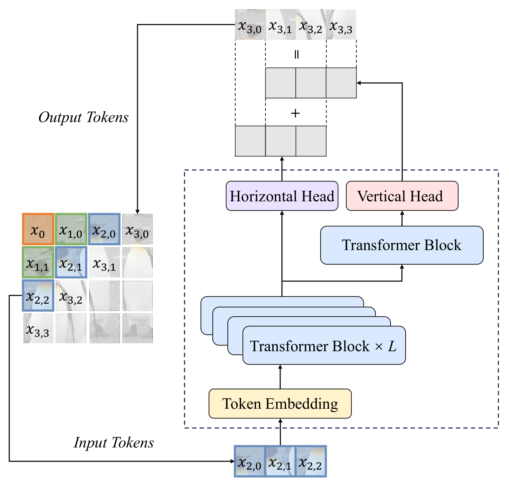
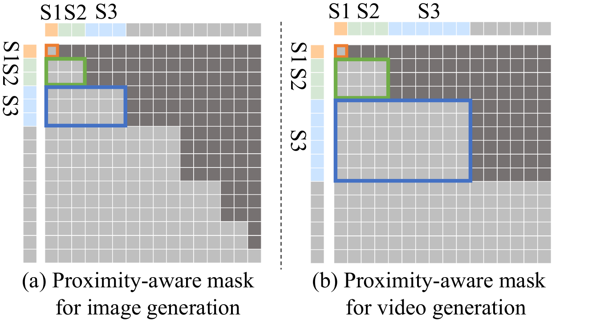
*** 关键指标（A100）
- ImageNet 256：NAR-L 372M，31 步，FID **3.06**——低于 LlamaGen-XXL 1.4B 的 3.09，步数少 87.8%，吞吐 **13.8×**（195.4 vs 14.1 img/s）；NAR-XXL 1.46B FID 2.58
- vs VAR：NAR-M 290M FID 3.27 < VAR-d16 310M 的 3.30，吞吐 1.92×（248.5 vs 129.3）——且不需要 VAR 的多尺度 tokenizer
- 视频 UCF-101：NAR-L 34 步 / 1.09s，FVD 96.2，比 LARP-L-Long（1280 步 / 44.0s）**延迟降 97.5%** 且 FVD 更好（-5.8）；NAR-LP 694M FVD 71.1 逼近 MAGVIT-v2 的 58
- 文生图 GenEval：NAR-XL 用 6M 对（LlamaGen 的 1/10）总体分 0.43 vs 0.32，吞吐 4.4×；超 Chameleon 7B（1.4B 训练数据）
- 指标核对：照片"复杂度 O(n)→O(√n)"对应论文步数公式 n²→2n−1（√量级），成立
*** 训练/工程约束
- *必须重训*（与 ZipAR 的本质分野）：改了训练目标 + 加了维度头，不能套在现成 NTP 权重上——好处是训练管线/tokenizer 与 LlamaGen 完全兼容，仅需改架构和注意力掩码
- 训练开销低于 VAR：VAR 需专门的多尺度 tokenizer（大量数据训练）+ 多尺度拼接长序列（训练复杂度随序列平方涨）；NAR 用现成单尺度 tokenizer
- 视频三头即插即用（时间/行/列），不需为视频改范式——报告把它列入视频加速线的合理性所在
- *与 ZipAR 的关系（同一班底的两面）*：ZipAR = 推理侧调度（training-free 但受训练目标制约，窗口保守）；NAR = 训练侧重建（付训练费但把邻域依赖变成原生结构，31 步 vs ZipAR 最优 185 步）。ZipAR 是权宜，NAR 是根治
- 对数字人/扩散管线的适用性同样有限——AR 视觉生成路线；价值在"若团队要自训 AR 视觉模型，这是当前步数-质量最优的建模范式"
*** 链接
- [[https://arxiv.org/abs/2503.10696][arXiv:2503.10696]] · [[https://github.com/ThisisBillhe/NAR][GitHub]] · [[https://yuanyu0.github.io/nar/][项目页]]

** FlashAR — AR 图像生成后训练加速
- 论文：FlashAR: Efficient Post-Training Acceleration for Autoregressive Image Generation（arXiv:2605.09430，投稿 NeurIPS 2026，浙大 + Adelaide——Junkang Zhou / Yefei He / Bohan Zhuang，*Zhuang 组第六次出现，与 NAR 直接接力*）
*** 问题背景
- 前两条路线各有硬伤：*改范式派*（NAR/VAR/PAR）要从头预训练，无法复用海量现成 raster-AR 权重；*推理侧派*（ZipAR/投机解码）受训练目标制约，加速天花板低。Emu3.5 的 Block Diffusion 后训练路线又改变了预测目标（离散扩散适配），训练-推理有 gap 且伤细粒度结构一致性
- 开放问题（论文原文）：能否把预训练 raster-AR 模型改造成高度并行生成器，*完整继承其生成先验*，同时后训练开销最小？
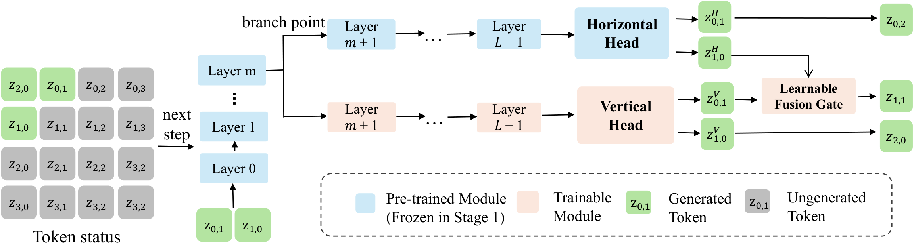
*** 核心方法
- *双向 next-token（对角线并行）*：保留原 AR 头作*水平头*（行内预测），新增轻量*垂直头*（列向预测）——沿反对角线并行解码，串行步数 O(HW)→O(H+W)，512² 图 1024 步 → 63 步。核心洞察：对预训练模型改动越少，先验保留越完整——水平头原封不动是关键
- *中间层分支（intermediate branching）*——最反直觉的设计：垂直头不从最后一层分出。Linear probe 实验发现顶层表征已特化到水平 raster 目标、丢失跨轴语义，中间层特征对垂直预测更有利。主干共享前 m 层，水平/垂直两路从第 m 层分岔并行走完剩余层（不加深关键路径）
- *可学习融合门*：水平/垂直预测的相对重要性随位置变化，固定平均不够（消融：平均 FID 4.36 → 门控 4.12）。门逐位置动态混合两路 logits
- *两阶段后训练*：stage 1 从预训练模型适配初始化垂直头（快速获得预测能力）；stage 2 垂直头 + 主干联合精调适应新解码范式
- *硬件感知推理管线*：FlexAttention 动态编译稀疏 2D 邻近掩码（避免稠密零填充的显存碎片，不物化全注意力矩阵）+ 批量 KV-cache 更新 + CFG 条件/无条件前向批处理——把理论并行度翻译成实际 wall-clock
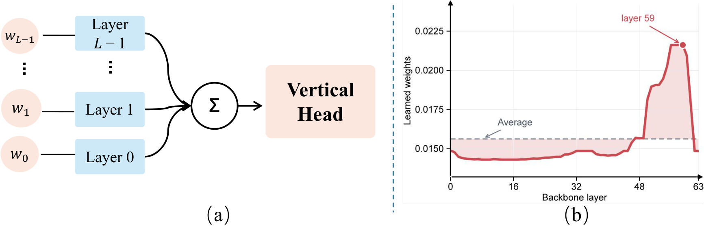
*** 关键指标（单 H20-96G，batch=1）
- Emu3.5-Image **34B** 512²：130.10s → **5.68s（22.9×）**，1024 步 → 63 步；GenEval 总分仅 -0.19（80.48→80.29），Colors（+1.59）/Position（+7.00）反超 AR 基线；BlockDiffusion 同设置大幅退化
- 后训练量：LlamaGen 上 25 epochs（BlockDiffusion 需 75k 步且更差：FID 3.16 vs 4.55）；Emu3.5 仅 80K 文图对（**原训练数据 0.05%**）+ 50K 步
- LlamaGen ImageNet 256：FlashAR-L FID 3.16、IS 289.0——*IS 超过从头训的 NAR-L（263.9）*，吞吐 224.7 img/s（vs NAR-L 195.4，FlexAttention 红利）；FlashAR-B 吞吐 447.2 超NAR-B 419.7
- 收敛效率：5 epochs 就达 FID 3.98，已优于 BlockDiffusion 25 epochs 的 4.55；两阶段 3.16 vs 单阶段 3.27
- 消融：垂直分支单独引入 FID 4.16 vs 基线 4.36（中间层分支有效）；分支深度 m 过深限制垂直路容量、过浅减少共享，L=24 时取中间最优
- 指标核对：照片"22.9×/130.10s→5.68s/1% 数据"与论文一致（1% 是早期版本口径，正式版 0.05%——更激进）；照片"跨规模吞吐 4.8×"论文中未直接出现对应表述（B 尺度 447.2/117.9≈3.8×，L 尺度 224.7/47.1≈4.8×，对应 L 尺度）；照片"U0 机器人近 83×"论文正文未含（疑为报告人补充的 Xiaomi U0 应用案例），标注待核
*** 训练/工程约束
- *定位在 NAR 和 ZipAR 之间*：比 NAR 便宜得多（NAR 从头训 300 epochs vs FlashAR 后训练 25 epochs + 0.05% 数据），比 ZipAR 强得多（63 步 vs 185 步 + 质量更好）——"花小钱改造成品"的甜点位
- 适配前提：基座必须是 raster-scan NTP 模型（LlamaGen/Emu3 系）；垂直头 + 融合门是新增可训练参数，分支深度 m 是每模型要调的超参
- 34B 级验证的意义：证明了该路线在大模型上后训练可行（Emu3.5-Image 34B 仅 80K 对就完成适配）——对"手握大预训练模型、没资源重训"的团队是直接可用的路径
- 工程依赖 PyTorch FlexAttention（动态编译稀疏掩码）；批量 KV-cache 更新和 CFG 批处理是拿到实测加速的必要工程，非可选
- 同为 image AR 线，对数字人/扩散管线直接适用性有限——与 NAR 一致
*** 链接
- [[https://arxiv.org/abs/2605.09430][arXiv:2605.09430]] · [[https://lxazjk.github.io/FlashAR/][项目页]]

** DAX — VideoGen 推理基础设施
- 项目：DAX（Diffusion Accelerated eXecution），github.com/RiseAI-Sys/DAX（2025.07 建仓，107 star；无论文——*纯工程开源项目*，RiseAI-Sys 组织（"Up"））
*** 问题背景
- 视频扩散推理慢是多因素叠加：单卡放不下 14B 要多卡、注意力算得慢、线性层占大头、50 步去噪有冗余、Python 算子调度开销大——单点优化各自为战时收益互相稀释
- DAX 定位：*训练无关的纯推理加速引擎*，把已验证的单点技术组合成管线并解决组合时的工程交互（量化算子与通信算子的融合、并行下的通信隐藏）
- 与前面工作的分野：FPSAttention/BLADE 是论文（新技术+协同设计），DAX 是工程（已验证技术的系统级组合）——加速栈的"集成商"
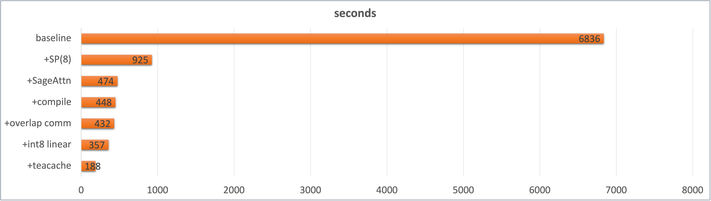
*** 核心方法（五件套，均 training-free）
- *序列并行 SP(8)*：8 卡切序列维（Ulysses 式 all-to-all），6836s → 925s——单点最大头（7.4×）
- *SageAttention2*：注意力 INT8 量化 kernel，925 → 474s
- *torch.compile*：融合小算子消除 Python/kernel 启动开销，474 → 448s
- *通信-计算重叠*：两个策略（源码+文档确认）——(1) QKV 投影与序列并行所需 all-to-all 通信流/计算流重叠；(2) 输出投影沿序列维切块，边算边通信。E2E +4~5%
- *INT8 线性层*：激活动态 per-token + 权重静态 per-channel；qconfig_dict 按层定制（condition_embedder / proj_out 跳过量化保精度），+20% 性能
- *TeaCache*：跳过"不重要"的去噪步（残差缓存插值），448 → 188s——收尾最大单项
*** 关键指标（Wan2.1-T2V-14B 720p 5s 50 步，8×H20）
- 消融阶梯（仓库 benchmark 图）：baseline 6836s → SP(8) 925 → +SageAttn 474 → +compile 448 → +overlap 432 → +int8 357 → +TeaCache **188s**（36.4×）
- 支持矩阵：Wan2.1 T2V + I2V（2025.09.05 加入）；ATTENTION_BACKEND 可选 FLASH_ATTN/SDPA，官方推荐 SageAttention
- 指标核对：照片"66.36s → 1.84s（36×）"与仓库 benchmark 图数字有出入（图为 6836s→188s，36×吻合；但"单卡"说法与 SP(8) 矛盾——6836s 是无并行基线、188s 是 8 卡结果，66.36s/1.84s 疑为报告人对不同配置的换算口径）。36× 总加速比与仓库一致
*** 训练/工程约束
- *零训练*：五件套全部 training-free，即插即用——与 ZipAR 同属免训练阵营，但作用于扩散管线（数字人相关！）
- 量化的精度-性能权衡有实测背书：per-token INT8 激活量化后生成 latent 余弦相似度 0.9759 / MSE 0.047，显著优于 per-token FP8（0.86/0.28）——*INT8 动态量化比 FP8 更准*（动态 per-token 校准范围小），这是反直觉但被表格证实的结论
- 组合的艺术在 torch.compile：文档明说 compile 是"达到预期性能的关键"——量化 kernel 与通信算子的融合要靠它兑现，不是可选项
- 8 卡门槛：36× 数字以 SP(8) 为前提；单卡只能吃到 SageAttn+INT8+TeaCache+compile 的部分（约 2-3× 量级）
- 工程现状：仓库 2025.09 后无更新（约一年）、只适配 Wan2.1 系——作为参考实现/组件库价值大于直接生产部署
- *对数字人管线的适用性（本草稿中最高）*：Wan2.1 正是数字人/视频生成常用基座；TeaCache/SageAttention/INT8 线性层均可单独移植到任意 DiT 管线
- *适用边界——流式数字人视频生成*：DAX 是"单次生成调用内"的加速，能压低每个去噪 chunk 的成本（且已支持 I2V），但流式的三个核心问题它都不管——(1) *范式*：Wan2.1 DiT 是全片段去噪非因果架构，真流式需要 block-causal Transformer（Wan-Streamer 类）或 Self-Forcing 式滚动生成，跨 chunk 一致性/历史状态传递 DAX 不涉及；(2) *延迟预算*：188s/5s（8 卡）≈ 37× 慢于实时，短 chunk 下注意力开销不线性缩短，TeaCache 缓存不跨 chunk 复用；(3) *正确定位*：DAX（算子）+ 步数蒸馏（DMD/Self-Forcing 类）+ chunk 调度三者正交可叠加——DAX 明确"无步数蒸馏"，单靠它到不了实时，但作为蒸馏后模型的推理引擎仍是最实用一块
*** 链接
- [[https://github.com/RiseAI-Sys/DAX][GitHub]]（无论文、无项目页）

** TurboDiffusion — 模型与系统协同设计
- 项目：TurboDiffusion: Accelerating Video Diffusion Models by 100–200 Times（arXiv 2512.16093，2025.12），github.com/thu-ml/TurboDiffusion（3.6k star，277 fork）
- 作者：Jintao Zhang、Kaiwen Zheng、Kai Jiang、Haoxu Wang、Ion Stoica、Joseph E. Gonzalez、Jianfei Chen、Jun Zhu——*清华大学 + 生数科技 + UC Berkeley*（朱军组，SageAttention/rCM 原班人马；注意：非前六个工作的 Bohan Zhuang 组）
*** 问题背景
- 与 DAX 的分野：DAX 是纯工程（training-free），上限受"50 步去噪"锁死；TurboDiffusion 走*模型与系统协同设计*——把训练侧手段（蒸馏、稀疏注意力微调）与系统侧手段（量化、算子融合）叠加，突破 training-free 天花板
- 核心矛盾：单卡消费级 GPU（RTX 5090，32GB）跑 Wan2.1-14B——原始实现必须 CPU offload（4767s），去掉直接 OOM
*** 核心方法（四件套 + 算子融合）
- *SageAttention2++*：低比特量化注意力 kernel（SageAttention 系列最新变体）
- *SLA → SageSLA*：Sparse-Linear Attention（可训练稀疏注意力，Top-K ratio 0.1 = 90% 稀疏度），SageSLA 是其在 SageAttention 之上的 CUDA 实现——稀疏计算与低比特 Tensor Core 正交，收益可叠加
- *rCM 步数蒸馏*：score-regularized 连续时间一致性蒸馏，采样 100 步 → 3-4 步；通过*模型权重合并*自然继承注意力层加速——消融中最大单项（33.3×）
- *W8A8 量化*：INT8 block-wise（块 128×128）量化权重+激活，模型体积减半，线性层走 INT8 Tensor Core——同时解决 14B 单卡放不下的问题（免 CPU offload）
- *算子融合*：LayerNorm/RMSNorm 用 Triton/CUDA 重写
- *训练流程*：(1) 全注意力替换为 SLA 后微调适配稀疏性；并行地用 rCM 蒸馏出少步学生模型；(2) 两者参数更新*合并*进单一模型（真实或合成数据均可）
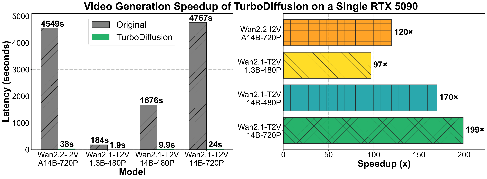
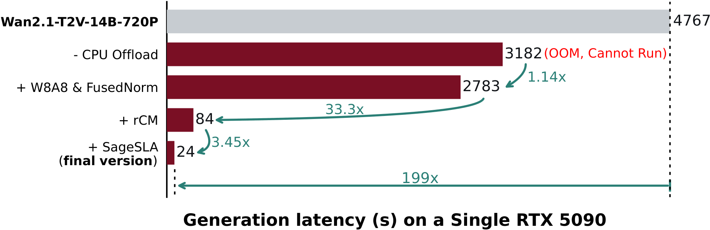
*** 关键指标（单卡 RTX 5090，5s 视频，3-4 步；延迟不含文本编码与 VAE 解码）
- 消融阶梯（Wan2.1-T2V-14B-720P，latency 分解图）：original 4767s（含 CPU offload，去掉则 OOM）→ 去掉 offload 3182s → +W8A8&FusedNorm 2783s（1.14×）→ +rCM **84s（33.3×）** → +SageSLA **24s（3.45×）**——总 **199×**
- 四模型加速比：Wan2.1-T2V-14B-720P 4767→24s（199×）；14B-480P 1676→9.9s（170×）；1.3B-480P 184→1.9s（97×）；Wan2.2-I2V-A14B-720P 4549→38s（120×，含高低噪声两模型切换开销，理论可达 199×）
- 对比 FastVideo（同为加速框架，3 步 + 0.8 稀疏度）：14B-720P 72.6s vs 24s（3× 优势）；1.3B 5.3s vs 1.9s
- *指标核对：照片数字与论文完全一致*——4767s→24s（199×）、rCM 33.3×、SageSLA 3.45× 均在论文原图中逐一对上；"100-200×"为论文标题口径（各模型区间），无出入。*十个工作中照片口径与论文核对最干净的一个*
*** 训练/工程约束
- *不是 training-free*：SLA 微调 + rCM 蒸馏需要训练管线（但训练代码完整开源）——蒸馏是"每模型一次"的成本，换新基座/自训数字人模型需重跑
- 质量证据全是*视觉对比*（帧序列 GIF），论文无 VBench/FVD 类量化指标——"maintaining video quality" 是定性声明，采用前需自测
- 超参：Top-K ratio 0.1（推荐区间 [0.1, 0.15]），步数 3（推荐 4 以稳定质量）
- 环境门槛：torch>=2.7.0（2.8.0 防 OOM）、需另装 SpargeAttn；RTX 4090/H100 也可用但加速倍数小于 5090（低比特 Tensor Core 利用率不同）
- 开源完整度高：4 个 TurboWan checkpoint（含 I2V）+ 训练代码 + 推理代码 + PyPI 包
- *对数字人管线的适用性（高，且与 DAX 互补）*：rCM 蒸馏正是流式管线需要的"少步采样"技术（与 DMD/Self-Forcing 同类，是 DAX 明确缺失的一环）；TurboWan2.2-I2V-A14B checkpoint 可直接用于 I2V 数字人生成；W8A8+SageSLA 可移植到任意 DiT。单卡 24s 生成 5s 视频已接近 chunk 式流式的延迟预算
*** 链接
- [[https://arxiv.org/abs/2512.16093][arXiv 2512.16093]] · [[https://github.com/thu-ml/TurboDiffusion][GitHub]]

** Inferix — AR-Diffusion 世界模型推理引擎
- 项目：Inferix: A Block-Diffusion based Next-Generation Inference Engine for World Simulation（arXiv 2511.20714，2025.11），github.com/alibaba-damo-academy/Inferix（135 star，2025.10 首发）
- 团队：Inferix Team——*浙江大学 + HKUST + 阿里达摩院 + 阿里 TRE*；论文源码宏定义 `\our{FPSAttention}` 与 `\bohan` 命令暴露其与 FPSAttention（本调研第一个工作）同源——Bohan Zhuang 团队生态的收口之作
*** 问题背景
- 定位叙事（论文原话类比）：LLM 时代催生 vLLM/SGLang，视觉扩散时代催生 xDiT/FastVideo，*世界模型时代需要自己的推理引擎*——Inferix 即为此而建
- 服务对象是*半自回归（block-diffusion）世界模型*：块内扩散并行 + 块间自回归 + 重新引入 LLM 式 KV Cache——恰好补上 DAX 小节里指出的流式缺口（chunk 调度 + 跨块状态传递）
- 两大挑战：(1) *存储*——历史块的 KV Cache 是主要瓶颈（防漂移/遗忘需保留上下文，但显存吃不消）；(2) *计算*——Wan2.1 14B 单卡 H20 生成 5s 视频约 6,800s（与 DAX 的 6836s 基线同源），长上下文下更重
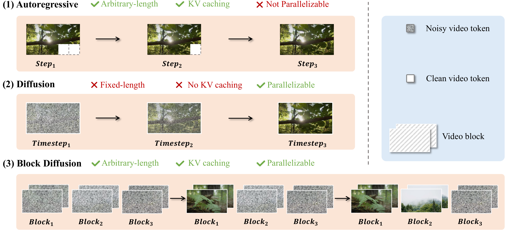
*** 核心方法（Block-DiT pipeline 五组件）
- *并行策略*：Ulysses 式序列并行（按 attention head 切分多卡）+ Ring Attention（环形拓扑分布注意力，按注意力机制选传 Q 或传 KV）——依模型架构/网络拓扑/通信开销自适应选择
- *块级 KV 管理*：统一 KV 管理接口；range-based 分块访问 + index-based 选择性取回两种取数模式（为未来"滑窗 + 选择性全局上下文"模型预留扩展性）；支持 MLA latent store 与主存 offload（分层：GPU→主存）
- *DAX 量化*：直接集成 DAX 的 INT8/FP8 线性层量化（论文引用 DAX 并致谢式复用——DAX 小节的工程组件在此被系统级吸收）
- *流式输出*：RTMP + WebRTC 双协议；连续 prompt（不同 chunk 可不同 prompt）；*切换 prompt 时清空 cross-attention cache* 消除旧 prompt 影响；暂停/恢复/停止
- *内置 Profiling*：扩散模型性能剖析
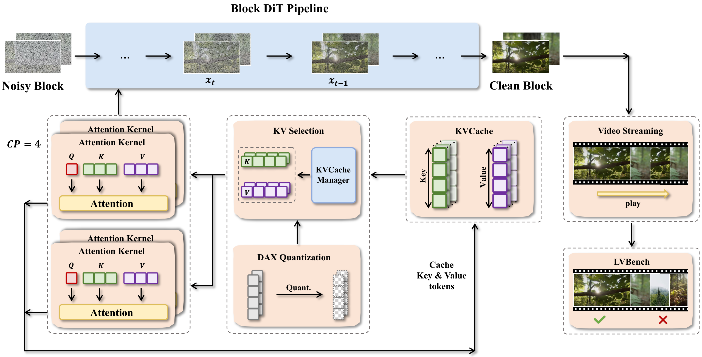
*** 关键指标
- *论文无任何加速倍数/吞吐数字*——纯系统定位文（连 InterVBench 都只给 benchmark 构造，无跑分结果）。照片与 README 亦无量化数字，口径一致："interactively, in real time — even on consumer GPUs" 是定性声明
- 支持模型：Self Forcing、CausVid（建于 Wan2.1 之上）+ MAGI-1（从头训练）+ Wan-Base 1.3B（供扩展）
- *指标核对*：照片特性列表（分层 KV / INT8-FP8 / CP-TP 并行 / 连续 prompt / RTMP-WebRTC / 16GB 消费级 GPU）与论文+README 全部对上；两处口径差异——(1) 照片"CP/TP 并行"vs 论文"Ulysses SP + Ring Attention"（Ring Attention 本质即 CP，实质一致，框架图标注 CP=4）；(2) "16GB 消费级 GPU"仅见于 README/照片，论文无此数据（README-only 声明，待自测）。另：论文图中 benchmark 名仍是旧名 LV-Bench，正文已更名 InterVBench
- InterVBench：1,000 条 50s+ 长视频（DanceTrack/GOT-10k/HD-VILA-100M/ShareGPT4V），GPT-4o 每 2-3s 生成 caption + 三阶段人工校验；提出 VDE（Video Drift Error）漂移指标五维度（Clarity/Motion/Aesthetic/Background/Subject）+ VBench 五维度
*** 训练/工程约束
- *引擎不是模型*：零训练，但只服务于 block-diffusion 范式的模型——传统全注意力 DiT（原版 Wan2.1）不受益，需先有半自回归化的模型（Self Forcing/CausVid 蒸馏产物或 MAGI-1）
- 真正的杀手级场景：*交互式世界模拟/数字人直播*——实时 prompt 切换 + RTMP/WebRTC 推流 + pause/resume，这是十个工作中唯一原生面向交互流式的
- 仓库活跃度：2025.10-11 密集更新后放缓；star 少（135）但论文/代码/文档完整
- LLM 推理技术迁移清单（论文 Challenges 节明示）：PageAttention、offload（FlexGen/InfiniGen）、KV 压缩（KIVI/SnapKV）待引入——当前版本只做了 offload，PageAttention/KV 压缩是路线图
- *对数字人管线的适用性（最高，与 DAX 互补拼图完成）*：DAX（算子加速）+ TurboDiffusion（rCM 少步蒸馏）+ Inferix（block-diffusion 范式 + 流式引擎）三者正好构成完整技术栈——Inferix 支持的 CausVid/Self Forcing 正是数字人滚动生成的主流路线（参考库里 wan-streamer、数字人系列（七））；16GB 消费级 GPU 跑交互式生成若属实，直接改变数字人直播的部署成本结构
*** 链接
- [[https://arxiv.org/abs/2511.20714][arXiv 2511.20714]] · [[https://github.com/alibaba-damo-academy/Inferix][GitHub]]

* 结语：十个工作教会我们的事

** 协同设计是唯一的免费午餐

单点技术简单拼装会互相抵消甚至翻车：FP8 量化与稀疏注意力 naive 组合，VBench 掉 21.1%（FPSAttention 消融）；先蒸馏再插稀疏同样质量崩（BLADE 的出发点）。反过来，把两个手段放进同一个训练循环联合优化，得到的不是 1+1=2，而是 1+1>2：BLADE 消融中蒸馏单独 +0.005、稀疏单独 +0.005、联合 +0.035。*加速手段之间的交互必须显式设计，不能事后拼装*——这是贯穿 FPSAttention、BLADE、TurboDiffusion、WorldAttention 四篇的共同结论。

** 训练费与即插即用的光谱

十个工作按"侵入性"排成一条光谱：ZipAR / DAX（零训练，只改推理代码）→ FlashAR（后训练 25 epochs、0.05% 数据）→ BLADE（data-free 蒸馏 250-500 迭代）→ FPSAttention（QAT，最多 64 节点×7 天）→ NAR（从头训练 300 epochs）。规律清晰：付的训练费越多，加速天花板越高、质量越有保障；零训练路线的天花板由训练目标划定——NAR 论文用"单头并行 FID 66.31"证明了推理侧调度的极限。对工程团队的启示：*先问自己能付多少训练费，再选路线*。

** 照片与论文的口径差异

十个工作中，TurboDiffusion 照片与论文逐字一致；BLADE、LSM、NAR、Inferix 基本一致；FPSAttention、ZipAR、DAX 的照片数字与论文/仓库有出入（均已逐条标注）。演讲幻灯片常换算口径或引用早期版本数字——引用具体数字前务必回原论文核对。两个"README-only"声明也值得警惕：Inferix 的"16GB 消费级 GPU"与 WorldAttention 的部分基线 FPS，论文中均无对应数据。

** 数字人管线的落地排序

对数字人视频生成（本库主线场景），十个工作的实用性排序：

1. *Inferix + TurboDiffusion + DAX*：三者正交可叠加，恰好构成流式技术栈——Inferix 提供 block-diffusion 流式引擎与 KV 管理，TurboDiffusion 的 rCM 提供少步采样，DAX 的算子加速已被 Inferix 系统级吸收。Inferix 支持的 CausVid / Self Forcing 正是数字人滚动生成的主流路线
2. *LSM*：隐空间记忆思路对跨 chunk 一致性有参考价值，但绑定单图 + 相机轨迹的 scene generation 任务
3. *FPSAttention / BLADE*：高质量视频生成的通用加速件，但前者吃 Hopper FP8 硬件、未在 14B 之外验证
4. *ZipAR / NAR / FlashAR*：AR 视觉生成路线，与扩散管线正交，仅在自训 AR 模型时有参考价值

真正改变部署成本结构的悬念只有一个：Inferix 声称的"16GB 消费级 GPU 实时交互生成"若自测属实，数字人直播的门槛从 8×H20 直接掉到一张消费卡。这比任何单篇论文的加速倍数都更值得工程团队亲手验证。

* 填充进度

- [x] FPSAttention（2026-08-31 调研填充）
- [x] BLADE（2026-08-31 调研填充）
- [x] Latent Spatial Memory（2026-08-31 调研填充）
- [x] WorldAttention（2026-08-31 调研填充）
- [x] ZipAR（2026-08-31 调研填充）
- [x] NAR（2026-08-31 调研填充）
- [x] FlashAR（2026-08-31 调研填充）
- [x] DAX（2026-08-31 调研填充）
- [x] TurboDiffusion（2026-08-31 调研填充）
- [x] Inferix（2026-08-31 调研填充）